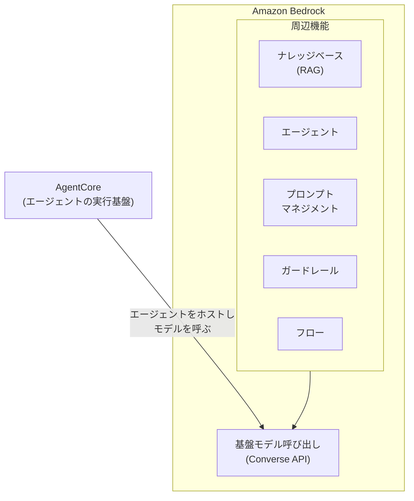

# 第1章 Bedrock で Claude を呼び出す

この章を終えると、Bedrock の Converse API を生で呼べるようになり、
クロスリージョン推論のモデル ID 解決を自分の手で実装した状態になります。

この章は独立した uv プロジェクトです。最初に依存を入れてください。

```bash
cd 01-invoke-bedrock
uv sync
```

## 1.1 概要

### 1.1.1 Bedrock とは

Amazon Bedrock は、複数ベンダーの基盤モデル(Anthropic Claude、Amazon Nova、
Meta Llama など)を単一の API で呼び出せる AWS のフルマネージドサービスです。
モデルプロバイダと個別に契約せず、AWS アカウントだけで生成 AI アプリケーションを構築できます。

エンタープライズで選ばれる理由は能力ではなく統制にあります。

- 呼び出し権限を IAM で管理できる(API キーの配布・失効管理が不要)
- データの処理地域を制御できる(1.1.3 の地理境界)
- 入出力がモデルの学習に使われない
- CloudTrail / CloudWatch など既存の監査・監視系に乗る

呼び出しには Converse API を使います。モデルごとに違うリクエスト形式を統一した層で、
ツール定義(第3章)もここで吸収されます。エラーは Converse の語彙で返ってくるので、
一度は生で叩いておくと障害の切り分けが速くなります。

### 1.1.2 Bedrock が解決すること

| 課題 | Bedrock での解決 |
| --- | --- |
| プロバイダごとに API・SDK・課金がバラバラ | Converse API と AWS 請求に統一。モデル乗り換えは ID の差し替えで済む |
| API キーの発行・保管・ローテーション | IAM で認証する。キーという概念自体が無い |
| 入力データの取り扱い不安 | 入出力はモデルの学習に使われない |

### 1.1.3 クロスリージョン推論プロファイル

新しめの Claude は、単一リージョンのオンデマンド呼び出しではなく
クロスリージョン推論プロファイル経由でしか呼べないものが多くなっています。
1 リージョンの容量に縛られず、複数リージョンへ自動で負荷分散する仕組みです。

仕様(AWS 公式ドキュメントで裏取り済み):

- プロファイル ID は地理接頭辞 + モデル ID。`apac.` / `us.` / `eu.`(別途 `global.` もある)
- リクエストは同一地理内の宛先リージョンへ自動ルーティングされる。
  `apac.` なら推論ペイロードは APAC 圏の外に出ない
- 宛先リージョンを自分で有効化しておく必要はない
- 追加料金なし。課金は**呼び出し元リージョンの単価**で計算される
- 地理プロファイルの宛先リストは不変。AWS が後からリージョンを追加することはない

厄介なのは接頭辞の導出です。ap-northeast-1 の接頭辞は `ap` ではなく `apac`。
リージョン名の機械的な切り出しでは足りず、対応表が要ります。

### 1.1.4 Bedrock の機能の位置づけ

Bedrock は「モデル呼び出し」を土台に、その上に周辺機能が載る構造です。
本教材が主に使うのはモデル呼び出しと AgentCore で、エージェント自体は
マネージドの Bedrock Agents ではなく Strands Agents で自前実装します。



| 機能 | 何をするものか | 本教材での扱い |
| --- | --- | --- |
| AgentCore | エージェントをコンテナとしてホストする実行基盤 | 第8章(+ 付録B/C/D) |
| エージェント | LLM が自律的にツールを呼びタスクを進める仕組み | 第2〜7章(Strands で自前実装) |
| ナレッジベース | 社内文書などの検索拡張生成(RAG) | 第10章 |
| プロンプトマネジメント | プロンプトの版管理と退行検知。本質は「Git + 評価」 | 第13章 |
| ガードレール | 入出力の内容フィルタ(マネージド層のセーフガード) | 第17章 |
| 自動推論チェック | 論理検証によるハルシネーション検出。ガードレールの一機能 | 第17章で触れる |
| フロー | プロンプト・モデル・処理をノードとして繋ぐワークフロー | 対象外(本教材はコードで制御する) |
| データオートメーション | 非構造化ドキュメントからの情報抽出(IDP) | 対象外(ロードマップ Tier 4) |

## 1.2 実装のポイント

Bedrock の呼び出しは boto3 の `bedrock-runtime` クライアントと Converse API で行います。
このリポジトリでは呼び出しに 2 つの規約を課しています。

- **モデル ID・リージョンをコードに書かない。** `.env` から `07-full-app/src/config.py` が
  読み、地理接頭辞の連結(`apac.` + モデル ID)もそこで行う。ID を差し替えるだけで
  モデルを乗り換えられる状態を保つため
- **消費トークンを必ずログに出す。** `response["usage"]` の値が第4章のコスト制御の土台になる

ID を間違えたときの `ValidationException` は「そのモデルは呼べない」としか言わず、
接頭辞が原因だとは教えてくれません。だから接頭辞の導出規則を関数として持ち、
起動前に実在確認する(1.6)構えにしています。

以降のハンズオンでこの構えを下から順に自分で作ります。生で 1 回呼ぶ(1.3)、
ID 解決を実装する(1.4)、本体の実装と突き合わせる(1.5)、実在確認する(1.6)、の順です。

## 1.3 【ハンズオン】Converse API を生で呼ぶ

`01_converse.py` を作成し、次のコードを自分の手で書いてください。

```python
import os

import boto3

# Bedrock Runtime を呼び出すクライアントを生成
client = boto3.client("bedrock-runtime", region_name=os.environ.get("AWS_REGION", "ap-northeast-1"))

# モデル ID。地理接頭辞の意味は 1.1.3 のとおり。
# 自分のリージョンで呼べる ID は 1.6 の確認コマンドで特定できる
model_id = os.environ.get("MODEL_ID", "apac.anthropic.claude-haiku-4-5")

# Converse API 呼び出し
response = client.converse(
    modelId=model_id,
    messages=[
        {"role": "user", "content": [{"text": "こんにちは。1 行で自己紹介して"}]},
    ],
    inferenceConfig={"maxTokens": 300},
)

# 応答テキストを表示
print(response["output"]["message"]["content"][0]["text"])

# 消費トークン。第4章のコスト計測はこの値の積み上げ
usage = response["usage"]
print(f"tokens: in={usage['inputTokens']} out={usage['outputTokens']}")
```

実行します。

```bash
uv run 01_converse.py
```

応答テキストが 1〜2 行と、`tokens: in=... out=...` が表示されるはずです。

## 1.4 【ハンズオン】モデル ID の解決を自分で実装する

導出の規則を関数として自分で書きます。`02_inference_profile.py` を作成し、
次の骨組みから始めてください。

```python
"""リージョン名から Bedrock 推論プロファイル ID を解決する。"""

# リージョン接頭辞 -> 推論プロファイル接頭辞の補正表。
# "ap" 系だけプロファイル側は "apac" になる
PREFIX_OVERRIDES = {"ap": "apac"}


def derive_prefix(region: str) -> str:
    """リージョン名から地理接頭辞を導出する。

    例: "ap-northeast-1" -> "apac" / "us-east-1" -> "us" / "us-gov-east-1" -> "us-gov"
    ヒント: 末尾の 2 要素（"northeast", "1"）を落とした残りが接頭辞の元。
    us-gov-east-1 のような 4 要素のリージョン名も正しく扱うこと。
    """
    raise NotImplementedError  # ここを自分で実装する


def resolve_model_id(base_id: str, region: str, prefix: str | None = None, full: str | None = None) -> str:
    """実際に Bedrock へ渡すモデル ID を組み立てる。

    優先順位:
      1. full が指定されていれば、連結せずそのまま返す（逃げ道）
      2. prefix が指定されていればそれを使う。空文字 "" は「接頭辞なし」の意味
      3. どちらも無ければ region から derive_prefix() で導出する
    """
    raise NotImplementedError  # ここを自分で実装する


if __name__ == "__main__":
    for region in ("ap-northeast-1", "us-east-1", "eu-central-1", "us-gov-east-1"):
        print(f"{region:16} -> {resolve_model_id('anthropic.claude-haiku-4-5', region)}")
```

実装できたら動かします。

```bash
uv run 02_inference_profile.py
```

4 行の対応が表示され、ap-northeast-1 の行が `apac.anthropic.claude-haiku-4-5` に
なっているはずです。合格判定を流します。

```bash
uv run pytest -q
```

`7 passed` で合格です。詰まったら `solutions/02_inference_profile.py` を見てください。

## 1.5 【ハンズオン】本体の実装と突き合わせる

同じ規則が本体 `07-full-app/src/config.py` に実装されています
（Strands 本体のソースと同じ対応表です）。自分の実装と本体が同じ答えを出すことを
確認するスクリプト `03_config_check.py` を書いてください。

```python
"""自分の実装と 07-full-app の実装の突き合わせ。"""

import pathlib
import sys

# 本体の config.py を import できるようにする
sys.path.insert(0, str(pathlib.Path(__file__).resolve().parents[1] / "07-full-app"))

from importlib import import_module

my_impl = import_module("02_inference_profile")

REGIONS = ["ap-northeast-1", "ap-southeast-2", "us-east-1", "eu-west-1", "us-gov-east-1"]

for region in REGIONS:
    mine = my_impl.derive_prefix(region)
    print(f"{region:16} mine={mine}")

print("\n07-full-app 側の実装は src/config.py の derive_inference_prefix() を読んで確認する")
```

```bash
uv run 03_config_check.py
```

表示された接頭辞と、`07-full-app/src/config.py` の `derive_inference_prefix()` を
読み比べてください。同じ対応表・同じ切り出しになっているはずです。
本体ではさらに、解決後の実 ID を起動ログに出す・不正な設定は起動時に落とす、という
運用の工夫が乗っています。`.env.example` の [確定] / [未確定] コメントも読んでおいてください。

## 1.6 【ハンズオン】実在確認

ID を間違えると `ValidationException` が返ります。案件初日にこれを打つ癖をつけてください。

```bash
aws bedrock list-inference-profiles --region ap-northeast-1 \
  --query 'inferenceProfileSummaries[].inferenceProfileId' | grep anthropic
```

自分のリージョンで呼べる ID の一覧が出ます。01_converse.py の `MODEL_ID` や
`07-full-app/.env` がこの一覧に無ければ直します。なお、コンソールの Model access で
未申請の場合は `AccessDeniedException` になります。ValidationException とは別物です。

`scripts/check_env.sh` はこの確認を自動化したもので、`.env` の値が一覧に無ければ
起動前に止めます。実行時の謎の例外を、起動前の分かるエラーに変換しているわけです。

## 1.7 まとめ

Bedrock は「モデルを IAM 認証・統一 API で呼べるようにする」土台であり、周辺機能は
すべて独立に採否を選べます。この章で作った **「ID はコードに書かず解決規則で導出し、
起動前に実在確認する」** という構えは、この先すべての章のモデル呼び出しが乗る前提です。
エージェント(第2章)も結局はこの Converse API の繰り返しです。

## 次の章

[第2章 はじめてのエージェント](../02-agent-loop/)
