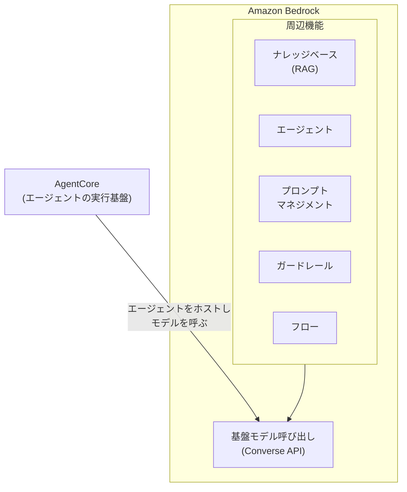

# 第1章 Bedrock で Claude を呼び出す

この章を終えると、Bedrock の Converse API を SDK から直接呼べるようになり、
1 回の呼び出しの料金を usage から概算でき、同期とストリーミングの応答の差を
実測した状態になります。

この章は独立した uv プロジェクトです。最初に依存を入れてください。

```bash
cd 01-invoke-bedrock
uv sync
```

ハンズオンは `exercises/` の TODO を実装して実行する形式です。
完成形は `solutions/` にあります。

## 1.1 概要

### 1.1.1 Bedrock とは

Amazon Bedrock は、複数ベンダーの基盤モデル(Anthropic Claude、Amazon Nova、
Meta Llama など)を単一の API で呼び出せる AWS のフルマネージドサービスです。
モデルプロバイダと個別に契約せず、AWS アカウントだけで生成 AI アプリケーションを構築できます。

エンタープライズで選ばれる理由は統制にあります。

- 呼び出し権限を IAM で管理できる(API キーの配布・失効管理が不要)
- データの処理地域を制御できる(1.1.8 の地理境界)
- 入出力がモデルの学習に使われない
- CloudTrail / CloudWatch など既存の監査・監視系に乗る

### 1.1.2 Bedrock が解決すること

| 課題 | Bedrock での解決 |
| --- | --- |
| API も SDK も課金もバラバラ | Converse API に統一 |
| API キーの発行と保管 | IAM の認証情報で呼ぶ |
| 入力データの取り扱い | 学習には使われない |

モデルを乗り換えるときに変えるのは `modelId` だけです。
API キーは発行する作業そのものが無くなり、保管もローテーションも要りません。

### 1.1.3 Converse API

モデル呼び出しには Converse API を使います。モデルごとに異なるリクエスト形式を
統一した層で、Claude でも Nova でも同じ形で呼べます。モデルの乗り換えが
`modelId` の差し替えだけで済むのはこの層のおかげです。

リクエストとレスポンスの構造は 3 つ覚えれば足ります。

- `messages` は `role`（user / assistant）と `content` の配列。会話履歴もこの配列に積む
- `inferenceConfig` は `maxTokens` や `temperature` など生成の制御
- レスポンスは `output` に応答本文、`usage` に消費トークン数

```python
response = client.converse(
    modelId="<推論プロファイル ID>",
    messages=[
        {"role": "user", "content": [{"text": "質問文"}]},
    ],
    inferenceConfig={"maxTokens": 300},
)

response["output"]["message"]["content"][0]["text"]  # 応答本文
response["usage"]  # {"inputTokens": ..., "outputTokens": ..., ...}
```

`inferenceConfig` に入る主な値は 4 つです。

| パラメータ | 効くところ |
| --- | --- |
| `maxTokens` | 出力の上限トークン数 |
| `temperature` | 語を選ぶときのばらつき |
| `topP` | 候補を残す確率の割合 |
| `stopSequences` | 生成を打ち切る文字列 |

`maxTokens` に達すると文の途中でも生成が止まります。
`temperature` は 0 に近いほど毎回同じ答えに寄り、`topP` はそれとは別の絞り方です。
`stopSequences` に指定した文字列自体は出力に含まれません。

`temperature` と `topP` はどちらも出力のばらつきを左右するので、
Anthropic は片方だけを動かすことを勧めています。
両方いじると、どちらが効いたのか分からなくなります。
繰り返しを抑えるペナルティ系のパラメータは Converse の共通項目には無く、
使う場合は `additionalModelRequestFields` にモデル固有の名前で渡します。

`stopSequences` は、出力の形が決まっているときに無駄なトークンを削る手です。
JSON を 1 個だけ返させたいなら、閉じ括弧の後ろに続く説明文を生成させる必要はありません。

ツール定義(第3章)もこの API の `toolConfig` で渡します。エージェントフレームワーク
経由でもエラーは Converse API の形式で返ってくるため、一度フレームワークを介さず
直接呼んでおくと、障害時にどの層のエラーかを切り分けやすくなります。

### 1.1.4 コンテキストウィンドウと最大出力

1 回の呼び出しで扱えるトークン数には、性質の違う上限が 2 つあります。
コンテキストウィンドウは入力と出力を合わせた総枠で、
この教材の既定 Haiku 4.5 は 200K トークンです。
最大出力はそのうち出力側だけに掛かる上限で、Haiku 4.5 は 64K トークンです
（モデルごとに違うので Anthropic のモデル一覧で確認してください）。

総枠を超えたときは呼び出し自体が例外で落ちるので、すぐ気づけます。
厄介なのは出力側で、`maxTokens` に達しても例外は出ません。
文の途中で切れた応答が、正常なレスポンスとして返ってきます。

```python
response["stopReason"]  # "end_turn" なら生成しきった。"max_tokens" なら途中で切れた
```

`end_turn` はモデルが自分で話し終えた場合、`max_tokens` は上限で打ち切られた場合です。
後者を見ずに応答を JSON としてパースすると、パースに失敗します。

### 1.1.5 トークンと料金

モデルは文章をトークンという単位に分割して処理します。課金もこの単位で、
入力トークン数 × 入力単価 + 出力トークン数 × 出力単価が 1 回の呼び出しの料金です。
単価はモデルとリージョンごとに決まり、出力は入力より数倍高くなっています
（この教材の既定 Haiku 系は入力 $1 / 出力 $5、100万トークンあたり。最新は Bedrock 料金ページで確認）。
単価が 100万トークンあたりなので、計算はこうなります。

```python
cost = usage["inputTokens"] * 入力単価 / 1_000_000 + usage["outputTokens"] * 出力単価 / 1_000_000
```

つまりコストを決めるのは呼び出し回数だけでなく、何を入れて何を出させるかです。
長いシステムプロンプト、積み上がる会話履歴、冗長な出力がそのまま金額になります。
レスポンスの `usage` に実測値が入っており、これをログに出し続けることが
第4章のコスト制御の入力データになります。

### 1.1.6 同期・ストリーミング・非同期

呼び出し方は 3 つあり、応答の受け取り方が違います。

| 方式 | API | 応答の受け取り方 |
| --- | --- | --- |
| 同期 | `converse` | 全文を一括で受け取る |
| ストリーミング | `converse_stream` | 断片を順に受け取る |
| 非同期 | `start_async_invoke` | 結果を後から S3 で受け取る |

非同期は動画生成のような長時間処理向けで、Claude のテキスト生成では使いません。

ストリーミングの応答はイベントの列です。`converse_stream` の引数は `converse` と
同じで、受け取り側だけがループになります。本文の断片は `contentBlockDelta`、
消費トークンは最後の `metadata` イベントに入っています。

```python
response = client.converse_stream(...)  # 引数は converse と同じ

for event in response["stream"]:
    if "contentBlockDelta" in event:
        event["contentBlockDelta"]["delta"]["text"]  # 本文の断片
    elif "metadata" in event:
        event["metadata"]["usage"]  # 消費トークン。最後に 1 回だけ届く
```

体感を決めるのは、最初の 1 文字が出るまでの時間です。同期は全文が完成するまで
無応答なので、生成に 20 秒かかれば 20 秒無言になります。
チャット UI でストリーミングが標準なのはこのためです。

### 1.1.7 オンデマンドとプロビジョンドスループット

応答の受け取り方とは別に、推論のキャパシティをどう確保するかの選択があります。

| 形態 | 課金 | 向くところ |
| --- | --- | --- |
| オンデマンド | 使ったトークン分 | 既定。開発と小規模運用 |
| プロビジョンド | モデル単位の時間課金 | 定常運用 |
| バッチ | オンデマンドより安い | 即時性の要らない処理 |

プロビジョンドスループットは 1 か月または 6 か月のコミットで単価が下がり、
カスタムモデルを使う場合はこれが必須です。
バッチの割引幅は Bedrock 料金ページで確認してください。結果は S3 に出ます。

オンデマンドにはリージョン単位のクォータがあり、
同時実行が増えると `ThrottlingException` が返ります。
リトライで吸収できる範囲を超えたら、
キャパシティを買うか、バッチに移すかの判断になります。
この教材は最後までオンデマンドだけで動きます。

### 1.1.8 クロスリージョン推論プロファイル

新しめの Claude は、単一リージョンのオンデマンド呼び出しではなくクロスリージョン
推論プロファイル経由でしか呼べないものが多くなっています。ID は接頭辞 + モデル ID
（地理の `us.` / `apac.` / `eu.` のほか、`global.` と国別の `jp.` もある）で、リクエストは同一地理内の宛先リージョンへ
自動ルーティングされます。追加料金はなく、課金は**呼び出し元リージョンの単価**です。

接頭辞はリージョン名から機械的に切り出せません（ap-northeast-1 は `ap` ではなく
`apac`）。この導出は本体 `07-full-app/src/config.py` の `derive_inference_prefix()` が
対応表として実装しており、`.env` のモデル ID との連結もそこで行います。

可用性を上げる仕組みですが、同時に「リクエストがどこで処理されるか」の話でもあります。
`us.` を選べば米国内のいずれかのリージョンで推論が走り、
宛先の一覧は AWS が決めるためこちらでは選べません。
データを国外に出せない案件では、ここが採否を決めます。
国内に閉じたい場合は国別の `jp.` プロファイルを使います。

### 1.1.9 Bedrock の機能の位置づけ

Bedrock はモデル呼び出しの上に周辺機能が載る構造です。
この教材が主に使うのはモデル呼び出しと AgentCore で、エージェント自体は
マネージドの Bedrock Agents ではなく Strands Agents で自前実装します。



| 機能 | 何をするものか | 扱う章 |
| --- | --- | --- |
| AgentCore | エージェントの実行基盤 | 第8章 |
| エージェント | ツールを呼んで進む仕組み | 第2〜7章 |
| ナレッジベース | 検索拡張生成(RAG) | 第10章 |
| プロンプトマネジメント | 版管理と退行検知 | 第13章 |
| ガードレール | 入出力の内容フィルタ | 第17章 |
| 自動推論チェック | ハルシネーション検出 | 第17章 |
| フロー | 処理をノードで繋ぐ | 対象外 |
| データオートメーション | 非構造化文書の情報抽出 | 対象外 |

エージェントはマネージドの Bedrock Agents ではなく Strands で自前実装し、
AgentCore の周辺機能（Memory / Observability / Gateway）は付録で扱います。
自動推論チェックはガードレールの一機能で、プロンプトマネジメントの実体は
Git と評価の組み合わせです。フローとデータオートメーションを対象外にしたのは、
この教材が処理の流れをコードで制御するからです。

## 1.2 実装のポイント

Bedrock の呼び出しは boto3 の `bedrock-runtime` クライアントと Converse API で行います。
このリポジトリが課している規約は 2 つです。

モデル ID とリージョンはコードに書きません。`.env` から `07-full-app/src/config.py` が読み、
地理接頭辞の連結(`apac.` + モデル ID)もそこで行います。
ID を差し替えるだけでモデルを乗り換えられる状態を保つためです。

消費トークンは必ずログに出します。`response["usage"]` に入出力のトークン数が入っており、
この値を積み上げたものが第4章のコスト上限と計測の入力データになります。

ID を間違えたときの `ValidationException` は「そのモデルは呼べない」としか言わず、
接頭辞が原因だとは教えてくれません。そのため起動前に実在確認する(1.3)構えにしています。

## 1.3 【ハンズオン】呼べるモデル ID を確認する

ID を間違えると `ValidationException` が返り、接頭辞が違うのかモデルが無いのかは
教えてくれません。そのためコードを書く前に、自分のリージョンで呼べる ID の一覧を
確認します。新しい AWS 環境や実案件に入ったときも、最初にこれを確認する習慣を
つけると、この種のエラーを未然に防げます。

```bash
aws bedrock list-inference-profiles --region us-east-1 \
  --query 'inferenceProfileSummaries[].inferenceProfileId' | grep anthropic
```

`--region` は自分のリージョンに合わせてください。呼べる ID の一覧が出るはずです。
次の 1.4 ではこの一覧にある ID を使います。なお、コンソールの Model access で
未申請の場合は `AccessDeniedException` になります。ValidationException とは別物です。

`scripts/check_env.sh` はこの確認を自動化したもので、`07-full-app/.env` の値が
一覧に無ければ起動前に止めます。実行時の謎の例外を、起動前の分かるエラーに
変換しているわけです。

## 1.4 【ハンズオン】Converse API を直接呼ぶ

`exercises/01_converse.py` を開いてください。クライアントの生成とモデル ID の
解決は書いてあり、TODO が 3 つ残っています。

1. `client.converse` の呼び出し。`messages` と `inferenceConfig` の形式は 1.1.3 のとおり
2. 応答テキストの表示。本文は `response["output"]["message"]["content"]` の先頭要素
3. 消費トークンの表示。`response["usage"]` に入っている

実装できたら TODO コメントを消して実行します。

```bash
uv run exercises/01_converse.py
```

既定値（us-east-1 / Haiku 4.5）と自分の環境が違う場合は、コードの既定値を
1.3 で確認した ID に書き換えるか、環境変数で上書きします。

```bash
AWS_REGION=<リージョン> MODEL_ID=<1.3 で確認した ID> uv run exercises/01_converse.py
```

応答テキストが 1〜2 行と、`tokens: in=... out=...` が表示されるはずです。

<details>
<summary>解答例</summary>

```python
response = client.converse(
    modelId=model_id,
    messages=[
        {"role": "user", "content": [{"text": "こんにちは。1 行で自己紹介して"}]},
    ],
    inferenceConfig={"maxTokens": 300},
)

print(response["output"]["message"]["content"][0]["text"])

usage = response["usage"]
print(f"tokens: in={usage['inputTokens']} out={usage['outputTokens']}")
```

全文は `solutions/01_converse.py` にあります。

</details>

## 1.5 【ハンズオン】トークンを計測して料金を概算する

1.4 で表示した `usage` が料金の実データです。`exercises/02_count_tokens.py` を
開いてください。呼び出し部分は書いてあり、TODO が 2 つ残っています。

1. 1 回分の料金の計算。式は入力トークン数 × 入力単価 + 出力トークン数 × 出力単価で、
   ファイル冒頭の単価は 100万トークンあたりの USD
2. 長さの違う 3 つの質問。一語で答えられるものから、長い説明を求めるものまで

実装できたら TODO コメントを消して実行します。

```bash
uv run exercises/02_count_tokens.py
```

3 行の結果が出るはずです。入力トークンの差は数十程度なのに、出力トークンの差で
料金が 1 桁変わることを確認してください。単価が入力の 5 倍ある出力を
どれだけ絞れるかが、コストの大半を決めます。

<details>
<summary>解答例</summary>

```python
    cost = usage["inputTokens"] * PRICE_INPUT / 1_000_000 + usage["outputTokens"] * PRICE_OUTPUT / 1_000_000
    print(f"in={usage['inputTokens']:4} out={usage['outputTokens']:4} cost=${cost:.6f} <- {text}")


ask("1+1 は？答えだけ")
ask("エージェント開発を学ぶ手順を 3 項目で")
ask("エージェント開発を学ぶ手順を詳しく説明して")
```

全文は `solutions/02_count_tokens.py` にあります。

</details>

## 1.6 【ハンズオン】ストリーミングで呼ぶ

同期との違いである、最初の文字が出るまでの時間を実測します。
`exercises/03_streaming.py` を開いてください。時間計測の枠は書いてあり、
TODO が 3 つ残っています。

1. `converse_stream` での呼び出し。引数は `converse` と同じ
2. `contentBlockDelta` イベントのテキストを逐次表示し、最初のチャンクの
   経過時間を `first_token_at` に記録する
3. `metadata` イベントから `usage` を取り出す。消費トークンは最後にまとめて届く

実装できたら TODO コメントを消して実行します。

```bash
uv run exercises/03_streaming.py
```

文章が少しずつ表示され、最後に 2 つの時間が出るはずです。total が数秒かかっても、
first_token はその何分の一かに収まります。この差がそのまま体感の差になります。
1.5 の 3 つ目と同じ質問なので、トークン数がほぼ同じであることも確認してください。

<details>
<summary>解答例</summary>

```python
response = client.converse_stream(
    modelId=model_id,
    messages=[
        {"role": "user", "content": [{"text": "エージェント開発を学ぶ手順を詳しく説明して"}]},
    ],
    inferenceConfig={"maxTokens": 500},
)

for event in response["stream"]:
    if "contentBlockDelta" in event:
        if first_token_at is None:
            first_token_at = time.perf_counter() - start
        print(event["contentBlockDelta"]["delta"]["text"], end="", flush=True)
    elif "metadata" in event:
        usage = event["metadata"]["usage"]
```

全文は `solutions/03_streaming.py` にあります。

</details>

合格判定を実行します。

```bash
uv run pytest -q
```

`3 passed` で合格です。詰まったら `solutions/` を見てください。

## 1.7 まとめ

Bedrock の中核は、モデルを IAM 認証と統一 API(Converse)で呼べるようにすることであり、
その上の周辺機能はすべて独立に採否を選べます。この章で身につけた
**呼ぶ前に実在確認し、usage を必ず見る**という構えは、この先すべての章の
モデル呼び出しが乗る前提です。トークン計測は第4章のコスト制御へ、ストリーミングは
第12章のフロントエンドへつながります。エージェント(第2章)も結局はこの
Converse API の繰り返しです。

## 次の章

[第2章 はじめてのエージェント](../02-agent-loop/)
