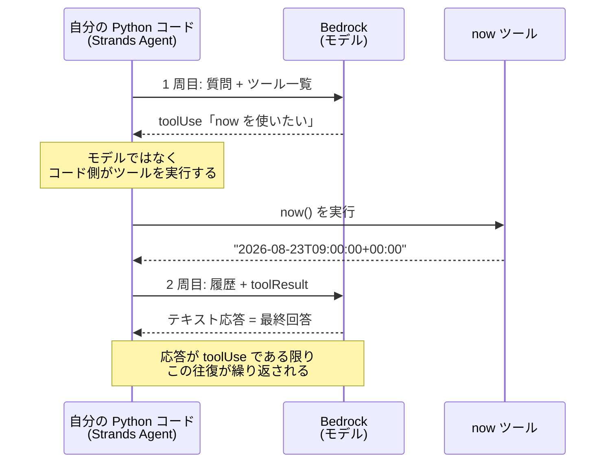

# 第2章 はじめてのエージェント

この章を終えると、ツール付きのエージェントを自分の手で書き、実行ログの各行が
ReAct のどのステップかを言い当てられるようになります。

この章も独立した uv プロジェクトです。最初に依存を入れてください。

```bash
cd 02-agent-loop
uv sync
```

ハンズオンは第1章と同じく、`exercises/` の TODO を実装して実行する形式です。

## 2.1 概要

### 2.1.1 Strands Agents とは

この章から使う Strands Agents は、AWS が公開しているオープンソースの
エージェント開発フレームワーク(Python)です。エージェントの中身(モデル呼び出しの
繰り返し、ツールの実行、会話履歴の管理)を実装済みで、開発者はモデルと
システムプロンプトとツールの 3 つを渡すだけでエージェントが動きます。
本体 `07-full-app/` のエージェントもこれで書かれています。

リポジトリ直下の README にある機能一覧の「エージェント」(マネージドの
Bedrock Agents)とは別物です。あちらは AWS 側がループを実行するサービス、
Strands は自分のコードとしてループを持つフレームワークで、
この教材は挙動を細部まで観察・制御できる後者で作ります。

### 2.1.2 エージェントのループ構造

第1章の `01_converse.py` は 1 回呼んで終わりでした。エージェントとの違いは
ループの有無だけです。

1. モデルに質問と「使えるツールの一覧」を渡す
2. 応答がテキストだけなら、それが最終回答。終了
3. 応答が「ツール X を引数 Y で使いたい」なら、X を実行し、結果を履歴に足して 1 へ戻る

内部では Converse API のマルチターンが動いています。ツール要求は `toolUse` ブロック
（`toolUseId` 付き）で返り、呼び出し側は実行結果を `toolResult` ブロックとして次の
リクエストに追加します。ツールを実行するのはモデルではなく、モデルを呼び出している
側のコードです。この章では、自分が書く Python コードがそれにあたります。

2.3 で書くエージェント（now ツール 1 つ）の場合、この往復は次のシーケンスに
なります。1 周 = モデル呼び出し 1 回で、ハンズオンで観察する `cycles: 2` の実体です。



### 2.1.3 ReAct と CoT

このループには ReAct という名前が付いています。推論だけで完結させず、
外部と相互作用しながら考える方が幻覚が減る、という提案から来たパターンです。

CoT（Chain of Thought）は、複雑な問題を思考ステップに分解させるプロンプト技法です。
ループの構造ではなくプロンプトの書き方であり、フレームワークの機能ではありません。

ReAct を論文どおりテキストで実装する場合は、
`Thought:` `Action:` `Observation:` の形式で書かせて応答を自分でパースします。
この形にすると、モデルは `Action:` を書いた後に、
`Observation:` の中身まで自分で書いて先へ進んでしまいます。
ツールを実行していないので、その観察結果は作り話です。

これを止めるのが第1章 1.1.3 の `stopSequences` です。
`Observation:` を停止シーケンスに指定すると生成がそこで切れ、
実行と観察を呼び出し側のコードに戻せます。
Strands ではこの制御は要りません。ツール要求が `toolUse` という構造で返り、
モデルはそこで生成を止めるからです。

### 2.1.4 会話履歴とコンテキストウィンドウ

ループが 1 周するたびに、モデルへ送るメッセージ配列は伸びます。
`toolUse` と `toolResult` が毎周ぶん積み上がり、
次の周では過去のやり取りがまるごと入力として再送されます。
ツールを 10 回呼ぶ調査なら、
10 回目の入力には 1 回目から 9 回目までの検索結果が全部入っています。

入力トークンは周回とともに増え、料金は入力側にも掛かります。
2.6 のメトリクスで `accumulated_usage` を見ると、
周回数に対して入力がどう伸びるかを実測できます。

伸び続ければ 1.1.4 のコンテキストウィンドウの上限に達します。例外になるので気づけますが、
それが起きるのは長い調査の終盤、一番トークンを使った後です。抑え方は 2 つあります。

ひとつは、直近のメッセージだけ残して古いものを捨てる方法です。
Strands の既定がこれで、`SlidingWindowConversationManager` が直近 40 メッセージに切り詰めます。
もうひとつは古いやり取りをモデルに要約させ、要約 1 通に置き換える方法で、
`SummarizingConversationManager` がこれにあたります。
この章のエージェントは 2 周で終わるので、どちらも出番がありません。

## 2.2 実装のポイント

Strands の `Agent` はこの往復の実装で、1 往復を cycle と呼びます。
組み立てと実行はこの形です。

```python
@tool  # 普通の関数をツールにするデコレータ
def now() -> str:
    """現在の日時を UTC の ISO 8601 形式で返す。"""  # docstring がそのままモデルに渡る
    return datetime.now(UTC).isoformat()


agent = Agent(
    model=BedrockModel(region_name="<リージョン>", model_id="<モデル ID>", max_tokens=512),
    system_prompt="<エージェントへの指示>",
    tools=[now],  # @tool を付けた関数を渡す
)

result = agent("質問文")
result.metrics.cycle_count           # ループが何周したか
result.metrics.accumulated_usage     # 消費トークンの累計（dict。合計は totalTokens）
```

もうひとつ、`tools` に渡した関数の docstring はそのままモデルに渡ります。
モデルはその文面だけでいつ使うかを決めるので、docstring の質がツール選択の質を
決めます。書き方の規約は第3章で扱います。

## 2.3 【ハンズオン】最小のエージェントを書く

`exercises/01_agent.py` を開いてください。now ツールは docstring まで含めて
書いてあり、TODO が 2 つ残っています。

1. `Agent` の組み立て。形は 2.2 のとおりで、モデルと system_prompt と tools を渡す
2. `result.metrics.cycle_count` の表示

実装できたら TODO コメントを消して実行します。

```bash
uv run exercises/01_agent.py
```

既定値（us-east-1 / Haiku 4.5）と自分の環境が違う場合は、第1章 1.3 で確認した ID を
`MODEL_ID` と `AWS_REGION` で渡してください。回答のあとに `cycles: 2` が出るはずです。
1 周目でモデルが now を使うと判断し、2 周目でツール結果を見て回答を組み立てた、
という意味です。

<details>
<summary>解答例</summary>

```python
@tool
def now() -> str:
    """現在の日時を UTC の ISO 8601 形式で返す。

    「今日」「現在」など、実行時点の日時が必要な質問に答えるときに使う。

    受け取るもの: なし
    返すもの: ISO 8601 形式の日時文字列 1 つ
    含まないもの: タイムゾーン変換、日付計算
    """
    return datetime.now(UTC).isoformat()


agent = Agent(
    model=BedrockModel(
        region_name=os.environ.get("AWS_REGION", "us-east-1"),
        model_id=MODEL_ID,
        max_tokens=512,
    ),
    system_prompt="質問に日本語で簡潔に答えてください。日時が必要なら now ツールを使ってください。",
    tools=[now],
)

if __name__ == "__main__":
    result = agent("今日は何日ですか？")
    print(f"\ncycles: {result.metrics.cycle_count}")
```

全文は `solutions/01_agent.py` にあります。

</details>

## 2.4 2.3 のコードと ReAct の対応

2.3 で書いたループが、ReAct の 3 ステップにそのまま対応します。

| ReAct のステップ | 2.3 のコードでの実体 |
| --- | --- |
| Reasoning（推論） | 1 周目の応答テキスト |
| Acting（行動） | `toolUse` → now() の実行 |
| Observation（観察） | `toolResult` が 2 周目へ |

実際のログで見るとこうなります。本体 07-full-app を 1 回呼んだときの抜粋です。

```
[ops]         {"message": "startup", "orchestrator": "us.anthropic..."}   ← ループ外の運用ログ
[Reasoning]   モデル応答: "依頼を『Acme の価格』『Globex の価格』の 2 観点に分解します"
[Acting]      {"message": "web_search", "query": "Acme pricing", "hits": 2}
[Observation] 次ターンの入力に tool_result として検索結果 2 件が追加された
[Reasoning]   モデル応答: "Acme は得られた。次に Globex を調べる必要がある"
[ops]         {"message": "token_usage", "total_tokens": 8412, "cycle_count": 4}
```

## 2.5 【ハンズオン】ツールを自分で追加する

今度はツールを自分で設計します。`exercises/02_add_tool.py` を開いてください。
now ツールは書いてあり、TODO が 3 つ残っています。

1. `char_count(text: str) -> str` の実装。受け取った文字列の文字数を返す。
   docstring に受け取るもの / 返すもの / 含まないものの 3 節を必ず書く
   （含まないものには、単語数のカウントはしない、など否定を 1 つ以上）
2. `Agent` の組み立て。`tools` に `now` と `char_count` の両方を渡す
3. `__main__` で「『こんにちは世界』は何文字？」と質問し、cycle 数を表示する

実装できたら TODO コメントを消して実行します。

```bash
uv run exercises/02_add_tool.py
```

7 文字という趣旨の回答と `cycles: 2` が出るはずです。
時間があれば、docstring を 1 行だけにして同じ質問を投げ、ツールの選ばれ方が変わるかも試してください。

<details>
<summary>解答例</summary>

```python
@tool
def char_count(text: str) -> str:
    """文字列の文字数を数えて返す。

    「何文字？」のように、正確な文字数が必要な質問に答えるときに使う。
    モデル自身の文字数カウントは間違えることがあるため、必ずこのツールを使うこと。

    受け取るもの:
        text: 数えたい文字列そのもの。前後の説明文を含めずに渡すこと。
    返すもの:
        文字数を含む短い文字列（例: "7 文字"）。
    含まないもの:
        単語数・バイト数のカウント。空白や記号も 1 文字として数える。
    """
    return f"{len(text)} 文字"


agent = Agent(
    model=BedrockModel(
        region_name=os.environ.get("AWS_REGION", "us-east-1"),
        model_id=MODEL_ID,
        max_tokens=512,
    ),
    system_prompt="質問に日本語で簡潔に答えてください。日時は now、文字数は char_count を使ってください。",
    tools=[now, char_count],
)

if __name__ == "__main__":
    result = agent("『こんにちは世界』は何文字？")
    print(f"\ncycles: {result.metrics.cycle_count}")
```

全文は `solutions/02_add_tool.py` にあります。

</details>

## 2.6 【ハンズオン】メトリクスを観察する

`exercises/03_metrics.py` を開いてください。2.5 のエージェントを import して
2 つの質問を投げる枠は書いてあり、TODO は 1 つ、cycle 数とトークン合計の表示です。
取り出し方は 2.2 のとおりです。

実装できたら TODO コメントを消して実行します。

```bash
uv run exercises/03_metrics.py
```

1 問目は cycles=1、2 問目はツールを 2 回使うので cycles=3 前後になり、
トークン数も数倍になるはずです。ツールを 1 回使うたびに履歴が長くなり、
モデル呼び出しが 1 回増えます。この構造が第4章のコスト制御につながります。

<details>
<summary>解答例</summary>

```python
for question in ("こんにちは", "今日は何日？『こんにちは世界』は何文字？"):
    result = agent(question)
    usage = result.metrics.accumulated_usage
    print(f"\nQ: {question}")
    print(f"  cycles={result.metrics.cycle_count}  tokens={usage.get('totalTokens')}")
```

全文は `solutions/03_metrics.py` にあります。

</details>

## 2.7 合格判定

```bash
uv run pytest -q
```

`6 passed` で合格です（エージェントの構造だけを検査します）。

## 2.8 まとめ

エージェントの実体は、ツール結果を履歴に積みながら繰り返す Converse 呼び出しです。
2.4 で読んだとおり、応答テキストが Reasoning、`toolUse` が Acting、
`toolResult` が Observation にあたります。

1 周増えるたびにモデル呼び出しと履歴が増え、トークン消費も増えます。
2.6 で観察したこの構造が、第4章で上限を掛ける理由になります。
次はループの質を決めるツールの側に進みます。

## 次の章

[第3章 ツール設計](../03-tool-design/)
