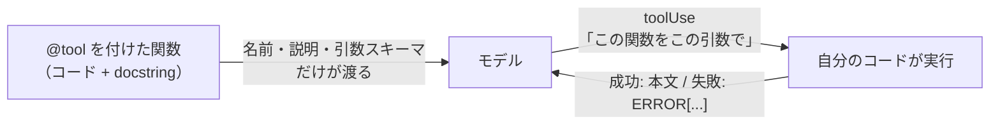

## 3.1 ツール設計とは

ツール設計では 3 つを決めます。1 つのツールにどこまでやらせるかという境界、モデルに何を伝えるか（名前と説明と引数スキーマ）という入力側の契約、モデルに何を返すか（成功時と失敗時）という出力側の契約です。



普通の関数設計と違うのは、呼び出し元がモデルで、その判断が確率的である点です。
人間が書くコードなら、関数の使い方は呼び出し側のコードが保証します。
エージェントでは、モデルが説明文を読んで判断するので、説明文の質がそのまま呼び出しの正しさになります。
返り値も同じで、モデルは受け取った文字列を解釈して次の行動を決めます。

ツール設計は、コードの外側にある 2 つの文字列を設計する作業です。
この 2 つが曖昧だと、例外は発生しないままエージェントの出力の品質が下がります。
説明が曖昧ならモデルはツールを誤用し、失敗時に空文字列を返せば推測で埋めた報告が返り、
取得した内容を丸ごと返せば毎ターンの入力が増えて費用が上がります。

## 3.2 境界を決める

`search_and_summarize` のような複合ツールは作りません。1 つにまとめると次が起きます。

- 「検索だけしたい」場面で使えるツールが無く、結局ツールが増え続ける
- 失敗時に検索と要約のどちらで失敗したか分からない
- 要約の質を直したいとき、要約処理がツールのコード内に固定されていて、プロンプトの修正では変えられない

原則は、判断はモデルに、作業はツールに任せることです。
検索という作業はツールが行い、結果の取捨と要約はモデルが判断します。

境界を絞ると、次の「含まないもの」が書けるようになります。
逆に責務が広いツールは、やらないことを列挙できません。

## 3.3 モデルに何を伝えるか

`@tool` が関数のシグネチャと docstring から Converse API の `toolSpec` を生成し、
そのままモデルに渡します。fetch_page なら、モデルに渡るのは次の JSON だけです。

```json
{
  "toolSpec": {
    "name": "fetch_page",
    "description": "<ここに docstring がそのまま入る>",
    "inputSchema": {"json": {"type": "object", "properties": {
      "url": {"type": "string"},
      "max_chars": {"type": "integer"}
    }}}
  }
}
```

モデルが見られるのは、この description の文章だけです。関数の中身は渡りません。

このリポジトリの規約は 3 節構成です。目的と使う場面を冒頭 2 文で書き、続けて次を書きます。

- 受け取るもの。パラメーターの形式と、やってはいけない渡し方
- 返すもの。成功時と失敗時（`ERROR[...]` で始まる）の両方の形式
- 含まないもの。このツールがやらないこと

3 節はそれぞれ、モデルが使うかどうかを判断する材料、引数を組み立てる材料、結果を解釈する材料になります。

```python
# 悪い例: 用途 1 行だけ
"""ページを取得する。"""

# 良い例: できないことまで書く
"""指定した URL のページ本文テキストを取得して返す。

受け取るもの:
    url: http:// か https:// で始まる URL だけを渡すこと。
返すもの:
    ページ本文のテキスト。失敗時は "ERROR[...]" で始まる文字列。
含まないもの:
    JavaScript の実行。認証が必要なページ。要約・抽出。
"""
```

3 つ目の「含まないもの」がもっとも誤用を防ぎます。
悪い例では、モデルはログインが必要な社内ページにもこのツールを使おうとします。
JavaScript で描画されるページでは取得した HTML が空になりますが、
モデルはそれを「このページに本文が無い」という事実として受け取り、
間違った前提のまま調査を続けます。

## 3.4 モデルに何を返すか

### 成功時に返す量

取得した内容をそのまま全部返すと、その全文が以降の毎ターンの入力に含まれ続け、
トークン費用が増え続けます。ハンズオンの `fetch_page` に `max_chars` があるのはこのためです。

### どの失敗をリトライするか

何を返すかを決める前に、そもそも返す段階まで来たかを判断します。
失敗には「時間を置けば直る可能性があるもの」と「何度呼んでも同じもの」があります。

| 失敗 | 意味 | fetch_page の行動 |
| --- | --- | --- |
| timeout / 5xx | 相手の混雑や一時障害 | リトライする |
| 403 / 404 などの 4xx | 依頼そのものが誤り | 即 `ERROR[...]` を返す |

リトライの間隔は指数バックオフ（1 秒 → 2 秒 → 4 秒）にします。
同じ短い間隔で呼び直すと、相手が復旧する前に試行を使い切ります。
タイムアウト値とリトライ回数はコードに書かず、`build_fetch_page_tool` の引数として外から注入します。

### 失敗時に何を返すか

ツール内で `except Exception: return ""` と書くと、モデルは空文字列を「0 件」と解釈し、
足りない情報を推測で埋めた報告を返します。ログにも何も残りません。

同じ 403 でも、返す文字列でモデルのその後の行動が変わります。

```
# 例外を捕まえて空文字列を返した場合
""    ← 「0 件だった」と解釈し、推測で埋める

# このリポジトリの形式（format_tool_error の出力）
ERROR[PageFetchError]: https://example.com/x が 403 を返しました。
retryable: no
next_action: この URL の本文は取得できません。検索結果のスニペットの範囲で報告してください。
```

下の形式を受け取ったモデルは、再試行が無意味なことと、代わりに何をすべきかを読み取れます。
`format_tool_error` は骨組み `exercises/fetch_page.py` に用意してあります。
例外に `retryable` と `hint` を持たせ、ツール層で `ERROR[...]` 形式の文字列に変換します。