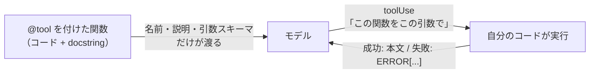
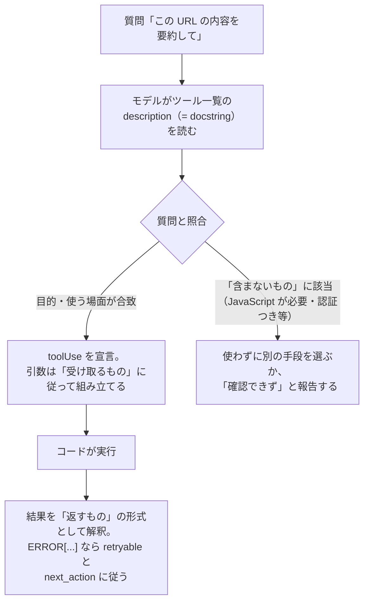

# 第3章 ツール設計

この章を終えると、規約に沿ったツールを 1 本自分で書けるようになります。
ハンズオンで `fetch_page`（ページ本文の取得）を実装し、自分の手で動かしたうえで、docstring の質・エラーの返し方・リトライの範囲まで機械判定にかけます。

この章も独立した uv プロジェクトです。最初に依存を入れてください。

```bash
cd 03-tool-design
uv sync
```

## 3.1 概要

ツール呼び出し（function calling）は、モデルが「この関数を、この引数で使いたい」と宣言し、実行はこちらのコードが行う仕組みです。
第2章で見たとおり、モデルに渡るのはツールの名前・説明・引数スキーマだけで、モデルはその文面から使いどころを推測します。



モデルから見えるのは、左端の説明の文章と、右端から返ってくる実行結果の文字列の 2 つだけです。
そのためツールの出来は、コードそのものより先に、この 2 つの文字列で決まります。

この 2 つが雑だと、例外は発生しないまま、エージェントの出力の品質が下がります。
説明が曖昧だとモデルはツールを誤用します。失敗時に空文字列を返せば、モデルは推測で埋めた報告を返します。本文を丸ごと返せば、毎ターンの入力が増えて費用が上がります。
どれも例外にならないぶん気づきにくく、この章の規約はこれを防ぐためにあります。

## 3.2 実装のポイント

### 3.2.1 docstring の書き方

Strands Agents では、`@tool` デコレーターを使って Python 関数をツール化します。
モデルはツールの説明（docstring）を頼りに、いつ・どのようにツールを使うかを判断します。
そのため、ツールの品質はコードと同じくらい docstring の書き方で決まります。

具体的には、`@tool` が関数のシグネチャと docstring から Converse API の `toolSpec` を生成し、そのままモデルに渡します。
この章で作る fetch_page なら、モデルに渡るのは次の JSON だけです。

```json
{
  "toolSpec": {
    "name": "fetch_page",
    "description": "<ここに docstring がそのまま入る>",
    "inputSchema": {"json": {"type": "object", "properties": {
      "url": {"type": "string"},
      "max_chars": {"type": "integer"}
    }}}
  }
}
```

関数の中身（コード）はモデルから見えません。
docstring を読むのは同僚ではなくモデルで、モデルにとってツールの正体はこの description の文章そのものです。

では何を書けばよいか。公式ドキュメントでは、ツールの説明に次の内容を含めるとよいとされています。

- ツールの目的
- どのような場面で使うか
- パラメーターの形式
- 期待される出力形式
- 制限事項や注意点

このリポジトリでは、これを 3 節構成の規約に落とし込んでいます。
目的と使う場面は docstring 冒頭の 2 文で書き、残りを次の 3 節で書きます。

- **受け取るもの** — パラメーターの形式と、やってはいけない渡し方（複数観点を 1 クエリに詰めない、など）
- **返すもの** — 期待される出力形式。成功時と失敗時（`ERROR[...]` で始まる、など）の両方
- **含まないもの** — 制限事項や注意点。このツールがやらないこと

docstring があると、モデルの処理はこう流れます。
3 節がそれぞれ「使うかどうかの判断」「引数の組み立て」「結果の解釈」の材料になります。



docstring が無い（または 1 行だけの）ツールでは、この図の照合と解釈がすべて名前からの推測になります。
3 つ目の「含まないもの」がもっとも誤用を防ぎます。悪い例と良い例を並べると差が分かります。

```python
# 悪い例: 用途 1 行だけ
"""ページを取得する。"""

# 良い例: できないことまで書く（ハンズオンで書く形の骨子）
"""指定した URL のページ本文テキストを取得して返す。

受け取るもの:
    url: http:// か https:// で始まる URL だけを渡すこと。
返すもの:
    ページ本文のテキスト。失敗時は "ERROR[...]" で始まる文字列。
含まないもの:
    JavaScript の実行。認証が必要なページ。要約・抽出。
"""
```

モデルは docstring から「できそうなこと」を推測するので、悪い例ではログインが必要な社内ページにもこのツールを使おうとします。
JavaScript で描画されるページでは取得した HTML が空になりますが、モデルはそれを「このページに本文が無い」という事実として受け取り、間違った前提のまま調査を続けます。
良い例のように「含まないもの」を明示しておくと、モデルは使う前に別の手段へ切り替えられます。

### 3.2.2 1 ツール 1 責務

`search_and_summarize` のような複合ツールは作りません。1 つにまとめると次が起きます。

- 「検索だけしたい」場面で使えるツールが無く、結局ツールが増え続ける
- 失敗時に検索と要約のどちらで失敗したか分からない
- 要約の質を直したいとき、要約処理がツールのコード内に固定されていて、プロンプトの修正では変えられない

原則は、判断はモデルに、作業はツールに任せることです。
検索という作業はツールが行い、結果の取捨と要約はモデルが判断します。

### 3.2.3 ツールが失敗したときに何を返すか

ツール内で `except Exception: return ""` と書くと何が起きるか。
モデルは空文字列を「検索したが 0 件」と解釈し、足りない情報を推測で埋めて、もっともらしい報告を書き上げます。
ログには何も残らず、開発者は品質劣化の原因を追えません。

同じ 403 失敗でも、モデルが受け取る文字列でその後の行動が変わります。

```
# 例外を捕まえて空文字列を返した場合にモデルが受け取るもの
""    ← 「0 件だった」と解釈し、推測で埋める

# このリポジトリの形式でモデルが受け取るもの（format_tool_error の実際の出力）
ERROR[PageFetchError]: https://example.com/x が 403 を返しました。
retryable: no
next_action: この URL の本文は取得できません。検索結果のスニペットの範囲で報告してください。
```

下の形を受け取ったモデルは、再試行が無意味なこと・代わりに何をすべきかを読み取れます。
この形式を作る `format_tool_error` は、骨組み `exercises/fetch_page.py` に用意してあります:

- 例外に `retryable`（再試行に意味があるか）と `hint`（次に取るべき行動）を持たせる
- ツール層で `format_tool_error()` により `ERROR[...]` 形式の文字列にしてモデルへ返す
- retryable: no と next_action を読んだモデルは、推測で埋める代わりに「確認できず」と報告する

### 3.2.4 どの失敗をリトライするか

外部 API の呼び出しは、相手の混雑や一時障害でときどき失敗します。
ただし失敗には「時間を置けば直る可能性があるもの」と「何度呼んでも同じもの」があり、区別せず全部リトライすると、直らない失敗のために待ち時間と費用を無駄にします。
そのため失敗の種類で行動を分けます。この章で作る fetch_page の方針は次の 2 行です。

| 失敗 | 意味 | fetch_page の行動 |
| --- | --- | --- |
| timeout / 5xx | 相手の混雑や一時障害 | リトライする |
| 403 / 404 などの 4xx | 依頼そのものが誤り | 即 `ERROR[...]` を返す |

5xx は時間を置けば直る可能性があり、4xx は何度呼んでも結果が同じです。

リトライの間隔は指数バックオフ（1 秒 → 2 秒 → 4 秒と倍にしていく）にします。
毎回同じ短い間隔で呼び直すと、相手が復旧する前に試行を使い切りやすく、障害中の相手に負荷をかけ続けることにもなるためです。
リトライ回数 2 回のときの動きを時系列にするとこうなります。

```
試行 1 → timeout → 1 秒待つ → 試行 2 → timeout → 2 秒待つ → 試行 3 → timeout
→ ここで諦めて ERROR[PageFetchTimeout] を返す（試行 = 初回 1 + リトライ 2 = 3 回）
```

タイムアウト値とリトライ回数はコードに書かず、`build_fetch_page_tool` の引数として外から注入します。

返す量もツール側で決めます。
取得した HTML をそのまま全部返すと、その全文が以降の毎ターンの入力に含まれ続け、トークン費用が増え続けます。
ハンズオンの `fetch_page` に `max_chars` があるのはこのためです。

## 3.3 【ハンズオン】fetch_page を実装する

検索結果のスニペット（検索エンジンが返す本文の抜粋）では足りないとき、出典 URL の本文を取得するツールを作ります。
編集するのは `exercises/fetch_page.py` の 1 ファイルだけです。

### 3.3.1 TODO を 4 つ埋める

`exercises/fetch_page.py` を開いてください。
エラーの型（`ERROR[...]` を作る仕組み）と設定注入の枠は書いてあり、TODO が 4 つ残っています。

1. docstring — 3.2.1 の 3 節構成で書く。モデルに渡る仕様書なので、これも実装の一部
2. URL の検証 — `http://` / `https://` 以外は取得を試みず `ERROR[` 形式で拒否する
3. 取得ループの中身 — httpx で GET し、200 系は `max_chars` で切り詰めて返す。4xx は即エラー、5xx とタイムアウトはリトライ（3.2.4 の方針そのまま）
4. 全試行が失敗したときのエラー返却

先に判定テスト `verify/test_fetch_page.py` を読むと分かりやすくなります。
要求仕様そのものになっています。

### 3.3.2 自分の手で呼ぶ

実装できたら TODO コメントを消し、判定の前に動かします。
成功と失敗の両方を呼ぶスクリプトを用意してあります（編集不要）。

```bash
uv run 01_call_fetch_page.py
```

成功側は「Example Domain」を含む HTML の先頭 200 文字が表示され（HTML の整形はこのツールの「含まないもの」です）、失敗側は 3.2.3 と同じ 3 行（`ERROR[PageFetchError]: ...` / `retryable: no` / `next_action: ...`）が表示されるはずです。
モデルが失敗時に受け取るのは、いまあなたが書いたこの文字列です。

### 3.3.3 合格判定

手動で見たのは 2 ケースだけです。
リトライ回数や 4xx の扱いまで含めた全仕様は verify が検査します。

```bash
uv run pytest -q
```

`7 passed` で合格です。

<details>
<summary>解答例</summary>

```python
    @tool
    def fetch_page(url: str, max_chars: int = 4000) -> str:
        """指定した URL のページ本文テキストを取得して返す。

        検索結果のスニペットだけでは情報が足りず、出典ページの本文を確認したいときに使う。

        受け取るもの:
            url: 取得したいページの URL。http:// か https:// で始まるものだけを渡すこと。
            max_chars: 返す本文の最大文字数。既定 4000。長いページは先頭から切り詰められる。

        返すもの:
            ページ本文のテキスト（max_chars で切り詰め済み）。
            失敗した場合は "ERROR[...]" で始まる文字列を返し、retryable と next_action を含む。

        含まないもの:
            - JavaScript の実行。動的レンダリングが必要なページは本文が取れないことがある。
            - 認証が必要なページ、ログインの背後にある情報。
            - HTML の整形・要約・抽出。取得したテキストをそのまま返す。要約はあなたの仕事。
        """
        if not url.startswith(("http://", "https://")):
            return format_tool_error(
                PageFetchError(f"http/https 以外の URL は取得できません: {url}")
            )

        last_error: Exception | None = None
        for attempt in range(max_retries + 1):
            try:
                with httpx.Client(timeout=timeout_seconds, follow_redirects=True) as client:
                    response = client.get(url)
            except httpx.TimeoutException as exc:
                last_error = exc
            else:
                if response.status_code >= 500:
                    last_error = PageFetchError(f"{url} が {response.status_code} を返しました。")
                elif response.status_code >= 400:
                    # 4xx はリトライしても直らない。即座に報告する
                    return format_tool_error(
                        PageFetchError(f"{url} が {response.status_code} を返しました。")
                    )
                else:
                    return response.text[:max_chars]

            if attempt < max_retries:
                time.sleep(2**attempt)

        if isinstance(last_error, httpx.TimeoutException):
            return format_tool_error(
                PageFetchTimeout(
                    f"{url} の取得が {max_retries + 1} 回ともタイムアウトしました。"
                )
            )
        return format_tool_error(PageFetchError(f"{url} の取得に失敗しました: {last_error}"))
```

全文は `solutions/fetch_page.py` にあります。

</details>

### 3.3.4 エージェントから呼ばせる

ここまでの呼び出し主体は、自分（3.3.2）とテスト（3.3.3）でした。
本来の使われ方は 3 つ目、モデルが docstring を読んで呼ぶ形です。Bedrock を 1 回呼びます。

```bash
uv run 02_agent_call.py
```

モデルが toolUse（ツールを使うという宣言。第2章 2.1.2）で fetch_page を選び、取得した本文をもとに 1 行の要約が返るはずです。
質問文に「fetch_page を使え」とは書いていません。docstring だけを頼りに選ばれています。

## 3.4 まとめ

ツール設計の中心は、**docstring をモデル向けの仕様書として書く**ことです。
責務の限定も、`ERROR[...]` でのエラー返却も、範囲を絞ったリトライも、モデルに次の行動を正しく判断させるための材料です。
fetch_page の verify が通ったら第4章へ進んでください。今度はツール呼び出しに上限を掛けて、暴走をコードで止めます。

## 次の章

[第4章 コストと暴走の制御](../04-cost-control/)
