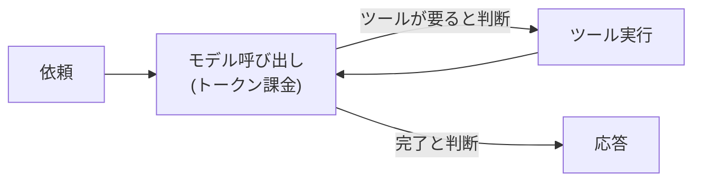

# 第4章 コストと暴走の制御

この章を終えると、Strands の hooks でエージェント実行に割り込めるようになります。
ハンズオンでは「トークン量で止めるガード」を自作し、フレームワークに無い制御を
自分で足せることを確かめます。

## 4.1 概要

### 4.1.1 エージェントのコスト構造

エージェントは従量課金 API を自律的に叩くプログラムです。第1章で見たとおり
モデル呼び出しはトークン量で課金され、第2章のループはその呼び出しを何周も
繰り返します。1 周あたりの金額は小さくても、総額は「単価 × 周回数」であり、
その周回数はコードのどこにも書かれていません。



ループを止める条件が「モデルの判断」であること。これがコスト構造のリスクの正体です。

### 4.1.2 暴走とは何か

モデルが「もう 1 回検索すれば分かるはず」と判断し続ける限りループは止まらず、
1 回の暴走で数千円〜数万円が数分で消えます。デモでは起きず、本番の複雑な質問で
初めて起きるのが厄介なところです。

「やりすぎないでください」とプロンプトに書いても、守られる保証がありません。
だから上限はコードで掛けます。CLAUDE.md の規約に「ガードを外すな」とあるのは
このためです。

### 4.1.3 アプリ層とマネージド層

ここで作るのはアプリ層のセーフガードです。有害コンテンツや PII のフィルタは
Bedrock Guardrails（マネージド層）の担当で役割が別。併用します（第17章で扱います）。

## 4.2 実装のポイント

### 4.2.1 hooks で割り込む

`HookProvider` を実装して `Agent(hooks=[...])` に渡すと、実行の各時点で
コールバックが呼ばれます。使うイベントは 4 つです。

| イベント | タイミング | 用途 |
| --- | --- | --- |
| `BeforeInvocationEvent` | リクエスト開始 | カウンタのリセット |
| `BeforeModelCallEvent` | モデル呼び出し直前 | ターン数上限（`event.cancel`） |
| `BeforeToolCallEvent` | ツール実行直前 | ツール回数上限（`event.cancel_tool`） |
| `AfterInvocationEvent` | リクエスト完了 | トークン消費のログ |

ターン数を自前で数えている理由も知っておいてください。Strands 1.52.0 には
max_turns 相当の組み込み設定がありません（`Agent.__init__` の全引数を確認済み）。
無い機能は hooks で足す。それがこの章のハンズオンです。

### 4.2.2 止めるときは理由を渡す

`cancel_tool` / `cancel` は `bool | str` 型で、
文字列を入れるとそれが中断理由としてモデルに渡ります。`guards.py` では
「上限 12 回に達しました。ここまでの情報で結論をまとめてください」という文を
入れています。bool で黙って止めると、モデルは「ツールが壊れた」と解釈して
同じ呼び出しを繰り返します。理由を渡せば、まとめる方向へ切り替わる。
`orchestrator.py` のシステムプロンプトには「上限の通知を受け取ったら、それ以上調べず
手持ちの情報でまとめる」という受け手側の指示があり、ガードが渡すこの文と対になっています。

### 4.2.3 計測なしに最適化はない

`AgentResult.metrics` から取れる値:

- `accumulated_usage` — inputTokens / outputTokens / totalTokens の累計
- `cycle_count` — ループの周回数
- `cycle_durations` — 各周回の所要時間

`guards.py` の UsageLogger がこれをリクエストごとに構造化ログへ出します。
role フィールド付きなので、どの役割のエージェントがいくら使ったかを後から
集計できます。「先月からコストが 3 倍。原因は？」に答えられるかは、この計測を
最初から仕込んでいたかで決まります。

先に読むファイル:

- `07-full-app/src/guards.py` — 3 つのガード全部で 190 行
- `07-full-app/tests/test_guards.py` — イベントを手で作って hook を検証する技法（第6章で再登場）
- `07-full-app/src/config.py` — 上限値の外出し

## 4.3 【ハンズオン】CostLimiter を自作する

回数ではなくトークン量で止めるガードを `07-full-app/src/guards.py` に追加します。

機能要件:

1. `CostLimiter(max_total_tokens: int)` — dataclass の `HookProvider`
2. `BeforeModelCallEvent` の `projected_input_tokens`（次のモデル呼び出しの予測入力量。
   Strands が計算してイベントに載せてくる）を積算する。`None` のときは加算しない
3. 積算が上限を超えたら `event.cancel` に理由の文字列を入れて止める。
   理由には上限値と「手持ちの情報でまとめよ」という次の行動を含める
4. `BeforeInvocationEvent` で積算をリセットする（インスタンスはリクエストを跨いで使い回される）
5. 止めたとき `log_event` で WARNING を出す（`message="cost_limit_exceeded"`）

設定要件:

6. `Settings` に `max_total_input_tokens: int`（既定 50_000、`ge=1000`）を追加し、
   既定値に根拠コメントを書く（数値の正しさより「根拠を書く習慣」を判定します）
7. `build_guards()` の `Guards` に `cost_limiter` を追加し、`hooks` に含める

`TurnLimiter` がほぼ同型なので、それを読んでから書くのが近道です。

```bash
uv run --project 07-full-app pytest 04-cost-control/verify -q
```

`6 passed` で合格。既存テストが壊れていないことも確認してください。

```bash
cd 07-full-app && uv run pytest -q
```

## 4.4 まとめ

エージェントのコストは「単価 × 周回数」で、周回数を決めるのはモデルの判断です。
だからプロンプトのお願いではなく hooks でコードの上限を掛け、止めるときは
理由の文字列を渡してまとめる方向へ切り替えさせます。**上限は止めるためではなく、
まとめさせるために掛ける**。UsageLogger でリクエストごとの消費を計測していて初めて、
上限値の調整もコストの説明もできます。

自作した CostLimiter はこの先の章でも外しません。次章では、このガードを付けたまま
エージェントを役割ごとに分割します。

## 次の章

[第5章 マルチエージェント](../05-multi-agent/)
