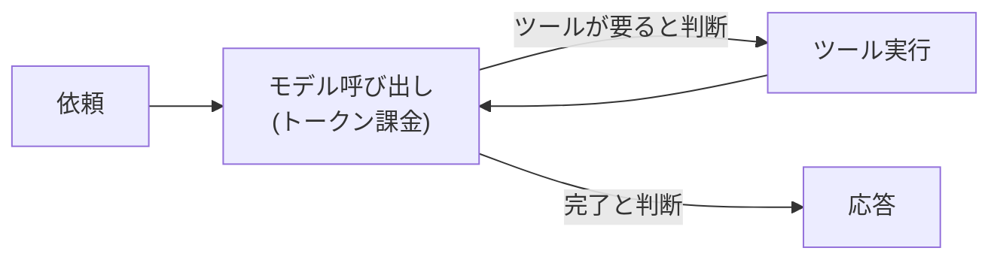
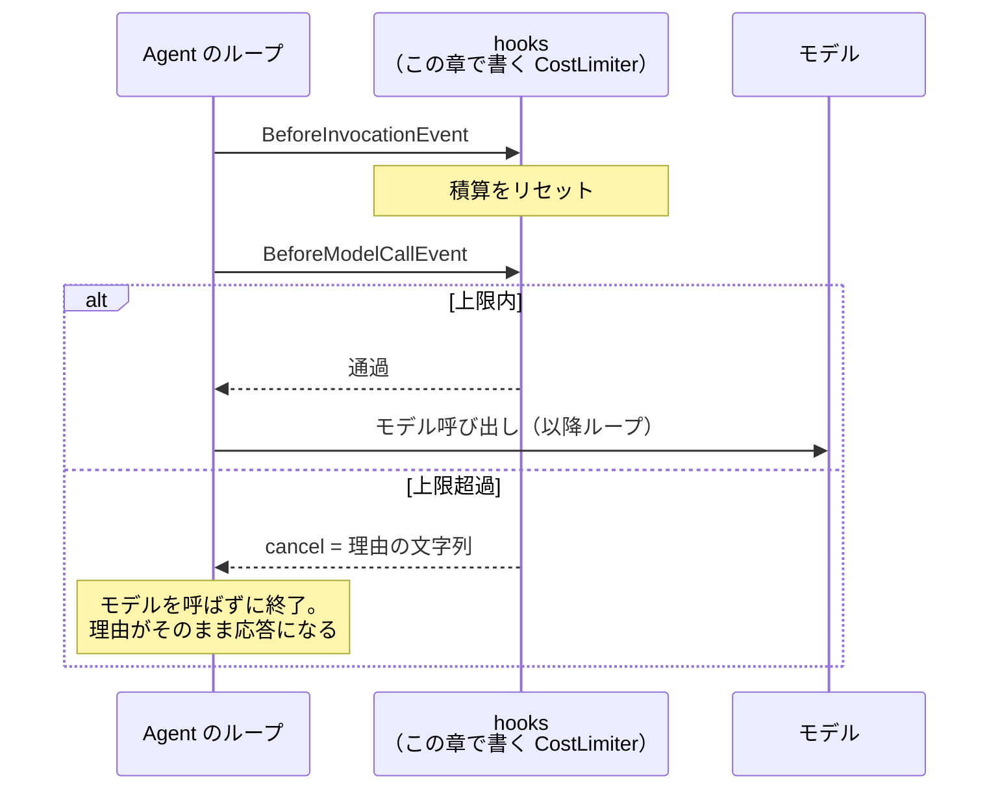

# 第4章 コストと暴走の制御

この章を終えると、Strands の hooks でエージェントの実行に割り込めるようになります。
ハンズオンでは「トークン量で止めるガード」を自作し、フレームワークに無い制御を自分で足せることを確かめます。

この章も独立した uv プロジェクトです。最初に依存を入れてください。

```bash
cd 04-cost-control
uv sync
```

## 4.1 概要

### 4.1.1 エージェントのコスト構造

エージェントは従量課金 API を自律的に叩くプログラムです。
第1章で見たとおりモデル呼び出しはトークン量で課金され、第2章のループはその呼び出しを何周も繰り返します。
1 周あたりの金額は小さくても、総額は「単価 × 周回数」であり、その周回数はコードのどこにも書かれていません。



ループを止める条件が「モデルの判断」であること。これがコスト構造のリスクの正体です。

### 4.1.2 暴走の起き方

モデルが「もう 1 回検索すれば分かるはず」と判断し続ける限りループは止まらず、1 回の暴走で数千円から数万円が数分で消えます。
デモでは起きず、本番の複雑な質問で初めて起きるのが厄介なところです。

「やりすぎないでください」とプロンプトに書いても、守られる保証がありません。
だから上限はコードで掛けます。

### 4.1.3 アプリ層とマネージド層

この章で作るのはアプリ層のセーフガードです。
有害コンテンツや PII のフィルタは Bedrock Guardrails（マネージド層）の担当で役割が別です。併用します（第17章）。

## 4.2 実装のポイント

### 4.2.1 hooks の仕組み

Strands では、`register_hooks` メソッドを持つクラスを `Agent(hooks=[...])` に渡すと、実行の節目ごとにコールバックが呼ばれます。
使うイベントは 4 つです。

| イベント | タイミング | 用途 |
| --- | --- | --- |
| `BeforeInvocationEvent` | リクエスト開始 | カウンタのリセット |
| `BeforeModelCallEvent` | モデル呼び出し直前 | ターン数・トークン量の上限（`event.cancel`） |
| `BeforeToolCallEvent` | ツール実行直前 | ツール回数の上限（`event.cancel_tool`） |
| `AfterInvocationEvent` | リクエスト完了 | トークン消費のログ |

第2章のループに重ねると、割り込む位置はこうなります。



Strands 1.52.0 には max_turns のような組み込みの上限設定がありません（`Agent.__init__` の全引数を確認済み）。
無い機能は hooks で足す。それがこの章のハンズオンです。

### 4.2.2 中断理由の渡し方

止めるときは bool ではなく、理由の文字列を渡します。
ただし止め方は 2 つあり、渡した理由の行き先が違います。

| 止め方 | 理由の行き先 | その後 |
| --- | --- | --- |
| `BeforeToolCallEvent` の `cancel_tool = "理由"` | ツール結果の代わりにモデルへ渡る | ループは続き、モデルは理由を読んで手持ちの情報でまとめ直せる |
| `BeforeModelCallEvent` の `cancel = "理由"` | そのまま最終応答になる | モデルは呼ばれず、リクエストはそこで終わる |

`cancel_tool` を bool で黙って止めると、モデルは「ツールが壊れた」と解釈して同じ呼び出しを繰り返します。
理由の文字列を渡せば、まとめる方向へ切り替わります。
この章で作る CostLimiter は後者の打ち切り型で、理由の文字列は利用者への説明になります。
「まとめ直させたい」上限（ツール回数など）は前者で掛けます。

### 4.2.3 トークン消費の計測

上限値をいくつにするかは、計測してから決めます。
`AgentResult.metrics` から取れる値は次の 3 つです。

- `accumulated_usage` — inputTokens / outputTokens / totalTokens の累計
- `cycle_count` — ループの周回数
- `cycle_durations` — 各周回の所要時間

これをリクエストごとにログへ出し続けておくと、「先月からコストが 3 倍になった。原因は？」に実測で答えられます。
計測が先、上限値の調整はその後です。

## 4.3 【ハンズオン】CostLimiter を自作する

回数ではなくトークン量で止めるガードを作ります。
編集するのは `exercises/cost_limiter.py` の 1 ファイルだけです。

### 4.3.1 TODO を 3 つ埋める

`exercises/cost_limiter.py` を開いてください。
dataclass の枠と積算用のフィールドは書いてあり、TODO が 3 つ残っています。

1. `register_hooks` — 2 つのイベントへのコールバック登録（4.2.1 の表のとおり）
2. `_reset` — リクエスト開始時に積算を 0 に戻す
3. `_check` — `projected_input_tokens`（次のモデル呼び出しの予測入力量。Strands が計算してイベントに載せてくる）を積算し、上限を超えたら `event.cancel` に理由の文字列を入れる。`None` のときは加算しない

先に判定テスト `verify/test_cost_limiter.py` を読むのも近道です。
イベントを手で作って hook を検証する技法は、第6章でも使います。

### 4.3.2 イベントを流して止める

実装できたら TODO コメントを消し、判定の前に動かします。
モデルを呼ばずに、イベントだけを手で流すスクリプトを用意してあります（編集不要）。

```bash
uv run 01_fire_events.py
```

毎ターン 4,000 トークンの想定で流すので、上限 10,000 に対してこう表示されるはずです。

```
ターン 1: 通過（積算 4,000 / 上限 10,000）
ターン 2: 通過（積算 8,000 / 上限 10,000）
ターン 3: 中断。モデルに渡る理由 ->
  入力トークンの概算上限 (10000) に達したため中断しました。追加の調査はせず、ここまでの情報で結論をまとめてください。
```

### 4.3.3 合格判定

```bash
uv run pytest -q
```

`5 passed` で合格です。
上限内で止めないこと・理由が文字列で上限値を含むこと・None を加算しないこと・リクエスト間でリセットされることを検査します。

<details>
<summary>解答例</summary>

```python
    def register_hooks(self, registry: HookRegistry, **kwargs: object) -> None:
        registry.add_callback(BeforeInvocationEvent, self._reset)
        registry.add_callback(BeforeModelCallEvent, self._check)

    def _reset(self, event: BeforeInvocationEvent) -> None:
        self._accumulated = 0

    def _check(self, event: BeforeModelCallEvent) -> None:
        projected = event.projected_input_tokens
        if projected is None:
            # 予測が取れないターンは加算しない。過剰に厳しく止めない
            return
        self._accumulated += int(projected)
        if self._accumulated > self.max_total_tokens:
            event.cancel = (
                f"入力トークンの概算上限 ({self.max_total_tokens}) に達したため中断しました。"
                "追加の調査はせず、ここまでの情報で結論をまとめてください。"
            )
            logger.warning(
                "cost_limit_exceeded limit=%s accumulated=%s",
                self.max_total_tokens,
                self._accumulated,
            )
```

全文は `solutions/cost_limiter.py` にあります。

</details>

### 4.3.4 エージェントで観察する（任意）

自作した CostLimiter を実エージェントに付けて走らせます。Bedrock を呼びます。

```bash
uv run 02_agent_with_limit.py
```

長文を返す lookup ツールを 3 回呼ばせる依頼に対し、上限 6,000 トークンを掛けてあります。
履歴が膨らんで上限に達したターンでモデル呼び出しが中断され、最終応答が CostLimiter の理由の文字列そのものになるはずです。
4.2.2 の表の「打ち切り型」を実物で確認できます。

## 4.4 まとめ

エージェントのコストは「単価 × 周回数」で、周回数を決めるのはモデルの判断です。
だからプロンプトのお願いではなく hooks でコードの上限を掛けます。
止めるときは理由の文字列を渡し、**まとめ直させたいなら `cancel_tool`、打ち切るなら `cancel`** と、理由の行き先で使い分けます。
消費の計測をログに残していて初めて、上限値の調整もコストの説明もできます。
次の第5章では、エージェントを役割ごとに分割してコストと品質を両立させる側に進みます。

## 次の章

[第5章 マルチエージェント](../05-multi-agent/)
