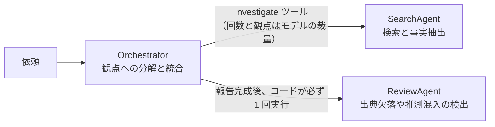

# 第5章 マルチエージェント

この章を終えると、エージェントを分割すべきかを判断でき、分割するなら「どこをモデルの裁量に任せ、どこをコードで固定するか」を理由付きで決められるようになります。
ハンズオンでは、価格調査の専門エージェントを組み立て、エージェントごとツールにしてオーケストレータへ渡します。

この章も独立した uv プロジェクトです。最初に依存を入れてください。

```bash
cd 05-multi-agent
uv sync
```

## 5.1 概要

### 5.1.1 役割ごとの分割

1 つのエージェントにすべてをやらせる代わりに、役割ごとの専門エージェントに分けて連携させる構成です。
役割を分けると、それぞれのシステムプロンプトを短く保て、役割に見合ったモデルを個別に選べるようになります。

### 5.1.2 分割の判断基準

1 つで足りる処理を分割すると、遅くなり、費用が増え、デバッグ対象も増えます。
分割ありきで構成を決めず、まず 1 つで足りるかを確かめます。

分割を検討するのは、次の症状が出たときです。

- システムプロンプトが長大化し、どの指示がモデルの挙動に影響しているか分からない
- 全工程に上位モデルを使っていてコストが下げられない
- 「検索の質」と「統合の質」を別々に改善したいのに、両方が 1 つのプロンプトに混ざっていて片方だけを変えられない

責務が違い、必要な能力（= モデル）が違うなら分けます。

## 5.2 実装のポイント

### 5.2.1 競合リサーチエージェントの役割分担

この教材の題材である競合リサーチエージェントは、3 つの役割に分かれています。



- Orchestrator — 観点への分解と統合。判断を伴うので、上位モデルに差し替える候補
- SearchAgent — クエリ整形と事実抽出だけの定型処理。軽量モデルで足りる
- ReviewAgent — 出典欠落や推測混入の検出。見逃しがそのまま報告の信頼性を落とすので、上位モデルに差し替える候補

コストの差は、役割ごとのモデル選択でつきます。
Haiku（入力 $1 / 出力 $5、100万トークンあたり）と Sonnet（$3 / $15）の単価差は 3 倍あるので、理由なく全役割に上位モデルを配ると費用はそれだけで数倍になります。
この教材の既定は全役割とも Haiku です。役割ごとにモデル ID の設定を分けてあるのは、判断を伴う役割だけを上位モデルに差し替えられるようにするためです。

### 5.2.2 agents-as-tools

Strands では、エージェントの呼び出しを `@tool` を付けた関数に入れると、別のエージェントからはツールとして見えます。
専門エージェントを増やす仕組みはこれだけです。

```python
@tool
def compare_pricing(companies: str) -> str:
    """（docstring がそのままツールの説明としてモデルに渡る）"""
    result = specialist_agent(f"次の企業の価格を比較してください: {companies}")
    return str(result)
```

呼び出す側のモデルに渡るのは、第3章のツールと同じで name と description と inputSchema だけです。中でエージェントが動いていることを、オーケストレータは知りません。
したがって第3章の規約がそのまま適用されます。docstring は 3 節構成で書き、「企業名は 2 社以上渡すこと」のような使い方の制約まで docstring がモデルに教えます。

Strands の他パターンとの使い分け:

- agents-as-tools — 上位が判断しながら委任する
- Graph — 手順が固定のパイプライン。分岐や並列を宣言的に固定したいとき
- Swarm — エージェント同士の対等な協調。コスト予測が難しく、最後の手段

### 5.2.3 どこをモデルに任せ、どこをコードで固定するか

競合リサーチエージェントで、SearchAgent と ReviewAgent は呼ばれ方が違います。

- SearchAgent は**ツール**。何回、どの観点で呼ぶかはモデルの裁量。依頼ごとに最適な分解が違うから、固定しないことに LLM を使う価値がある
- ReviewAgent は**コードが必ず 1 回実行**。ツールにすると、モデルが「今回はレビュー不要」と判断した瞬間に検証がスキップされる
- 修正回数もコードで 1 回に固定。「revise が出る限り修正」にすると、コストとターン数の上限が決まらなくなる

同じ判断を細部にも適用しています。ReviewAgent の判定行（VERDICT）がパースできなかったとき、この構成では「問題なし」ではなく revise と同じ扱いにします。パースに失敗しただけで、報告が検証されないまま通ることを防ぐためです。

迷ったときは、その工程がスキップされたときに誰かが困るかで判断します。
困るならコードで固定し、困らないなら裁量に任せます。

## 5.3 【ハンズオン】専門エージェントのツール化

価格調査だけを担当する専門エージェントを組み立て、エージェントごとツールにします。
編集するのは `exercises/specialist.py` の 1 ファイルだけです。

固定の価格データ（`PRICING_DATA`）と、それを引く `lookup_pricing` ツール、システムプロンプトは用意してあります。
`exercises/tool_call_limiter.py` は第4章で作った CostLimiter の回数版で、これも編集不要です。

### 5.3.1 TODO を 3 つ埋める

`exercises/specialist.py` を開いてください。TODO が 3 つ残っています。

1. `build_specialist_agent` — 専門エージェントの組み立て。モデル、システムプロンプト、`lookup_pricing`、そして hooks に `ToolCallLimiter`
2. `compare_pricing` の docstring — 第3章の 3 節構成。「含まないもの」に価格以外（機能や評判）を調べないことを明記する
3. `compare_pricing` の中身 — 専門エージェントに依頼文を渡し、結果を文字列で返す

先に判定テスト `verify/test_specialist.py` を読むと分かりやすくなります。

### 5.3.2 モデルに渡る定義を確認する

実装できたら TODO コメントを消し、モデルを呼ばずに動かします。

```bash
uv run 01_show_tool_spec.py
```

compare_pricing の name と description と inputSchema（第3章 3.2.1 の `toolSpec`）が JSON で表示されるはずです。description の中身は、いま自分が書いた docstring です。
オーケストレータのモデルに渡るのはこの JSON だけで、中でエージェントが動いていることはどこにも書かれていません。

### 5.3.3 合格判定

```bash
uv run pytest -q
```

`5 passed` で合格です。
@tool が付いていることとツール名、docstring の 3 節、専門エージェントの呼び出し、ガードの発動を検査します。モデルは呼びません。

<details>
<summary>解答例</summary>

```python
def build_specialist_agent() -> Agent:
    """価格調査の専門エージェントを組み立てて返す。"""
    return Agent(
        name="PricingSpecialist",
        # 価格の検索と表への整形は定型処理なので、軽量モデル（Haiku）で足りる。
        # 「どの企業を比較すべきか」の判断は呼び出し側（オーケストレータ）の仕事
        model=BedrockModel(
            region_name=os.environ.get("AWS_REGION", "us-east-1"),
            model_id=MODEL_ID,
            max_tokens=1024,
        ),
        system_prompt=SYSTEM_PROMPT,
        tools=[lookup_pricing],
        hooks=[ToolCallLimiter(max_calls=4)],  # ガードなしのエージェントを新設しない
        callback_handler=None,  # 専門エージェントの途中経過を呼び出し側の出力に混ぜない
    )


def build_specialist_tool():
    """専門エージェントをツールとして返す。オーケストレータはこれを tools に載せる。"""
    agent = build_specialist_agent()

    @tool
    def compare_pricing(companies: str) -> str:
        """指定された企業の料金プランを調べ、Markdown の比較表で返す。

        利用者が複数企業の価格の比較を求めているときに使う。

        受け取るもの:
            companies: 比較したい企業名をカンマや読点で並べた文字列。
                例: 「Acme Analytics, Globex Insights」。2 社以上を渡すこと。

        返すもの:
            行 = 企業、列 = プランの Markdown 表。確認できなかったセルは「不明」。

        含まないもの:
            - 価格以外の情報（機能や評判）。
            - どの企業が安い・優れているかの判断。判断はあなた（呼び出し側）の仕事。
        """
        result = agent(f"次の企業の価格を比較してください: {companies}")
        return str(result)

    return compare_pricing
```

全文は `solutions/specialist.py` にあります。

</details>

### 5.3.4 オーケストレータから呼ぶ

作った compare_pricing をオーケストレータの tools に載せて動かします。Bedrock を呼びます。

```bash
uv run 02_orchestrator.py
```

オーケストレータが toolUse で compare_pricing を選び、専門エージェントが lookup_pricing を企業ごとに呼んで、比較表をもとにした回答が返るはずです。

## 5.4 まとめ

マルチエージェントの設計判断は、分けるかどうかよりも「分けた後にどう呼ぶか」に表れます。
スキップされたら困る工程はコードで固定し、依頼ごとに最適解が変わる工程だけをモデルの裁量に残します。

エージェント同士の呼び出しが正しく繋がっていることを、人手で確かめ続けることはできません。
この章の verify がモデルを呼ばずにそれを検査したように、次章ではエージェントのテストの書き方そのものを扱います。

## 次の章

[第6章 エージェントのテスト](../06-agent-testing/)
