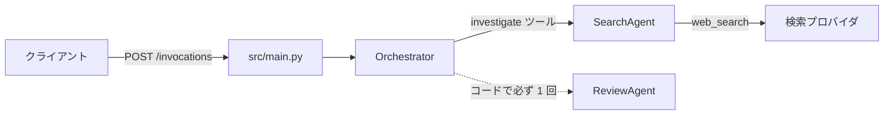

# 第7章 完成形を通読する

このディレクトリは章であると同時に、動くコードの本体です。
各章のハンズオンは章内で完結するので、この本体は「各章で自作したものの完成形」として読み、動かします。
終えると、1 リクエストがどのファイルをどの順に通るか、どのファイルがどの章に対応するかを言える状態になります。

依存を先に入れてください。

```bash
cd 07-full-app
uv sync
```

## 7.1 概要

### 7.1.1 このアプリは何か

競合リサーチエージェントです。調査依頼を受け取り、観点への分解・Web 検索・
報告への統合・出力の検証までを 3 つのエージェントで分担します。モデルは役割ごとに
環境変数で差し替えられ、既定は全役割とも安価な Haiku 4.5 です。判断が要る
Orchestrator と ReviewAgent は、上位モデルに差し替える候補です（第5章）。

構成には設計判断がひとつ埋まっています。SearchAgent は Orchestrator が
ツールとして呼びます（agents-as-tools）が、ReviewAgent はモデルの裁量に任せず、
`orchestrator.py` のコードで決定的に最後に 1 回実行します。実行するかどうかを
モデルの判断に委ねると、検証が省略されることがあるためです。

### 7.1.2 1 リクエストの処理の流れ



1. `src/main.py` が POST /invocations を受ける。HTTP 契約を知るのはこのファイルだけ
2. Orchestrator が依頼を調査観点に分解する
3. 観点ごとに investigate ツール = SearchAgent が web_search で調べ、事実と出典を返す
4. Orchestrator が報告に統合する
5. コードが ReviewAgent を必ず 1 回実行して検証する
6. revise 判定なら修正を 1 回だけ試みて、結果を返す

すべてのエージェントに guards（ツール上限・ターン上限・トークン計測）が付きます。
ガードなしのエージェントはこのリポジトリに存在しません。

## 7.2 【ハンズオン】まず動かす

コードを読む前に一度動かしておくと、各ファイルの役割を実際の挙動と
結びつけながら読めます。

```bash
cd 07-full-app
uv run python -m src.main
```

起動ログの 1 行目に、解決済みモデル ID の一覧が JSON で出ます。
別のターミナルからヘルスチェックを呼びます。

```bash
curl http://127.0.0.1:8080/ping
```

`{"status":"Healthy",...}` が返るはずです。確認したら Ctrl+C で止めてください。

`address already in use` で起動しない場合は、macOS の Docker Desktop が 8080 番を
使用しています。ポートを変えて起動し直してください（troubleshooting.md 参照）。

```bash
SERVER_PORT=8181 uv run python -m src.main
```

## 7.3 実装のポイント

### 7.3.1 ファイルと章の対応

| ファイル | 内容 | 章 |
| --- | --- | --- |
| `src/config.py` | 環境変数を読む唯一の場所 | 1 |
| `src/agents/orchestrator.py` | 分解と統合、Review の実行 | 2, 5 |
| `src/agents/*_agent.py` | 専門エージェント | 5 |
| `src/tools/` | ツールと外部 API の作法 | 3 |
| `src/errors.py` | retryable を持つ例外 | 3 |
| `src/guards.py` | 上限ガードとトークン計測 | 4 |
| `src/observability.py` | 構造化ログと request_id | 4 |
| `tests/`（38 件） | LLM を呼ばないテスト | 6 |
| `src/main.py` / `Dockerfile` | エントリポイントとコンテナ | 8 |

`src/tools/fetch_page.py` は第3章で自作するものと同じ実装です。
この表はファイルから章を引く向きなので、逆向き、つまり開発工程のどこで
どの章の話になるかは、リポジトリ直下の README にある工程図を見てください。

### 7.3.2 普段のコマンド

```bash
uv run pytest
```

```bash
uv run ruff check . && uv run mypy src
```

設定は `cp .env.example .env` して編集します。各値の根拠は `.env.example` の
コメントにあります。`.env` はコミットしないでください。

### 7.3.3 読み方の提案

`src/main.py`（60 行で骨格が見える）→ `orchestrator.py`（本体）→ `config.py`
（設定の出どころ）の順が最短です。残りは対応する章を進めるときに精読すれば足ります。

## 7.4 まとめ

1 リクエストは main.py → orchestrator.py → search_agent.py → review_agent.py の順に通り、
その途中で guards.py が上限を見て observability.py がログを出します（7.1.2）。
どのファイルがどの章に対応するかは 7.3.1 の表にあり、章を進めるたびにここへ戻れます。

**HTTP 契約は main.py、環境変数は config.py、上限ガードは guards.py という、
知る場所を 1 つに絞る構造**が、迷わず読める理由です。
`uv run pytest` が通ることを確認したら、次は第8章でこの本体をコンテナに載せます。

## 次の章

[第8章 AgentCore Runtime にデプロイする](../08-agentcore-deploy/)
