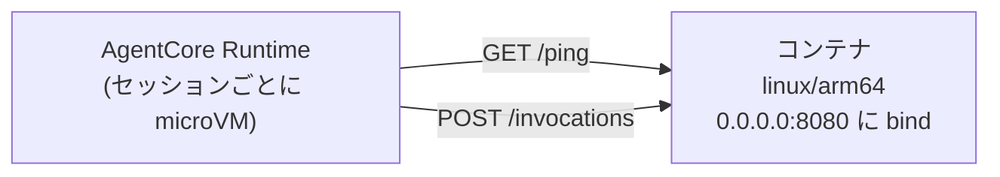

# 第8章 AgentCore Runtime にデプロイする

この章を終えると、AgentCore Runtime が受け付けるコンテナの条件を言え、
その条件を満たすイメージをビルドして、デプロイ前にローカルで契約検証できるように
なります。

## 8.1 概要

### 8.1.1 AgentCore Runtime とは

第7章までのエージェントはローカルの Python プロセスでした。AgentCore Runtime は
それをコンテナとしてホストする、エージェント専用のサーバレス実行基盤です。
仕様を押さえてください（AWS 公式ドキュメントで裏取り済み）。

- セッションごとに専用の microVM を起動。CPU・メモリ・ファイルシステムが
  セッション間で分離され、終了時に microVM ごと破棄・メモリはサニタイズされる
- 同期呼び出し 15 分、ストリーミング最長 60 分、非同期ジョブ最長 8 時間
- セッションは既定 15 分・最長 8 時間
- ペイロード最大 100 MB
- 課金は消費した CPU・メモリベース。事前のキャパシティ確保は不要

Lambda との違いはこの実行特性です。15 分を超える処理、セッション状態の分離、
ストリーミング応答。エージェントが必要とするものに合わせてあります。
VPC を用意する必要もないため、このリポジトリではネットワークをマネージドに
任せています。

### 8.1.2 コンテナ契約は 3 つ

- アーキテクチャ: **linux/arm64 のみ**
- エンドポイント: `POST /invocations`（本体）と `GET /ping`（ヘルスチェック）
- バインド: `0.0.0.0:8080`



この短さが設計です。基盤はフレームワークを指定せず、HTTP の契約だけを決めている。
中身は Strands でも LangGraph でも自作でもよく、乗り換えるとき書き換えるのは
`src/main.py` 1 ファイルで済みます。Dockerfile も CDK も無傷。

`BedrockAgentCoreApp` が契約の実装を肩代わりします。`@app.entrypoint` を付けた関数を
書くだけで /invocations と /ping が生えます。

罠がひとつ。`app.run()` は host 省略時に 127.0.0.1 へ bind します。ローカルでは
動くのに、コンテナに入れると外から届かない。開発中に踏んで、main.py で
`host="0.0.0.0"` を明示する形に直しました（troubleshooting.md 参照）。

## 8.2 実装のポイント

契約のイメージ側を満たすのが `07-full-app/Dockerfile` です。30 行未満ですが、
各行に理由があります。

- `FROM --platform=linux/arm64` — x86 マシンで誤って amd64 を作ると、デプロイ後の
  起動時まで気づけない。ビルド時に固定して間違いを即時エラーにする
- 依存レイヤと src レイヤの分離 — コード 1 行の修正で依存の再解決を走らせない
- `CMD [..., "--no-sync", ...]` — 実測に基づく修正。最初は起動のたびに uv が再ビルドして
  コールドスタート 8 秒、`--no-sync` で 4 秒になった

サーバレスではコールドスタートが UX とタイムアウト設計に直結します。
4 秒の差は誤差ではありません。

## 8.3 【ハンズオン】ビルドして契約をローカルで検証する

AWS なしで最後まで進められます。

### 8.3.1 ARM64 イメージをビルドする

```bash
docker buildx build --platform linux/arm64 -t agent-platform/agent:local --load 07-full-app
```

### 8.3.2 アーキテクチャを確認する

```bash
docker image inspect agent-platform/agent:local --format '{{.Os}}/{{.Architecture}}'
```

`linux/arm64` と出るはずです。

### 8.3.3 コンテナで契約の 2 エンドポイントを叩く

```bash
docker run -d --name agent-local -p 8181:8080 \
  -e AWS_ACCESS_KEY_ID=dummy -e AWS_SECRET_ACCESS_KEY=dummy \
  -e AWS_DEFAULT_REGION=ap-northeast-1 \
  agent-platform/agent:local
```

```bash
curl http://127.0.0.1:8181/ping
```

```bash
curl -XPOST http://127.0.0.1:8181/invocations \
  -H 'Content-Type: application/json' -d '{"prompt":""}'
```

空プロンプトはモデルを呼ばずにエラー応答を返す設計なので、ローカルのコンテナだけで
契約検証ができます。終わったら片付けます。

```bash
docker rm -f agent-local
```

## 8.4 【ハンズオン】自分で Dockerfile を書く

ここまでは完成品のビルドでした。今度は契約を自分の手で満たします。
`hello-agent/` に 20 行のミニエージェント（app.py、LLM は呼ばない）と
pyproject.toml を用意してあります。`hello-agent/Dockerfile` を自分で書いてください。

要件:

1. linux/arm64 に固定する（FROM の書き方は 8.2 を参照）
2. uv の Python 3.12 ベースイメージを使う
3. 依存レイヤ（pyproject.toml + uv.lock → `uv sync --frozen --no-dev`）と
   app.py のコピーを分ける
4. 8080 を EXPOSE し、CMD で app.py を起動する。コールドスタート対策も 8.2 のとおり

書けたらビルドして契約を検証します。

```bash
docker buildx build --platform linux/arm64 -t hello-agent:local --load 08-agentcore-deploy/hello-agent
```

```bash
docker run -d --name hello-local -p 18081:8080 hello-agent:local
```

```bash
curl http://127.0.0.1:18081/ping
```

```bash
curl -XPOST http://127.0.0.1:18081/invocations -H 'Content-Type: application/json' -d '{"prompt":"test"}'
```

`{"echo": "test", "chapter": 8}` が返るはずです。片付けます。

```bash
docker rm -f hello-local
```

詰まったら `solutions/hello-agent.Dockerfile` を見てください。

### 8.4.1 合格判定

verify.sh が本体（8.3）と自作 Dockerfile（8.4）の両方を自動判定します。

```bash
./08-agentcore-deploy/verify/verify.sh
```

## 8.5 【ハンズオン】デプロイして 1 回呼び出す

```bash
./scripts/deploy.sh
```

ECR 作成 → ARM64 イメージ push → Runtime 作成の順で進みます（順序の理由は第9章）。
完了メッセージに `InvokeAgentRuntime` の呼び出し例が出力されます。
セッション ID は 33 文字以上という制約があり、例はそれを満たす形になっています。
呼び出し後、CloudWatch Logs で `token_usage` ログを確認してください。

## 8.6 まとめ

AgentCore Runtime が決めているのは arm64 / 2 エンドポイント / 0.0.0.0:8080 の
3 点だけで、中身のフレームワークには関与しません。契約が短いからこそ
**デプロイ前にローカルで契約検証を済ませる**ことができ、壊れたイメージを
push してから気づく状況を避けられます。verify.sh を通したら第9章へ進んでください。
deploy.sh が強制していた「ECR → push → Runtime」の順序の理由が、
CDK のスタック分割として出てきます。

## 次の章

[第9章 基盤をコードで定義する](../09-infra-as-code/)
