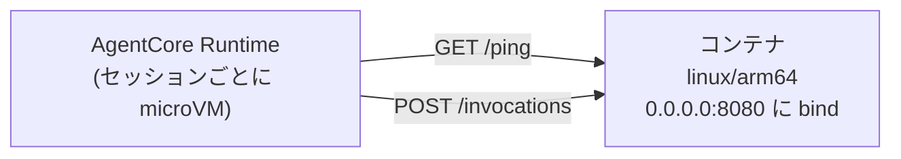

# 第8章 AgentCore Runtime にデプロイする

この章を終えると、AgentCore Runtime が受け付けるコンテナの条件を言え、その条件を満たす Dockerfile を自分で書いて、デプロイ前にローカルで契約検証できるようになります。

## 8.1 概要

### 8.1.1 AgentCore Runtime とは

第7章までのエージェントはローカルの Python プロセスでした。
AgentCore Runtime はそれをコンテナとしてホストする、エージェント専用のサーバレス実行基盤です。
実行特性は次のとおりです（AWS 公式ドキュメントで裏取り済み）。

- セッションごとに専用の microVM を起動。CPU、メモリ、ファイルシステムがセッション間で分離され、終了時に microVM ごと破棄されてメモリはサニタイズされる
- 同期呼び出し 15 分、ストリーミング最長 60 分、非同期ジョブ最長 8 時間
- セッションは既定 15 分、最長 8 時間
- ペイロード最大 100 MB
- 課金は消費した CPU とメモリに基づく。事前のキャパシティ確保は不要

Lambda との違いはこの実行特性です。
15 分を超える処理、セッション状態の分離、ストリーミング応答という、エージェントが必要とする条件に合わせてあります。
VPC を用意する必要もないため、このリポジトリではネットワークをマネージドに任せています。

### 8.1.2 コンテナ契約

Runtime がコンテナに要求するのは 3 点です。

- アーキテクチャ: **linux/arm64 のみ**
- エンドポイント: `POST /invocations`（本体）と `GET /ping`（ヘルスチェック）
- バインド: `0.0.0.0:8080`



契約は HTTP の 3 点だけで、フレームワークは指定されていません。
中身は Strands でも LangGraph でも自作でもよく、乗り換えるとき書き換えるのは `src/main.py` 1 ファイルで済みます。
Dockerfile も CDK も変更不要です。

`BedrockAgentCoreApp` が契約の実装を肩代わりします。
`@app.entrypoint` を付けた関数を書くだけで /invocations と /ping のエンドポイントが用意されます。

`app.run()` は host 省略時に 127.0.0.1 へ bind します。
ローカルでは動くのに、コンテナに入れると外から届かない。
開発中にこの問題に遭遇し、main.py で `host="0.0.0.0"` を明示する形に直しました（troubleshooting.md 参照）。

## 8.2 実装のポイント

この契約をイメージの側で満たすのが `07-full-app/Dockerfile` です。
30 行未満ですが、各行に理由があります。

- `FROM --platform=linux/arm64` — x86 マシンで誤って amd64 を作ると、デプロイ後の起動時まで気づけない。ビルド時に固定して間違いを即時エラーにする
- 依存レイヤと src レイヤの分離 — pyproject.toml と uv.lock だけを先に COPY して `uv sync --frozen --no-dev` を実行し、ソースは後から別レイヤで COPY する。コード 1 行の修正で依存の再解決を走らせないため
- `CMD [..., "--no-sync", ...]` — 実測に基づく修正。最初は起動のたびに uv が再ビルドしてコールドスタート 8 秒、`--no-sync` で 4 秒になった

コールドスタートは新しいセッションの初回応答にそのまま乗るため、8 秒と 4 秒の差は利用者の待ち時間の差です。

## 8.3 【ハンズオン】本体イメージをビルドして契約を検証する

第7章の本体をイメージにして、契約の 3 点をローカルで検査します。

### 8.3.1 ARM64 イメージをビルドする

```bash
docker buildx build --platform linux/arm64 -t agent-platform/agent:local --load 07-full-app
```

### 8.3.2 アーキテクチャを確認する

```bash
docker image inspect agent-platform/agent:local --format '{{.Os}}/{{.Architecture}}'
```

`linux/arm64` と出るはずです。

### 8.3.3 契約の 2 エンドポイントを叩く

```bash
docker run -d --name agent-local -p 8181:8080 \
  -e AWS_ACCESS_KEY_ID=dummy -e AWS_SECRET_ACCESS_KEY=dummy \
  -e AWS_DEFAULT_REGION=ap-northeast-1 \
  agent-platform/agent:local
```

```bash
curl http://127.0.0.1:8181/ping
```

`{"status":"Healthy",...}` が返るはずです。

```bash
curl -XPOST http://127.0.0.1:8181/invocations \
  -H 'Content-Type: application/json' -d '{"prompt":""}'
```

`{"error": "payload に 'prompt' が必要です。", ...}` が返るはずです。
空プロンプトはモデルを呼ばずにエラー応答を返す設計なので、ローカルのコンテナだけで契約検証ができます。
終わったら片付けます。

```bash
docker rm -f agent-local
```

## 8.4 【ハンズオン】Dockerfile を自作する

8.3 は完成品のビルドでした。今度は契約を自分の手で満たします。
`hello-agent/` に LLM を呼ばないミニエージェント（app.py と pyproject.toml）を用意してあり、無いのは Dockerfile だけです。

### 8.4.1 骨組みをコピーして TODO を埋める

```bash
cp 08-agentcore-deploy/exercises/Dockerfile 08-agentcore-deploy/hello-agent/Dockerfile
```

`hello-agent/Dockerfile` を開いてください。
WORKDIR と ENV は書いてあり、TODO が 4 つ残っています。

1. FROM — uv の Python 3.12 ベースイメージを linux/arm64 に固定する
2. 依存レイヤの分離 — pyproject.toml と uv.lock を先に入れ、app.py は後から別レイヤで COPY する
3. EXPOSE — 契約のポート 8080
4. CMD — uv run で app.py を起動する。コールドスタート対策も入れる

埋める材料はすべて 8.2 にあります。
埋めたら TODO コメントは消してください。

### 8.4.2 ビルドして契約を検証する

```bash
docker buildx build --platform linux/arm64 -t hello-agent:local --load 08-agentcore-deploy/hello-agent
```

```bash
docker run -d --name hello-local -p 18081:8080 hello-agent:local
```

```bash
curl http://127.0.0.1:18081/ping
```

`{"status":"Healthy",...}` が返るはずです。

```bash
curl -XPOST http://127.0.0.1:18081/invocations -H 'Content-Type: application/json' -d '{"prompt":"test"}'
```

`{"echo": "test", "chapter": 8}` が返るはずです。
片付けます。

```bash
docker rm -f hello-local
```

### 8.4.3 合格判定

verify.sh が本体（8.3）と自作 Dockerfile（8.4）の両方を自動判定します。

```bash
./08-agentcore-deploy/verify/verify.sh
```

<details>
<summary>解答例</summary>

```dockerfile
FROM --platform=linux/arm64 ghcr.io/astral-sh/uv:python3.12-bookworm-slim

WORKDIR /app

ENV PYTHONUNBUFFERED=1 UV_COMPILE_BYTECODE=1

COPY pyproject.toml uv.lock ./
RUN uv sync --frozen --no-dev

COPY app.py ./

EXPOSE 8080

CMD ["uv", "run", "--no-sync", "python", "app.py"]
```

コメント付きの全文は `solutions/hello-agent.Dockerfile` にあります。

</details>

## 8.5 【ハンズオン】デプロイして 1 回呼び出す

```bash
./scripts/deploy.sh
```

ECR 作成 → ARM64 イメージ push → Runtime 作成の順で進みます（順序の理由は第9章）。
完了メッセージに `InvokeAgentRuntime` の呼び出し例が出力されます。
セッション ID は 33 文字以上という制約があり、例はそれを満たす形になっています。
呼び出し後、CloudWatch Logs で `token_usage` ログを確認してください。

## 8.6 まとめ

AgentCore Runtime が決めているのは arm64 / 2 エンドポイント / 0.0.0.0:8080 の 3 点だけで、中身のフレームワークには関与しません。
契約が短いからこそ**デプロイ前にローカルで契約検証を済ませる**ことができ、壊れたイメージを push してから気づく状況を避けられます。
verify.sh を通したら第9章へ進んでください。
第9章では、deploy.sh が強制していた「ECR → push → Runtime」の順序がなぜ必要なのかを、CDK のスタック分割の設計として扱います。

## 次の章

[第9章 基盤をコードで定義する](../09-infra-as-code/)
