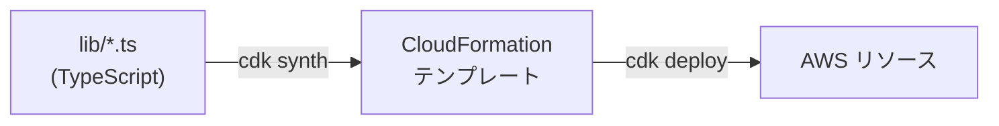

# 第9章 基盤をコードで定義する — AWS CDK

CDK (TypeScript) の本体であり、IaC を学ぶ章です。終えると、L2 コンストラクタが無い
新しめのサービスを L1 で書け、IAM 実行ロールの信頼ポリシーに何を書くべきか、
なぜスタックを分けるのかを説明できるようになります。

依存を先に入れてください。

```bash
cd 09-infra-as-code
npm ci
```

## 9.1 概要

### 9.1.1 CDK とは

インフラを TypeScript のコードとして定義し、CloudFormation テンプレートに変換して
デプロイする IaC ツールです。コンソールの手作業と違い、何を作るかがコードレビューと
差分確認（`npx cdk diff`）の対象になり、同じ構成を何度でも再現できます。



コンストラクタには階層があります。

- **L2**（`ecr.Repository` など） — 良い既定値とヘルパー付きの高水準 API
- **L1**（`Cfn` 始まり） — CloudFormation リソースと 1 対 1。全プロパティを自分で書く

### 9.1.2 L2 が無いサービスを書く

AgentCore のような新しいサービスには L2 がまだありません。
【開発時の実話】「stable な L2 Runtime がある」と書いた Web 記事を信じて設計し、
実装段階で `node_modules` の型定義を開いたら存在しませんでした。
aws-cdk-lib 2.264.0 の aws-bedrockagentcore に入っているのは L1 だけです。

持ち帰るべきは確認方法です。記事より型定義。

```bash
ls 09-infra-as-code/node_modules/aws-cdk-lib/aws-bedrockagentcore/lib/
```

`lib/agent-runtime-stack.ts` は `CfnRuntime` を直接使っています。L1 は手間な代わり、
CloudFormation リファレンスがそのまま読めるようになる副産物があります。

## 9.2 実装のポイント

### 9.2.1 スタックを 2 つに分けた理由

AgentCore Runtime は、作成時点で ECR にイメージが存在することを要求します。
ECR と Runtime を同じスタックに入れると、CloudFormation は「空のリポジトリを参照する
Runtime」を作ろうとして失敗します。

一般化すると、CloudFormation が管理するのはリソースの存在であって、
「イメージが push 済みか」という状態ではないからです。リソースが IaC の管理外の
状態に依存するとき、IaC 単体では順序を保証できません。AgentCore に限らず
繰り返し出会う問題です。

このリポジトリの解き方:

1. スタックを EcrStack と AgentRuntimeStack に分割する
2. `scripts/deploy.sh` が「ECR デプロイ → イメージ push → Runtime デプロイ」を強制する
3. `cdk deploy --all` の直叩きは禁止（CLAUDE.md の禁止事項）

### 9.2.2 IAM 実行ロール。レビューで見られる場所

`resolveExecutionRole()` が Runtime の実行ロールを定義しています。
読みどころは信頼ポリシーです。

`bedrock-agentcore.amazonaws.com` からの AssumeRole を、`aws:SourceAccount` と
`aws:SourceArn` の条件で自アカウント起源に限定しています。条件が無いと、
他人の AWS アカウントの AgentCore があなたのロールを引き受けられる余地が生まれます
（confused deputy 問題）。セキュリティレビューで必ず指摘される類のもので、
最初から書く癖をつけてください。

権限は 3 つに絞ってあります。

- ECR からのイメージ pull
- Bedrock の InvokeModel / InvokeModelWithResponseStream
- CloudWatch Logs への書き込み

ロールを自分で作れない組織向けに、context で既存ロール ARN を渡すと
新規作成をスキップする分岐も入れてあります。

### 9.2.3 環境差分は context で注入する

リージョン・モデル ID・ロール ARN はコードに書かず、`cdk.json` の context に
既定値を置いて `-c` で上書きします。context を読むのは `lib/config.ts` の
`loadConfig()` だけ。Python 側の「config.py だけが環境変数を読む」と同じ規約です。

```bash
npx cdk deploy -c region=us-east-1 -c imageTag=v1.2.0
```

`cdk synth` も覚えてください。テンプレート生成だけでデプロイはしないので、
デプロイ前に「この変更で何が作られるか」を確認できます。次のハンズオンで使います。

## 9.3 【ハンズオン】context 経由で Runtime の環境変数を追加する

エージェントの `LOG_LEVEL` を CDK context から Runtime に注入できるようにします。

1. `lib/config.ts` の `loadConfig()` に、context `logLevel` を読んで
   `agentEnvironment.LOG_LEVEL` に入れる処理を追加する
   （`searchProvider` と同じパターン。未指定なら入れない）
2. `cdk.json` の context に既定値 `"logLevel": "INFO"` を追加する

型チェックを通します。

```bash
cd 09-infra-as-code && npx tsc --noEmit
```

synth への反映を確認します。

```bash
CDK_DEFAULT_ACCOUNT=111111111111 npx cdk synth AgentPlatformRuntimeStack \
  -c logLevel=DEBUG | grep LOG_LEVEL
```

`LOG_LEVEL: DEBUG` が出るはずです。合格判定を流します。

```bash
cd .. && ./09-infra-as-code/verify/verify.sh
```

考えてみてください（記述・任意）。`-c logLevel=DEBUG` と `07-full-app/.env` の
`LOG_LEVEL=DEBUG` は、それぞれいつ効くでしょうか。

## 9.4 まとめ

CloudFormation が保証するのはリソースの存在までで、「イメージが push 済みか」の
ような管理外の状態には手が届きません。だからスタックを分け、順序は
`scripts/deploy.sh` に持たせる。**IaC の境界を見極めて、足りない保証を手順で補う**
のがこの章の核心です。

## 次の章

[第10章 ナレッジベース](../10-knowledge-base/)
