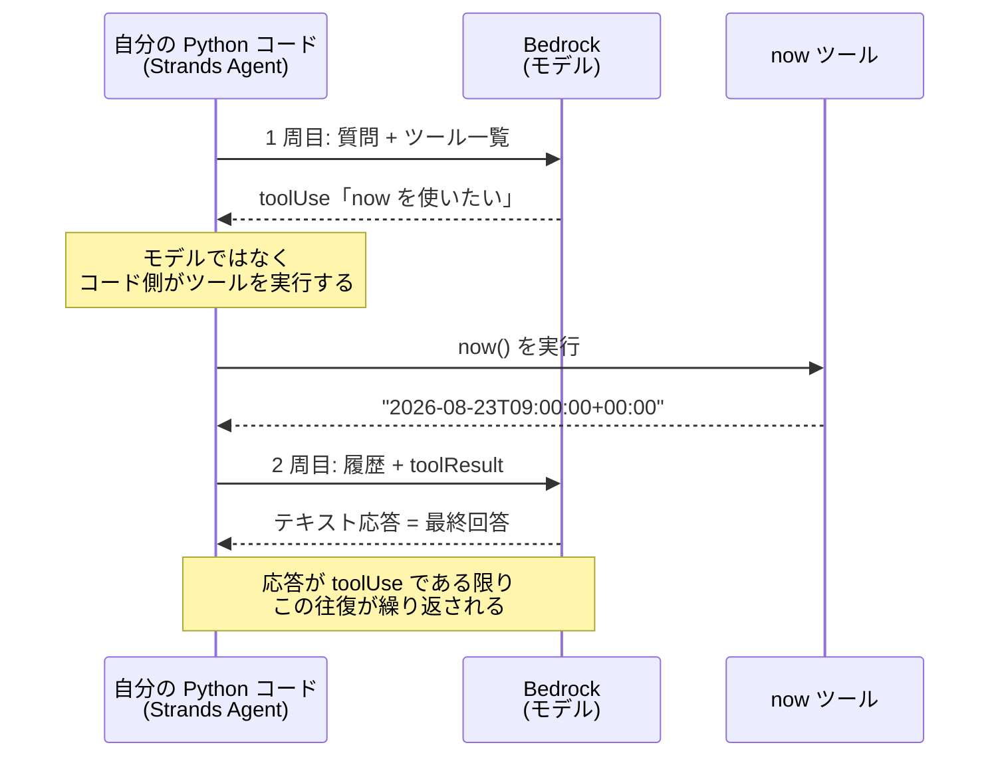

# 第2章 はじめてのエージェント

この章を終えると、ツール付きのエージェントを自分の手で書き、実行ログの各行がReAct のどのステップかを言い当てられるようになります。

この章は独立した uv プロジェクトです。
最初に依存を入れてください。

```bash
cd 1-basic/02-agent-loop
uv sync
```

ハンズオンは `exercises/` の TODO を実装して実行する形式で、完成形は `solutions/` にあります。
モデル ID は `MODEL_ID`、リージョンは `AWS_REGION` で上書きできます。
自分のリージョンで呼べる ID は`aws bedrock list-inference-profiles --region <リージョン>` で確認できます。

## 2.1 概要

### 2.1.1 Strands Agents とは

この章から使う Strands Agents は、AWS が公開しているオープンソースのエージェント開発フレームワーク（Python）です。
モデル呼び出しの繰り返し、ツールの実行、会話履歴の管理が実装済みで、開発者はモデルとシステムプロンプトとツールの 3 つを渡すだけでエージェントが動きます。

マネージドの Bedrock Agents とは別物です。
あちらは AWS 側がループを実行するサービス、Strands は自分のコードとしてループを持つフレームワークで、この教材は挙動を細部まで観察・制御できる後者で作ります。

### 2.1.2 エージェントのループ構造

モデルを 1 回呼んで終わりにするコードとの違いは、ループの有無だけです。

1. モデルに質問と「使えるツールの一覧」を渡す
2. 応答がテキストだけなら、それが最終回答。終了
3. 応答が「ツール X を引数 Y で使いたい」なら、X を実行し、結果を履歴に足して 1 へ戻る

内部では Converse API のマルチターンが動いています。
ツール要求は `toolUse` ブロック（`toolUseId` 付き）で返り、呼び出し側は実行結果を`toolResult` ブロックとして次のリクエストに追加します。
ツールを実行するのはモデルではなく、モデルを呼び出している側のコードです。

2.3 で書くエージェント（now ツール 1 つ）の往復は次のようになります。
1 周 = モデル呼び出し 1 回で、ハンズオンで観察する `cycles: 2` の実体です。



### 2.1.3 ReAct と CoT

このループには ReAct という名前が付いています。
推論だけで完結させず、外部と相互作用しながら考える方が幻覚が減る、という提案から来たパターンです。

CoT（Chain of Thought）は、複雑な問題を思考ステップに分解させるプロンプト技法です。
ループの構造ではなくプロンプトの書き方であり、フレームワークの機能ではありません。

### 2.1.4 会話履歴とコンテキストウィンドウ

ループが 1 周するたびに、モデルへ送るメッセージ配列は伸びます。
`toolUse` と `toolResult` が毎周ぶん積み上がり、次の周では過去のやり取りがまるごと入力として再送されます。
ツールを 10 回呼ぶ調査なら、10 回目の入力には 1 回目から 9 回目までの検索結果が全部入っています。

入力トークンは周回とともに増え、料金は入力側にも掛かります。
伸び続ければモデルのコンテキストウィンドウの上限に達し、呼び出しが例外になります。
Strands はこれを抑えるため、既定で直近 40 メッセージだけを残して古いものを捨てます（`Agent` の `conversation_manager` 引数で差し替えられます）。

## 2.2 実装のポイント

Strands の `Agent` はこの往復の実装で、1 往復を cycle と呼びます。
組み立てと実行はこの形です。

```python
@tool  # 普通の関数をツールにするデコレータ
def now() -> str:
    """現在の日時を UTC の ISO 8601 形式で返す。"""  # docstring がそのままモデルに渡る
    return datetime.now(UTC).isoformat()


agent = Agent(
    model=BedrockModel(region_name="<リージョン>", model_id="<モデル ID>", max_tokens=512),
    system_prompt="<エージェントへの指示>",
    tools=[now],  # @tool を付けた関数を渡す
)

result = agent("質問文")
result.metrics.cycle_count           # ループが何周したか
result.metrics.accumulated_usage     # 消費トークンの累計（dict。合計は totalTokens）
```

`BedrockModel` には `boto_client_config` も渡せます。
Strands の既定は読み取りタイムアウト 120 秒と botocore 既定の自動リトライで、長い生成がタイムアウトで切れると同じ生成が自動再送されて二重に走ります。
本番では `BotocoreConfig(retries={"max_attempts": 1})` を渡し、自動再送を止めます。

`tools` に渡した関数の docstring は、そのままモデルに渡ります。
モデルはその文面だけでいつ使うかを決めるので、docstring の質がツール選択の質を決めます。

`Agent` と `AgentResult` のメトリクスは、そのインスタンスの生涯で累計されます。
`cycle_count` も `accumulated_usage` も、同じ `Agent` を 2 回呼べば 2 回分の合計です。
1 回の呼び出しぶんだけを見たいときは、質問ごとに `Agent` を作り直します（`result.metrics.agent_invocations[-1].usage` でも 1 回分を取れます）。

## 2.3 ハンズオン: 最小のエージェントを実装する

### 2.3.1 TODO を 2 個埋める

`exercises/01_agent.py` を開いてください。
now ツールは docstring まで含めて書いてあり、TODO が 2 つ残っています。

1. `Agent` の組み立て。形は 2.2 のとおりで、モデルと system_prompt と tools を渡す
2. `result.metrics.cycle_count` の表示

### 2.3.2 実行する

実装できたら TODO コメントを消して実行します。

```bash
uv run exercises/01_agent.py
```

回答のあとに `cycles: 2` が出るはずです。
1 周目でモデルが now を使うと判断し、2 周目でツール結果を見て回答を組み立てた、という意味です。

<details>
<summary>解答例</summary>

```python
agent = Agent(
    model=BedrockModel(
        region_name=os.environ.get("AWS_REGION", "us-east-1"),
        model_id=MODEL_ID,
        max_tokens=512,
    ),
    system_prompt="質問に日本語で簡潔に答えてください。日時が必要なら now ツールを使ってください。",
    tools=[now],
)

if __name__ == "__main__":
    result = agent("今日は何日ですか？")
    print(f"\ncycles: {result.metrics.cycle_count}")
```

全文は `solutions/01_agent.py` にあります。

</details>

### 2.3.3 コードと ReAct の対応

いま書いたループが、ReAct の 3 ステップにそのまま対応します。

| ReAct のステップ | コードでの実体 |
| --- | --- |
| Reasoning（推論） | 1 周目の応答テキスト |
| Acting（行動） | `toolUse` → now() の実行 |
| Observation（観察） | `toolResult` が 2 周目へ |

## 2.4 ハンズオン: ツールを追加する

### 2.4.1 TODO を 3 個埋める

今度はツールを自分で設計します。
`exercises/02_add_tool.py` を開いてください。
now ツールは書いてあり、TODO が 3 つ残っています。

1. `char_count(text: str) -> str` の実装。受け取った文字列の文字数を返す。
   docstring に受け取るもの / 返すもの / 含まないものの 3 節を必ず書く（含まないものには、単語数のカウントはしない、など否定を 1 つ以上）
2. `build_agent()` の中身。`tools` に `now` と `char_count` の両方を渡した `Agent` を返す
3. `__main__` で「『こんにちは世界』は何文字？」と質問し、cycle 数を表示する

### 2.4.2 実行する

実装できたら TODO コメントを消して実行します。

```bash
uv run exercises/02_add_tool.py
```

7 文字という趣旨の回答と `cycles: 2` が出るはずです。
時間があれば docstring を 1 行だけにして同じ質問を投げ、ツールの選ばれ方が変わるかも試してください。

<details>
<summary>解答例</summary>

```python
@tool
def char_count(text: str) -> str:
    """文字列の文字数を数えて返す。

    「何文字？」のように、正確な文字数が必要な質問に答えるときに使う。
    モデル自身の文字数カウントは間違えることがあるため、必ずこのツールを使うこと。

    受け取るもの:
        text: 数えたい文字列そのもの。前後の説明文を含めずに渡すこと。
    返すもの:
        文字数を含む短い文字列（例: "7 文字"）。
    含まないもの:
        単語数・バイト数のカウント。空白や記号も 1 文字として数える。
    """
    return f"{len(text)} 文字"


def build_agent() -> Agent:
    return Agent(
        model=BedrockModel(
            region_name=os.environ.get("AWS_REGION", "us-east-1"),
            model_id=MODEL_ID,
            max_tokens=512,
        ),
        system_prompt="質問に日本語で簡潔に答えてください。日時は now、文字数は char_count を使ってください。",
        tools=[now, char_count],
    )


if __name__ == "__main__":
    result = build_agent()("『こんにちは世界』は何文字？")
    print(f"\ncycles: {result.metrics.cycle_count}")
```

全文は `solutions/02_add_tool.py` にあります。

</details>

## 2.5 ハンズオン: メトリクスを観察する

### 2.5.1 TODO を 1 個埋める

`exercises/03_metrics.py` を開いてください。
`02_add_tool.py` の `build_agent()` を import し、質問ごとに新しい `Agent` を作る枠は書いてあります。
TODO は 1 つ、cycle 数とトークン合計の表示です。
取り出し方は 2.2 のとおりです。

質問ごとに `Agent` を作り直しているのは、メトリクスが生涯累計だからです。
同じインスタンスを使い回すと 2 問目の値に 1 問目が混ざり、会話履歴も引き継がれます。

### 2.5.2 実行する

実装できたら TODO コメントを消して実行します。

```bash
uv run exercises/03_metrics.py
```

2 行の結果が出ます。
1 問目はツールを使わないので cycles=1、2 問目は now と char_count を呼ぶので cycles=3 になり、トークン数も数倍になるはずです。

```
Q: こんにちは
  cycles=1  tokens=412
Q: 今日は何日？『こんにちは世界』は何文字？
  cycles=3  tokens=2731
```

ツールを 1 回使うたびに履歴が長くなり、モデル呼び出しが 1 回増えます。
この構造が、次の章で上限を掛ける理由になります。

<details>
<summary>解答例</summary>

```python
for question in ("こんにちは", "今日は何日？『こんにちは世界』は何文字？"):
    agent = build_agent()  # メトリクスは Agent の生涯累計なので、質問ごとに作り直す
    result = agent(question)
    usage = result.metrics.accumulated_usage
    print(f"\nQ: {question}")
    print(f"  cycles={result.metrics.cycle_count}  tokens={usage.get('totalTokens')}")
```

全文は `solutions/03_metrics.py` にあります。

</details>

### 2.5.3 合格判定

```bash
uv run pytest -q
```

`6 passed` で合格です（エージェントの構造だけを検査します）。

## 2.6 まとめ

エージェントの実体は、ツール結果を履歴に積みながら繰り返す Converse 呼び出しです。
応答テキストが Reasoning、`toolUse` が Acting、`toolResult` が Observation にあたります。

1 周増えるたびにモデル呼び出しと履歴が増え、トークン消費も増えます。
次はループの質を決めるツールの側に進みます。

## 次の章

[第3章 ツール設計](../03-tool-design/)
