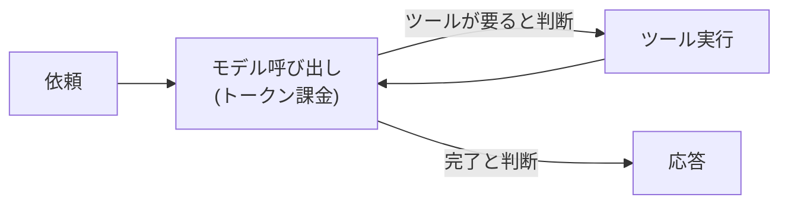
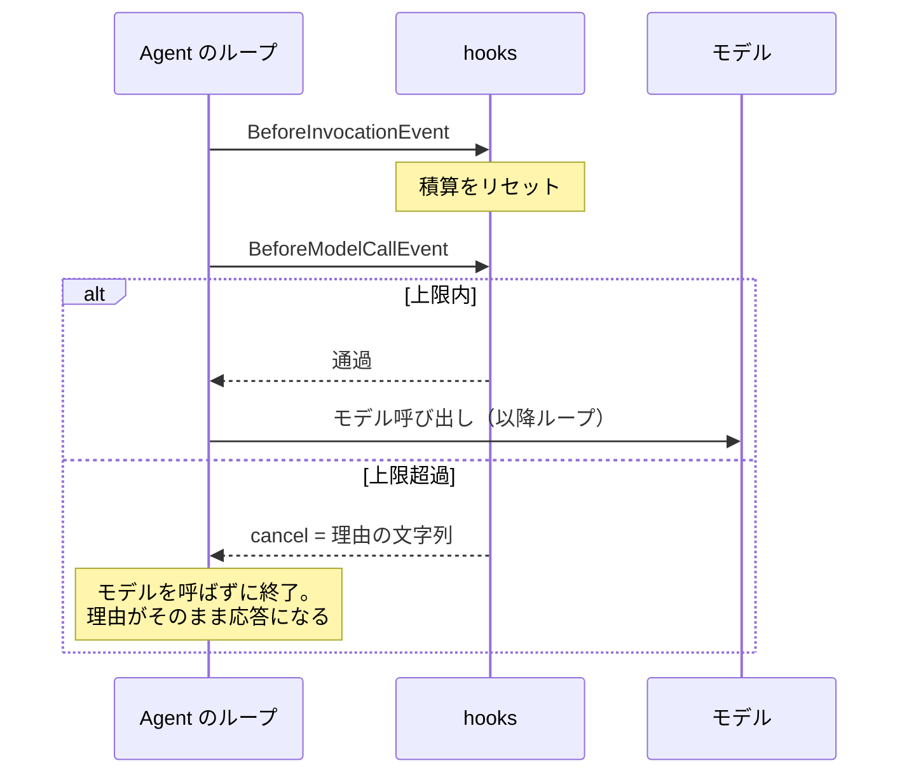

# 第4章 コストと実行回数の制御

この章を終えると、Strands の hooks でエージェントの実行に割り込めるようになります。
ハンズオンでは「トークン量で止めるガード」を自作し、フレームワークに無い制御を自分で足せることを確かめます。

この章は独立した uv プロジェクトです。
最初に依存を入れてください。

```bash
cd 1-basic/04-cost-control
uv sync
```

編集するのは `exercises/cost_limiter.py` の 1 ファイルだけで、完成形は `solutions/` にあります。
モデルを呼ぶのは 4.3.4 だけです。
モデル ID は `MODEL_ID`、リージョンは `AWS_REGION` で上書きできます。

## 4.1 概要

### 4.1.1 エージェントのコスト構造

エージェントは従量課金 API を自律的に呼び出すプログラムです。
モデル呼び出しはトークン量で課金され、ループはその呼び出しを何周も繰り返します。
総額は「単価 × 周回数」ですが、その周回数はコードのどこにも書かれていません。



### 4.1.2 上限が無いと何が起きるか

モデルがもう 1 回ツールを使うと判断し続ける限りループは止まらず、その間の呼び出しはすべて課金されます。
周回数は質問の複雑さで変わるので、短い質問で試して問題が無くても安全とは言えません。
ツールの使用回数を控えるようプロンプトに書いても、守られる保証はありません。

### 4.1.3 上限を掛けられる場所

上限は次の 3 か所に掛けられます。抑える対象が違うので、1 つでは足りません。

| 掛ける場所 | 何を抑えるか |
| --- | --- |
| `max_tokens` | 1 回の出力の長さ |
| ツール呼び出し回数 | 1 リクエストの周回数 |
| モデル呼び出し回数 | 同じく周回数 |

`max_tokens` が第一手なのは、引数 1 つで 1 回あたりの最悪値が決まるからです（`BedrockModel(max_tokens=...)`）。
既定のままだと、モデルの最大出力（docs/versions.md）まで出しうる状態になります。

上限に達すると、Strands では途中まで書かれた応答が返るのではなく `MaxTokensReachedException` が送出され、`agent(...)` の呼び出しが例外で終わります。
途中までの本文は `agent.messages` の末尾に残るので、例外を捕まえて救出するか、`max_tokens` を上げるかの二択です。
既定値に頼らず、`max_tokens` は常に明示します。

そもそも周回数をモデルに決めさせない選択もあります。
工程の順序が固定なら、エージェント間の呼び出しをコード（または Step Functions のようなワークフロー）で直列に書けば、実行回数は設計時に決まります。
その場合、ループ上限の hooks は単一のエージェント内に閉じた保険という位置づけになります。

## 4.2 実装のポイント

### 4.2.1 hooks の仕組み

Strands では、`register_hooks` メソッドを持つクラスを `Agent(hooks=[...])` に渡すと、実行の節目ごとにコールバックが呼ばれます。
使うイベントは 4 つです。

| イベント | タイミング | 用途 |
| --- | --- | --- |
| `BeforeInvocationEvent` | リクエスト開始 | カウンタのリセット |
| `BeforeModelCallEvent` | モデル呼び出し直前 | ターン数の上限 |
| `BeforeToolCallEvent` | ツール実行直前 | ツール回数の上限 |
| `AfterInvocationEvent` | リクエスト完了 | トークン消費のログ |

上限を掛けるのは `BeforeModelCallEvent` の `event.cancel` と `BeforeToolCallEvent` の `event.cancel_tool` です。
割り込む位置はこうなります。



H はこの章で書く CostLimiter です。

Strands には max_turns のような組み込みの上限設定がありません（確認したバージョンは docs/versions.md）。
この章のハンズオンでは、その無い機能を hooks で足します。

### 4.2.2 中断理由の渡し方

止めるときは bool ではなく、理由の文字列を渡します。
ただし止め方は 2 つあり、渡した理由の行き先が違います。

| 止め方 | 理由の行き先 | その後 |
| --- | --- | --- |
| `cancel_tool = "理由"` | モデルへ渡る | ループは続く |
| `cancel = "理由"` | 最終応答になる | そこで終わる |

前者はツール結果の代わりに理由がモデルへ渡るので、モデルは手持ちの情報でまとめ直せます。
後者はモデルを呼ばずにリクエストを終わらせます。

bool だけで止めると、モデルは「ツールが失敗した」と解釈して同じ呼び出しを繰り返します。
この章で作る CostLimiter は `cancel` を使う打ち切り型です。

### 4.2.3 トークン消費の計測

上限値をいくつにするかは、計測してから決めます。
`AgentResult.metrics` の `accumulated_usage` は、その `Agent` インスタンスの生涯の累計です。
1 リクエスト分だけを取りたいなら、リクエストごとに `Agent` を作るか、`result.metrics.agent_invocations[-1].usage` を読みます。
これをログに出し続けていると、コストが増えたときに周回数と入出力のどちらが増えたのかを実測で切り分けられます。

## 4.3 ハンズオン: トークン量で止めるガードを実装する

回数ではなくトークン量で止めるガード `CostLimiter` を作ります。

### 4.3.1 TODO を 3 個埋める

`exercises/cost_limiter.py` を開いてください。
dataclass の枠と積算用のフィールドは書いてあり、TODO が 3 つ残っています。

1. `register_hooks` で 2 つのイベントにコールバックを登録する（4.2.1 の表のとおり）
2. `_reset` でリクエスト開始時に積算を 0 に戻す
3. `_check` で `projected_input_tokens`（次のモデル呼び出しの予測入力量。Strands が計算してイベントに入れる）を積算し、上限を超えたら `event.cancel` に理由の文字列を入れる。
   `None` のときは加算しない

判定テスト `verify/test_cost_limiter.py` を先に読むと分かりやすくなります。

### 4.3.2 実行する

実装できたら TODO コメントを消し、判定の前に動かします。
モデルを呼ばずに、イベントだけを手で渡すスクリプトを用意してあります（編集不要）。

```bash
uv run 01_fire_events.py
```

毎ターン 4,000 トークンの想定で渡すので、上限 10,000 に対してこう表示されるはずです。

```
ターン 1: 通過（積算 4,000 / 上限 10,000）
ターン 2: 通過（積算 8,000 / 上限 10,000）
ターン 3: 中断。モデルに渡る理由 ->
  入力トークンの概算上限 (10000) に達したため中断しました。追加の調査はせず、ここまでの情報で結論をまとめてください。
```

<details>
<summary>解答例</summary>

```python
    def register_hooks(self, registry: HookRegistry, **kwargs: object) -> None:
        registry.add_callback(BeforeInvocationEvent, self._reset)
        registry.add_callback(BeforeModelCallEvent, self._check)

    def _reset(self, event: BeforeInvocationEvent) -> None:
        self._accumulated = 0

    def _check(self, event: BeforeModelCallEvent) -> None:
        projected = event.projected_input_tokens
        if projected is None:
            # 予測が取れないターンは加算しない。過剰に厳しく止めない
            return
        self._accumulated += int(projected)
        if self._accumulated > self.max_total_tokens:
            event.cancel = (
                f"入力トークンの概算上限 ({self.max_total_tokens}) に達したため中断しました。"
                "追加の調査はせず、ここまでの情報で結論をまとめてください。"
            )
            logger.warning(
                "cost_limit_exceeded limit=%s accumulated=%s",
                self.max_total_tokens,
                self._accumulated,
            )
```

全文は `solutions/cost_limiter.py` にあります。

</details>

### 4.3.3 合格判定

```bash
uv run pytest -q
```

`5 passed` で合格です。
上限内で止めないこと、理由が文字列で上限値を含むこと、None を加算しないこと、リクエスト間でリセットされることを検査します。

### 4.3.4 エージェントで観察する（任意）

自作した CostLimiter を、Bedrock を呼ぶ実際のエージェントに付けて動かします。

```bash
uv run 02_agent_with_limit.py
```

長文を返す lookup ツールを 3 回呼ばせる依頼に対し、上限 6,000 トークンを掛けてあります。
履歴が長くなって上限に達したターンでモデル呼び出しが中断され、最終応答が CostLimiter の理由の文字列そのものになるはずです。

## 4.4 まとめ

エージェントのコストは「単価 × 周回数」で、周回数を決めるのはモデルの判断です。
そのためプロンプトでの指示ではなく、hooks でコードの上限を掛けます。
止めるときは理由の文字列を渡し、まとめ直させたいなら `cancel_tool`、打ち切るなら `cancel` と、理由の行き先で使い分けます。
消費の計測をログに残していて初めて、上限値の調整もコストの説明もできます。

## 次の章

[第5章 マルチエージェント](../05-multi-agent/)
