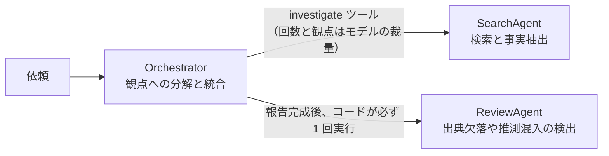

# 第5章 マルチエージェント

この章を終えると、エージェントを分割すべきかを判断でき、分割するなら「どこをモデルの裁量に任せ、どこをコードで固定するか」を理由付きで決められるようになります。
ハンズオンでは、価格調査の専門エージェントを組み立て、エージェントごとツールにしてオーケストレータへ渡します。

この章は独立した uv プロジェクトです。
最初に依存を入れてください。

```bash
cd 1-basic/05-multi-agent
uv sync
```

編集するのは `exercises/specialist.py` の 1 ファイルだけで、完成形は `solutions/` にあります。
モデルを呼ぶのは 5.3.4 だけです。
モデル ID は `MODEL_ID`、リージョンは `AWS_REGION` で上書きできます。

## 5.1 概要

### 5.1.1 役割ごとの分割

1 つのエージェントにすべてをやらせる代わりに、役割ごとの専門エージェントに分けて連携させる構成です。
役割を分けると、それぞれのシステムプロンプトを短く保て、役割に見合ったモデルを個別に選べるようになります。

### 5.1.2 分割の判断基準

1 つで足りる処理を分割すると、遅くなり、費用が増え、デバッグ対象も増えます。
分割ありきで構成を決めず、まず 1 つで足りるかを確かめます。

分割を検討するのは、次の症状が出たときです。

- システムプロンプトが長大化し、どの指示が挙動に影響しているか分からない
- 全工程に上位モデルを使っていてコストが下げられない
- 「検索の質」と「統合の質」を別々に改善したいのに、片方だけを変えられない

責務が違い、必要な能力（= モデル）が違うなら分けます。

## 5.2 実装のポイント

### 5.2.1 役割ごとのモデル選択

この教材の題材である競合リサーチエージェントは、依頼を観点に分解して統合する Orchestrator、検索と事実抽出を行う SearchAgent、出典欠落や推測混入を検出する ReviewAgent の 3 つに分かれています。
判断を伴う Orchestrator と ReviewAgent は上位モデルに差し替える候補で、定型処理の SearchAgent は軽量モデルで足ります。



Haiku と Sonnet の単価差は 3 倍あるので（docs/versions.md）、理由なく全役割に上位モデルを割り当てると費用は数倍になります。
役割ごとにモデル ID の設定を分けてあるのは、判断を伴う役割だけを差し替えられるようにするためです（既定は全役割とも Haiku）。

### 5.2.2 agents-as-tools

Strands では、エージェントの呼び出しを `@tool` を付けた関数に入れると、別のエージェントからはツールとして見えます。
専門エージェントを増やす仕組みはこれだけです。

```python
@tool
def compare_pricing(companies: str) -> str:
    """（docstring がそのままツールの説明としてモデルに渡る）"""
    agent = build_specialist_agent(model)  # 呼び出しごとに作る
    return str(agent(f"次の企業の価格を比較してください: {companies}"))
```

Agent をツール関数の外で 1 つ作って使い回さないでください。
Strands の `Agent` は会話履歴とメトリクスを持ち、同一インスタンスの並行実行を`ConcurrencyException` で拒否します。
使い回すと、既定の `ConcurrentToolExecutor` が複数のツールを同時に実行したときに例外になり、直列に呼べたとしても前の依頼の会話履歴が次の依頼に混ざります。
`BedrockModel` は boto3 クライアントを内包していてスレッドセーフなので、こちらは共有します。

呼び出す側のモデルに渡るのは、普通のツールと同じで name と description と inputSchema だけです。
中でエージェントが動いていることを、オーケストレータは知りません。
したがってツール設計の規約がそのまま適用されます。
docstring は 3 節構成で書き、「企業名は 2 社以上渡すこと」のような使い方の制約まで docstring がモデルに教えます。

### 5.2.3 どこをモデルに任せ、どこをコードで固定するか

SearchAgent はツールで、何回、どの観点で呼ぶかはモデルの裁量です。
依頼ごとに最適な分解が違うので、固定しないことに LLM を使う価値があります。
ReviewAgent はコードが必ず 1 回実行します。
ツールにすると、モデルが今回はレビュー不要と判断した時点で検証がスキップされます。
修正回数もコードで 1 回に固定しています。
revise が出る限り修正する形にすると、コストとターン数の上限が決まらなくなります。

迷ったときは、その工程がスキップされたときに誰かが困るかで判断します。
困るならコードで固定し、困らないなら裁量に任せます。
工程の順序まで固定でよいなら、エージェント間の呼び出しはコードで直列に書きます。
その場合、モデルの裁量は 1 工程の中に閉じます。

## 5.3 ハンズオン: エージェントをツールにする

価格調査だけを担当する専門エージェントを組み立て、エージェントごとツールにします。

固定の価格データ（`PRICING_DATA`）と、それを引く `lookup_pricing` ツール、システムプロンプト、モデルを作る `build_model` は用意してあります。
`exercises/tool_call_limiter.py` は呼び出し回数の上限ガードで、これも編集不要です。

### 5.3.1 TODO を 3 個埋める

`exercises/specialist.py` を開いてください。
TODO が 3 つ残っています。

1. `build_specialist_agent(model)` で専門エージェントを組み立てる。
   システムプロンプトと `lookup_pricing`、そして hooks に `ToolCallLimiter` を渡す。
2. `compare_pricing` の docstring を 3 節構成で書く。
   「含まないもの」に価格以外（機能や評判）を調べないことを明記する。
3. `compare_pricing` の中身。呼び出しごとに `build_specialist_agent(model)` でエージェントを作り、依頼文を渡して結果を文字列で返す（5.2.2 のとおり）。

### 5.3.2 実行する

実装できたら TODO コメントを消し、モデルを呼ばずに動かします。

```bash
uv run 01_show_tool_spec.py
```

compare_pricing の name と description と inputSchema が JSON で表示されるはずです。
description の中身は、いま自分が書いた docstring です。
オーケストレータのモデルに渡るのはこの JSON だけで、中でエージェントが動いていることはどこにも書かれていません。

<details>
<summary>解答例</summary>

```python
def build_specialist_agent(model: BedrockModel) -> Agent:
    """価格調査の専門エージェントを 1 つ組み立てて返す。"""
    return Agent(
        name="PricingSpecialist",
        # 価格の検索と表への整形は定型処理なので、軽量モデル（Haiku）で足りる。
        # 「どの企業を比較すべきか」の判断は呼び出し側（オーケストレータ）の仕事
        model=model,
        system_prompt=SYSTEM_PROMPT,
        tools=[lookup_pricing],
        hooks=[ToolCallLimiter(max_calls=4)],  # ガードなしのエージェントを新設しない
        callback_handler=None,  # 専門エージェントの途中経過を呼び出し側の出力に混ぜない
    )


def build_specialist_tool():
    """専門エージェントをツールとして返す。オーケストレータはこれを tools に載せる。"""
    model = build_model()  # BedrockModel はスレッドセーフなので共有してよい

    @tool
    def compare_pricing(companies: str) -> str:
        """指定された企業の料金プランを調べ、Markdown の比較表で返す。

        利用者が複数企業の価格の比較を求めているときに使う。

        受け取るもの:
            companies: 比較したい企業名をカンマや読点で並べた文字列。
                例: 「Acme Analytics, Globex Insights」。2 社以上を渡すこと。

        返すもの:
            行 = 企業、列 = プランの Markdown 表。確認できなかったセルは「不明」。

        含まないもの:
            - 価格以外の情報（機能や評判）。
            - どの企業が安い・優れているかの判断。判断はあなた（呼び出し側）の仕事。
        """
        # Agent は会話履歴とメトリクスを持ち、並行実行を拒否する。呼び出しごとに作る
        agent = build_specialist_agent(model)
        result = agent(f"次の企業の価格を比較してください: {companies}")
        return str(result)

    return compare_pricing
```

全文は `solutions/specialist.py` にあります。

</details>

### 5.3.3 合格判定

```bash
uv run pytest -q
```

`6 passed` で合格です。
@tool が付いていることとツール名、docstring の 3 節、呼び出しごとにエージェントを作ること、ガードの発動を検査します。
モデルは呼びません。

### 5.3.4 オーケストレータから呼ぶ

作った compare_pricing をオーケストレータの tools に載せて動かします。
Bedrock を呼びます。

```bash
uv run 02_orchestrator.py
```

オーケストレータが toolUse で compare_pricing を選び、専門エージェントが lookup_pricing を企業ごとに呼んで、比較表をもとにした回答が返るはずです。

## 5.4 まとめ

マルチエージェントの設計判断は、分けるかどうかよりも「分けた後にどう呼ぶか」に表れます。
スキップされたら困る工程はコードで固定し、依頼ごとに最適解が変わる工程だけをモデルの裁量に残します。
本体 `07-full-app/src/agents/` に 3 エージェント構成の実装があるので、読み比べてください。

## 次の章

[第6章 エージェントのテスト](../06-agent-testing/)
