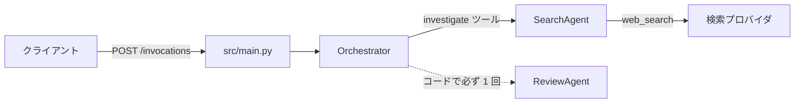

# 第7章 完成形を通読する

このディレクトリは章であると同時に、動くコードの本体です。
各章のハンズオンは章内で完結するので、この本体は各章で自作したものの完成形として読み、動かします。
終えると、1 リクエストがどのファイルをどの順に通るか、どのファイルがどの章に対応するかを説明できる状態になります。

依存を先に入れてください。

```bash
cd 1-basic/07-full-app
uv sync
```

## 7.1 概要

### 7.1.1 3 つのエージェントの役割分担

競合リサーチエージェントです。
調査依頼を受け取り、観点に分解して Web 検索で調べ、報告に統合し、出力を検証するまでを 3 つのエージェントで分担します。
モデルは役割ごとに環境変数で差し替えられ、既定は全役割とも安価な Haiku 4.5 です（docs/versions.md 参照）。
判断が要る Orchestrator と ReviewAgent は上位モデルの候補です。

この構成には設計判断がひとつあります。
SearchAgent は Orchestrator がツールとして呼びます（agents-as-tools）が、ReviewAgent はモデルの裁量に任せず、`orchestrator.py` のコードで最後に必ず 1 回実行します。
実行するかどうかをモデルの判断に委ねると、検証が省略されることがあるためです。

### 7.1.2 1 リクエストの処理の流れ



1. `src/main.py` が POST /invocations を受ける。HTTP 契約を知るのはこのファイルだけ
2. `ResearchOrchestrator.run()` が `build_agent()` でこのリクエスト用の Agent を作る
3. Orchestrator が依頼を調査観点に分解する
4. 観点ごとに investigate ツール（実体は SearchAgent）が web_search で調べ、事実と出典を返す
5. Orchestrator が報告に統合する
6. コードが ReviewAgent を必ず 1 回実行して検証する
7. revise 判定なら報告の修正を 1 回だけ試みて、結果を返す

すべてのエージェントに guards（ツール上限とターン上限、トークン計測）が適用されます。

## 7.2 実装のポイント

### 7.2.1 ファイルと章の対応

| ファイル | 内容 | 章 |
| --- | --- | --- |
| `src/config.py` | 環境変数を読む唯一の場所 | 1 |
| `src/agents/orchestrator.py` | 分解と統合、Review の実行 | 2, 5 |
| `src/agents/*_agent.py` | 専門エージェント | 5 |
| `src/agents/results.py` | 応答本文の取り出し | 6 |
| `src/tools/` | ツールと外部 API の作法 | 3 |
| `src/errors.py` | retryable を持つ例外 | 3 |
| `src/guards.py` | 上限ガードとトークン計測 | 4 |
| `src/observability.py` | 構造化ログと request_id | 4 |
| `tests/`（41 件） | LLM を呼ばないテスト | 6 |
| `src/main.py` / `Dockerfile` | エントリポイントとコンテナ | 17 |

### 7.2.2 Agent とモデルの寿命

`BedrockModel` は boto3 クライアントを内包していてスレッドセーフなので、`ResearchOrchestrator.__init__` で役割ごとに 1 つずつ作り、プロセスで共有します。
`Agent` は会話履歴とメトリクスを持ち、同一インスタンスの並行実行を`ConcurrencyException` で拒否するため、リクエストごとに `build_agent()` で作ります。
AgentCore Runtime は `/invocations` をスレッドプールで並列に処理するので、この分け方が要ります。

`BedrockModel` には `boto_client_config` を渡しています。
既定のままだと、長い生成が読み取りタイムアウトで切れたときに botocore が同じリクエストを自動で再送し、同じ生成が二重に走ります。
値は `.env` の `BEDROCK_READ_TIMEOUT_SECONDS` / `BEDROCK_CONNECT_TIMEOUT_SECONDS` /`BEDROCK_MAX_ATTEMPTS` で変えます。

### 7.2.3 応答の取り出しと打ち切り

モデル応答の本文は `src/agents/results.py` の `result_text()` で取ります。
`str(result.message)` は Python の dict 表現を返すので本文ではありません。

出力が `max_tokens` に達すると Strands は `MaxTokensReachedException` を送出します。
`orchestrator.py` の `_invoke()` がこれを捕まえ、`agent.messages` に残っている途中までの本文を救出して打ち切りの注記を添え、応答 payload の `truncated` を `true` にします。
payload には `report` と `review` のほかに、この `truncated` と、使ったツール呼び出し回数の `tool_calls` が入ります。

ログには検索クエリや調査観点の本文を出さず、長さ（`query_length` / `topic_length`）だけを記録します。
利用者の依頼内容がログへ残らないようにするためです。

### 7.2.4 読む順番

`src/main.py`（全体の流れが読める）→ `orchestrator.py`（処理の中心）→`config.py`（設定の出どころ）の順が最短です。
残りは対応する章を進めるときに精読すれば足ります。

### 7.2.5 普段のコマンド

```bash
uv run pytest
```

```bash
uv run ruff check . && uv run mypy src
```

設定は `cp .env.example .env` して編集します。
各値の根拠は `.env.example` のコメントにあります。
`.env` はコミットしないでください。

## 7.3 ハンズオン: 起動して HTTP 契約を確かめる

7.1.2 の入口である `src/main.py` を起動し、コンテナ契約のヘルスチェックが応答することを確認します。

```bash
uv run python -m src.main
```

起動ログの 1 行目に、解決済みモデル ID の一覧が JSON で出ます。
別のターミナルからヘルスチェックを呼びます。

```bash
curl http://127.0.0.1:8080/ping
```

`{"status":"Healthy",...}` が返るはずです。
確認したら Ctrl+C で止めてください。

`address already in use` で起動しない場合は、macOS の Docker Desktop が 8080 番を使用しています。
ポートを変えて起動し直してください（[docs/troubleshooting.md](../../docs/troubleshooting.md) 参照）。

```bash
SERVER_PORT=8181 uv run python -m src.main
```

## 7.4 確認

コードを見ながら、次の 3 つを自分の言葉で答えてください（記述・任意）。

1. POST /invocations から応答が返るまで、どのファイルを順に通るか
2. ツール呼び出しの上限を変えたいとき、どのファイルを開くか
3. ReviewAgent がツールではなくコードから呼ばれているのはなぜか

## 7.5 まとめ

HTTP 契約は main.py、環境変数は config.py、上限ガードは guards.py と、知る場所を 1 つに絞ってあります。
Agent はリクエストごと、モデルはプロセスで 1 つという寿命の分け方も、`orchestrator.py` の docstring に理由付きで書いてあります。
どのファイルがどの章に対応するかは 7.2.1 の表にあり、章を進めるたびにここへ戻れます。

## 次の章

[第8章 ナレッジベース](../../2-advanced/08-knowledge-base/)
