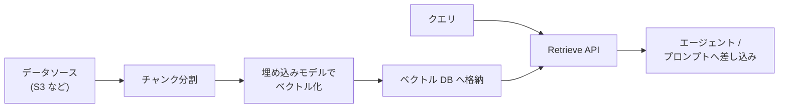

# 第10章 ナレッジベース

この章を終えると、RAG（検索拡張生成）の中身であるチャンク分割、スコアリング、上位 k 件取得を自分の手で実装した状態になります。
そのうえで同じ質問を Bedrock Knowledge Bases の Retrieve API にも投げ、マネージドサービスがパイプラインのどこを肩代わりしているかを説明できるようになります。

この章も独立した uv プロジェクトです。最初に依存を入れてください。

```bash
cd 10-knowledge-base
uv sync
```

## 10.1 概要

### 10.1.1 RAG とは

モデルの知識は学習時点で止まっており、自社の議事録や仕様書のような社内文書はそもそも知りません。
かといって手元の文書を全部プロンプトに詰めると、コンテキスト長とコストの両方で破綻します。

RAG（Retrieval-Augmented Generation）は、文書を全部渡す代わりに必要な断片だけを渡すことでこの問題を解く設計です。
質問を受けるたびに関連する文書の断片だけを検索し、プロンプトに差し込んでから生成させます。
モデルを再学習せずに今日の社内知識で答えられるのは、知識を重みではなく呼び出し時の入力として渡しているからです。

### 10.1.2 Bedrock Knowledge Bases とは

RAG を成立させるには、文書を分割し、ベクトル化して格納し、クエリで検索する一連のパイプラインが要ります。
Bedrock Knowledge Bases はこれをマネージドで肩代わりする機能です（第1章 1.1.9 の位置づけ表を参照）。



エージェント側から見ると、同期済みの Knowledge Base に対して Retrieve API を呼ぶだけです。
返ってくるのはスコア付きの文書断片で、この形はこの章で自作するミニ RAG の戻り値と同じです。

### 10.1.3 埋め込みと次元数

埋め込みモデルは文をベクトルに変換します。
次元数はそのベクトルの長さで、Titan Text Embeddings V2 なら 1024 / 512 / 256 から選べます。
Knowledge Base を作るときに決める値で、後から変えるにはインデックスを作り直します。

次元が多いほど元の文の情報を落とさずに持てますが、ベクトル DB のストレージと検索のコストは上がります。
そして、多いほど検索が当たるとは限りません。
自分のデータで 3 つとも試し、上位 k 件に正解が入る割合を比べて決める値です。
とりあえず最大で始めると、後から下げるときの判断材料が手元に残りません。

### 10.1.4 Web 検索との使い分け

この教材の題材である競合リサーチは公開 Web 情報が対象なので、第3章では Web からページを取得するツールを作りました。
対象が社内に蓄積された文書なら Knowledge Bases が候補になります。
どちらも「クエリを受けて文書断片を返すツール」であり、エージェントから見た形は同じです。
違いは検索対象がどこにあり、誰がインデックスを管理するかだけです。

## 10.2 実装のポイント

このハンズオンでは、埋め込みベクトルの代わりに**文字 2-gram の重なり**でスコアを付けます。
意味の近さは測れませんが、「分割 → スコア → 上位 k 件」というパイプラインの形は実物と同じです。
実運用の Knowledge Bases は、この 2-gram の部分が埋め込みモデルに置き換わったものだと理解できます。

チャンク設計にはトレードオフがあります。
小さすぎると文脈が切れて答えに必要な情報が断片から漏れ、大きすぎると無関係な文が混ざってスコアが薄まります。
チャンクの境界で文が途中で切れる問題を緩和するのが overlap（隣接チャンクを一部重ねて切り出す手法）です。

retrieve をエージェントのツールにするときは、第3章の規約がそのまま適用できます。

- 1 ツール 1 責務。検索と要約を 1 つのツールに混ぜない
- docstring は「受け取るもの / 返すもの / 含まないもの」の 3 節
- 検索結果は信頼できない入力として扱う（第14章）。KB の文書に紛れた指示文も Web 検索結果と同じく従う対象ではない

最後の項目は KB 特有の落とし穴なので補足します。
注入の入口が、Web 検索なら取得したページ、KB なら取り込み元だという違いがあります。
社内 Wiki や共有ドライブのように誰でも書ける場所を同期対象にした時点で、そこに書かれた「これまでの指示を無視して」がチャンクとしてプロンプトに載ります。

しかも KB は一度取り込めば、毎回のクエリで引かれ続けます。
Web 検索の注入がその 1 回きりなのに対し、こちらは消すまで残り続けます。
対策は取り込み側で行います。同期対象を編集権限の管理された場所に限る、取り込み時に指示文らしき記述を除外する、といった方法です。
プロンプト側の防御（第14章）は、これらを通過したものに対処します。

## 10.3 【ハンズオン】ミニ RAG を実装する

架空 3 社の紹介文を検索対象に、「無料トライアルの期間は？」に効く断片を取り出せるようにします。
編集するのは `exercises/mini_rag.py` の 1 ファイルだけです。

### 10.3.1 TODO を 3 つ埋める

`exercises/mini_rag.py` を開いてください。
検索対象の `DOCUMENTS` と、文字 2-gram を作る `bigrams` は書いてあり、TODO が 3 つ残っています。

1. `chunk_text` — 開始位置を size - overlap ずつ進めて切り出す。先頭チャンクは `text[:size]`、末尾は size に満たなくてよい
2. `score` — クエリ側 2-gram のうちチャンクにも現れるものの割合。2-gram が作れないクエリは 0.0
3. `retrieve` — 全ドキュメントを分割してスコアを付け、降順で上位 top_k 件の (スコア, チャンク) を返す

先に判定テスト `verify/test_mini_rag.py` を読むと分かりやすくなります。
要求仕様そのものになっています。

### 10.3.2 自分の手で検索する

実装できたら TODO コメントを消し、判定の前に動かします。
retrieve に質問を投げるスクリプトを用意してあります（編集不要）。

```bash
uv run 01_search.py
```

スコア付きの 3 行が表示され、最上位（1 行目）がベータ社のチャンクになっているはずです。
「30 日間」を含む断片が、料金や機能の話より高いスコアを取っていれば正解です。

### 10.3.3 合格判定

手動で見たのは 1 クエリだけです。
チャンクの重なりやスコアの範囲まで含めた全仕様は verify が検査します。

```bash
uv run pytest -q
```

`7 passed` で合格です。

<details>
<summary>解答例</summary>

```python
def chunk_text(text: str, size: int = 120, overlap: int = 30) -> list[str]:
    """テキストを size 文字のチャンクに分割する。隣り合うチャンクは overlap 文字重ねる。"""
    step = size - overlap
    chunks = []
    start = 0
    while start < len(text):
        chunks.append(text[start : start + size])
        if start + size >= len(text):
            break
        start += step
    return chunks


def score(query: str, chunk: str) -> float:
    """query と chunk の近さを 0.0〜1.0 で返す。"""
    q = bigrams(query)
    if not q:
        return 0.0
    return len(q & bigrams(chunk)) / len(q)


def retrieve(
    query: str,
    documents: list[str],
    top_k: int = 3,
    size: int = 120,
    overlap: int = 30,
) -> list[tuple[float, str]]:
    """全ドキュメントをチャンクに割り、スコア降順で上位 top_k 件の (スコア, チャンク) を返す。"""
    chunks = [c for doc in documents for c in chunk_text(doc, size, overlap)]
    ranked = sorted(((score(query, c), c) for c in chunks), key=lambda t: t[0], reverse=True)
    return ranked[:top_k]
```

全文は `solutions/mini_rag.py` にあります。

</details>

### 10.3.4 Bedrock Knowledge Bases で同じことをする

自作したパイプラインのマネージド版を 1 回呼びます。AWS を使います。
Knowledge Base の作成はコンソールから行ってください（S3 バケットにテキストを数枚置き、Knowledge Base を作成してデータソースを同期する。利用可能な埋め込みモデルとリージョン対応は AWS 公式ドキュメントで確認する）。

作成した Knowledge Base の ID を控え、Retrieve API を呼びます。
スクリプトは用意してあります（編集不要）。

```bash
KB_ID=<自分の Knowledge Base ID> uv run 02_kb_retrieve.py
```

numberOfResults を 3 にしているので、スコア付きの断片が 3 件出るはずです。
10.3.2 と同じ形の出力ですが、スコアの根拠が 2-gram の一致ではなく埋め込みベクトルの類似度になっています。
「期間」「トライアル」という語を含まない言い換えクエリでも当たるか試すと、意味検索との差が実感できます。

## 10.4 まとめ

RAG は知識をモデルの重みではなく、呼び出し時の入力として差し込む設計であり、Knowledge Bases はその分割から検索までのパイプラインのマネージド版です。
自作した `retrieve()` と Retrieve API の戻り値が同じ形だったことが示すとおり、**エージェントにとって検索は「クエリを受けて断片を返すツール」の一種**にすぎません。
そのためツール設計の規約（第3章）も、検索結果を信頼しない原則（第14章）も、そのまま適用されます。

## 次の章

[第11章 認証と認可](../11-auth/)
