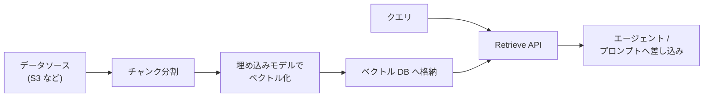

# 第10章 ナレッジベース — RAG の仕組みを手で作る

この章を終えると、検索拡張生成(RAG)の中身 — チャンク分割・スコアリング・上位 k 件取得 —
を自分の手で実装した状態になり、Bedrock Knowledge Bases がそのどこを肩代わりする
マネージドサービスなのかを説明できるようになります。

この章は独立した uv プロジェクトです。最初に依存を入れてください。

```bash
cd 10-knowledge-base
uv sync
```

## 10.1 概要

### 10.1.1 RAG とは

モデルの知識は学習時点で止まっており、自社の議事録や仕様書のような社内文書は
そもそも知りません。かといって手元の文書を全部プロンプトに詰めると、
コンテキスト長とコストの両方で破綻します。

RAG(Retrieval-Augmented Generation)はこの間を取る設計です。質問を受けるたびに
関連する文書の断片だけを検索し、プロンプトに差し込んでから生成させます。
モデルを再学習せずに「今日の社内知識」で答えられるのは、知識を重みではなく
呼び出し時の入力として渡しているからです。

### 10.1.2 Bedrock Knowledge Bases とは

RAG を成立させるには、文書の分割・ベクトル化・格納・検索という一連のパイプラインが
要ります。Bedrock Knowledge Bases はこれをマネージドで肩代わりする機能です
(第1章 1.1.4 の位置づけ表を参照)。



エージェント側から見ると、同期済みの Knowledge Base に対して Retrieve API を
呼ぶだけです。返ってくるのはスコア付きの文書断片で、この形はこの章で自作する
ミニ RAG の戻り値と同じです。

### 10.1.3 本教材の題材との使い分け

競合リサーチの対象は公開 Web 情報なので、本体は `web_search` ツール(第3章)を
使っています。対象が社内に蓄積された文書なら Knowledge Bases が候補になります。
どちらも「クエリを受けて文書断片を返すツール」であり、エージェントから見た形は同じです。
違いは検索対象がどこにあり、誰がインデックスを管理するかだけです。

## 10.2 実装のポイント

このハンズオンでは、埋め込みベクトルの代わりに**文字 2-gram の重なり**でスコアを
付けます。意味の近さは測れませんが、「分割 → スコア → 上位 k 件」というパイプラインの
形は実物と同じです。実運用の Knowledge Bases は、この 2-gram の部分が埋め込みモデルに
置き換わったものだと理解できます。

チャンク設計には trade-off があります。小さすぎると文脈が切れて答えに必要な情報が
断片から漏れ、大きすぎると無関係な文が混ざってスコアが薄まります。境界で文が
切れる問題への保険が overlap(隣接チャンクの重ね)です。

retrieve をエージェントのツールにするときは、第3章の規約がそのまま生きます。

- 1 ツール 1 責務。検索と要約を 1 つのツールに混ぜない
- docstring は「受け取るもの / 返すもの / 含まないもの」の 3 節
- 検索結果は信頼できない入力として扱う(第14章)。KB の文書に紛れた指示文も
  Web 検索結果と同じく従う対象ではない

## 10.3 【ハンズオン】ミニ RAG を実装する

`01_mini_rag.py` を作成し、次の骨組みから始めてください。`DOCUMENTS` と `bigrams` は
そのまま写し、残り 3 つの関数を自分で実装します。

```python
"""ミニ RAG。埋め込みの代わりに文字 2-gram の重なりで近さを測る。"""

DOCUMENTS = [
    "アクメ社は法人向けの経費精算 SaaS を提供している。料金プランは月額の従量課金で、"
    "ユーザー数 50 名までのスタータープランと、SSO と監査ログが付くエンタープライズプランがある。"
    "2025 年にモバイルアプリのレシート OCR 機能を追加した。",
    "ベータ社の主力製品は人事労務の管理ツール。無料トライアルは 30 日間で、"
    "有料化の際は年間契約のみ。カスタマーサポートはメールのみで、導入支援は別料金。"
    "最近は API 連携の拡充を打ち出している。",
    "ガンマ社はチームのタスク管理ツールを開発している。個人利用は無料、"
    "チーム利用は 1 ユーザーあたりの月額課金。強みはガントチャートと外部カレンダー連携で、"
    "大企業よりも中小のソフトウェア開発チームに採用が多い。",
]


def bigrams(text: str) -> set[str]:
    """文字 2-gram の集合を返す。例: "料金プラン" -> {"料金", "金プ", "プラ", "ラン"}"""
    return {text[i : i + 2] for i in range(len(text) - 1)}


def chunk_text(text: str, size: int = 120, overlap: int = 30) -> list[str]:
    """テキストを size 文字のチャンクに分割する。隣り合うチャンクは overlap 文字重ねる。

    ヒント: 開始位置を size - overlap ずつ進める。先頭チャンクは text[:size]。
    末尾のチャンクは size に満たなくてよい。
    """
    raise NotImplementedError  # ここを自分で実装する


def score(query: str, chunk: str) -> float:
    """query と chunk の近さを 0.0〜1.0 で返す。

    クエリ側の 2-gram のうち、チャンクにも現れるものの割合。
    query が 1 文字以下で 2-gram が作れないときは 0.0。
    """
    raise NotImplementedError  # ここを自分で実装する


def retrieve(
    query: str,
    documents: list[str],
    top_k: int = 3,
    size: int = 120,
    overlap: int = 30,
) -> list[tuple[float, str]]:
    """全ドキュメントをチャンクに割り、スコア降順で上位 top_k 件の (スコア, チャンク) を返す。"""
    raise NotImplementedError  # ここを自分で実装する


if __name__ == "__main__":
    for s, c in retrieve("無料トライアルの期間は？", DOCUMENTS, top_k=3):
        print(f"{s:.2f} | {c[:40]}")
```

実装できたら動かします。

```bash
uv run 01_mini_rag.py
```

3 行が表示され、最上位(1 行目)がベータ社のチャンクになっているはずです。
「30 日間」を含む断片が、料金や機能の話より高いスコアを取っていれば正解です。
合格判定を流します。

```bash
uv run pytest -q
```

`6 passed` で合格です。詰まったら `solutions/01_mini_rag.py` を見てください。

## 10.4 【ハンズオン】Bedrock Knowledge Bases で同じことをする

自作したパイプラインのマネージド版を 1 回呼びます。Knowledge Base の作成は
コンソールから行ってください(S3 バケットにテキストを数枚置き、Knowledge Base を
作成してデータソースを同期する。利用可能な埋め込みモデルとリージョン対応は
AWS 公式ドキュメントで確認する)。

作成した Knowledge Base の ID を控え、`02_kb_retrieve.py` を作成します。

```python
"""Bedrock Knowledge Bases の Retrieve API を生で呼ぶ。"""

import os

import boto3

client = boto3.client(
    "bedrock-agent-runtime",
    region_name=os.environ.get("AWS_REGION", "ap-northeast-1"),
)

response = client.retrieve(
    knowledgeBaseId=os.environ["KB_ID"],
    retrievalQuery={"text": "無料トライアルの期間は？"},
    retrievalConfiguration={"vectorSearchConfiguration": {"numberOfResults": 3}},
)

for result in response["retrievalResults"]:
    print(f"{result['score']:.3f} | {result['content']['text'][:60]}")
```

```bash
KB_ID=<自分の Knowledge Base ID> uv run 02_kb_retrieve.py
```

スコア付きの断片が 3 件出るはずです。10.3 の `retrieve()` と同じ形の出力ですが、
スコアの根拠が 2-gram の一致ではなく埋め込みベクトルの類似度になっています。
「期間」「トライアル」という語を含まない言い換えクエリでも当たるか試すと、
意味検索との差が実感できます。

## 10.5 まとめ

RAG は「知識をモデルの重みではなく、呼び出し時の入力として差し込む」設計であり、
Knowledge Bases はその分割・ベクトル化・検索パイプラインのマネージド版です。
自作した `retrieve()` と Retrieve API の戻り値が同じ形だったことが示すとおり、
**エージェントにとって検索は「クエリを受けて断片を返すツール」の一種**にすぎません。
だからツール設計の規約(第3章)も、検索結果を信頼しない原則(第14章)も、
そのまま適用されます。

## 次の章

[第11章 認証と認可](../11-auth/)
