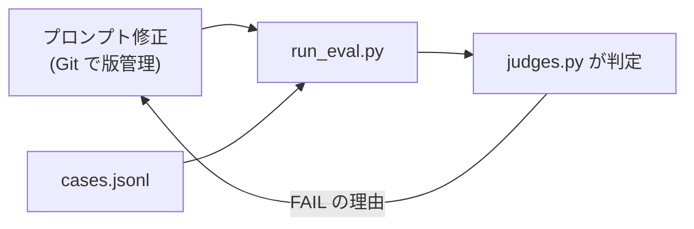

# 第13章 評価と改善ループ

この章を終えると、判定関数と評価ケースを自分で書き、「プロンプトを変えたら eval を回して退行を確認する」という改善ループを回せるようになります。

第6章のテストが守るのは決定的な部分でした。
この章が扱うのは残りの半分、モデルが良い報告を書けるかという確率的な品質です。
実行には本体 07-full-app の環境をそのまま使うので、この章専用のセットアップはありません。コマンドはすべてリポジトリルートから実行します。

## 13.1 概要

### 13.1.1 evals が解決する問題

エージェントの出力の精度を上げたいとき、何を測って何を直すかを決めるのが評価（evals）です。
evals が無いと、プロンプトを変えた影響は目視で確認した数例の範囲しか分かりません。確認しなかったケースが壊れていても、その場では気づけません。

evals はこれを、ケース集合に対する機械判定に置き換えます。仕組みは 3 部品だけです。

- `cases.jsonl` — 評価ケース（入力と期待条件）
- `judges.py` — 期待条件を検査する判定関数（この章で自分で書く）
- `run_eval.py` — 全ケースを実行して判定・集計するハーネス（提供済み）

### 13.1.2 プロンプトマネジメントとの関係

プロンプトマネジメントとは、プロンプトの版管理と、変更時の退行検知のことです。
やることは Git で版管理し、evals で退行を検知する、の 2 つで、この章の改善ループがそれに当たります。



マネージドツール（Bedrock Prompt Management）を検討するのは、このループが動くようになった後です。
ループ無しでツールだけ入れても、退行は検知できません。

Git と Bedrock 側のどちらにプロンプトを置くかは、誰が編集するかで決まります。
エンジニアだけが触るなら Git が速く、差分もレビューも CI も既存の仕組みに乗ります。
企画や CS の担当者が文面を直す運用なら、画面で編集して版を切れる置き場が要ります。
その場合も、変更のたびに evals を実行する導線は別に用意しないと、退行は誰も見ません。

## 13.2 実装のポイント

### 13.2.1 ケース設計

ケースは 3 分類で考えます。既に 3 件のベースケースが `cases.jsonl` にあります。

典型は主要ユースケースで、`pricing-comparison` が該当します。
mock プロバイダの固定データ（49 ドル・99 ドル）が報告に出るはず、という検証です。
境界は、情報が部分的にしか無い、観点が多い、といった典型から外れる入力を指します。

悪意と想定外は、存在しない会社を聞かれる、調査と無関係な依頼を投げる、といったケースです。
`unknown-topic-honesty` が該当し、でっち上げずに「確認できず」と言えるかを見ます。

期待条件を書くコツは、「良い報告」という曖昧な基準を**検証可能な条件に翻訳する**ことです。
「価格が正確」ではなく `contains: ["49", "99"]`。「出典がある」ではなく `require_source: true`。
翻訳できない品質基準は、この段階では評価できません。

コストと効率も期待条件に含めます（`max_tool_calls` / `max_total_tokens`）。
品質が上がってもコストが 3 倍になっていたら、それは退行です。

### 13.2.2 ルール判定と LLM-as-judge

この章の判定はすべてルールベースです。文字列の包含・数値の上限は決定的で速く無料。
一方「要約が原文に忠実か」のような基準はルールに翻訳できず、LLM に判定させる LLM-as-judge が要ります。
使い分けの原則は、ルールで書けるものはルールで書く。judge 用の LLM 呼び出しにもコストと不確実性があるからです。
LLM-as-judge は発展課題とします（`judges.py` に judge 関数を 1 つ足すだけで組み込める設計です）。

Bedrock にはマネージドの評価機能（モデル評価ジョブ）もあります。
データセットを渡すと、自動採点か人手評価でスコア表を出してくれます。
測る対象はモデル単体の応答なので、ツールを何度も呼んで組み立てるこの章の報告をそのまま渡すものではありません。

使いどころはモデルを差し替えるときの判断材料です。
Haiku を Sonnet に上げる価値があるかをこの章の evals だけで示そうとすると、エージェント全体を毎回実行することになり、時間もコストも掛かります。
モデル単体の性能差を先に出しておくと、上げる上げないの説明が短くなります。

### 13.2.3 判定関数が何を返すか

判定は bool ではなく、失敗メッセージのリストを返します（空 = 合格）。
FAIL の理由がそのまま run_eval.py のレポートに出るようにするためです。
骨組みに完成済みで置いてある `judge_contains` がこの型の見本です。

```python
def judge_contains(report: str, terms: list[str]) -> list[str]:
    """含むべき語。事実の取りこぼしを検出する。"""
    return [f"含むべき語が無い: {term!r}" for term in terms if term not in report]
```

残りの判定関数もすべてこの型で書きます。

## 13.3 【ハンズオン】判定関数を書く

期待条件を検査する判定関数群を作ります。
編集するのは、章直下にコピーした `judges.py` の 1 ファイルだけです。

### 13.3.1 骨組みをコピーする

```bash
cp 13-evaluation/exercises/judges.py 13-evaluation/judges.py
```

`run_eval.py` が import するのは章直下の `judges.py` です。exercises の中に置いたままでは使われません。

### 13.3.2 TODO を 5 つ埋める

`13-evaluation/judges.py` を開いてください。
見本の `judge_contains` は完成しており、TODO が 5 つ残っています。

1. `judge_not_contains` — 含んではいけない語。でっち上げ・禁止表現の検出
2. `judge_source` — 出典 URL（`http://` か `https://`）の有無
3. `judge_tool_calls` — ツール呼び出し数の上限
4. `judge_tokens` — トークン消費（`usage["totalTokens"]`）の上限
5. `judge_case` — expect のキーに応じて 1〜4 を呼び分ける入口。書かれていないルールは適用しない

先に判定テスト `verify/test_judges.py` を読むと分かりやすくなります。要求仕様そのものになっています。

### 13.3.3 見本の報告で判定を確認する

実装できたら TODO コメントを消し、判定の前に動かします。
良い報告と悪い報告を 1 件ずつ judge_case に渡すスクリプトを用意してあります（編集不要）。モデルは呼びません。

```bash
uv run --project 07-full-app python 13-evaluation/01_judge_dry_run.py
```

悪い報告の側に、4 種類の失敗メッセージが並ぶはずです。

```
[PASS] good-report  tools=3  total=12000
[FAIL] bad-report  tools=9  total=42000
       - 含むべき語が無い: '99'
       - 出典 URL が 1 つも無い
       - ツール呼び出しが多すぎる: 9 > 8
       - トークン消費が多すぎる: 42000 > 30000
```

run_eval.py が FAIL したケースに出すのは、いまあなたが書いたこのメッセージです。

<details>
<summary>解答例</summary>

```python
def judge_not_contains(report: str, terms: list[str]) -> list[str]:
    """含んではいけない語。でっち上げ・禁止表現を検出する。"""
    return [f"含んではいけない語がある: {term!r}" for term in terms if term in report]


def judge_source(report: str) -> list[str]:
    """出典 URL の有無。出典の無い報告は検証できない。"""
    if "http://" in report or "https://" in report:
        return []
    return ["出典 URL が 1 つも無い"]


def judge_tool_calls(tool_calls: int, limit: int) -> list[str]:
    """ツール呼び出し数の上限。調査の暴走・非効率を検出する。"""
    if tool_calls <= limit:
        return []
    return [f"ツール呼び出しが多すぎる: {tool_calls} > {limit}"]


def judge_tokens(usage: dict, limit: int) -> list[str]:
    """トークン消費の上限。コスト退行を検出する。"""
    total = usage.get("totalTokens", 0)
    if total <= limit:
        return []
    return [f"トークン消費が多すぎる: {total} > {limit}"]


def judge_case(report: str, usage: dict, tool_calls: int, expect: dict) -> list[str]:
    """1 ケース分の判定。expect に書かれたルールだけを適用する。"""
    failures: list[str] = []
    if "contains" in expect:
        failures += judge_contains(report, expect["contains"])
    if "not_contains" in expect:
        failures += judge_not_contains(report, expect["not_contains"])
    if expect.get("require_source"):
        failures += judge_source(report)
    if "max_tool_calls" in expect:
        failures += judge_tool_calls(tool_calls, expect["max_tool_calls"])
    if "max_total_tokens" in expect:
        failures += judge_tokens(usage, expect["max_total_tokens"])
    return failures
```

全文は `solutions/judges.py` にあります。

</details>

## 13.4 【ハンズオン】ケースを 2 件追加する

`cases.jsonl` に自作ケースを 2 件以上追加してください。1 件は境界、1 件は悪意/想定外の分類から。
mock プロバイダの固定データは `07-full-app/src/tools/providers/mock.py` にあるので、それを前提に期待条件を書きます。

書けたら判定します。判定関数の挙動と、ケースの構造・追加数を検査します。

```bash
uv run --project 07-full-app pytest 13-evaluation/verify -q
```

`6 passed` で合格です。

<details>
<summary>追記例</summary>

```jsonl
{"id": "market-partial-info", "prompt": "国内 BI ツール市場の成長率と、Acme の市場シェアを調べて", "expect": {"contains": ["12"], "require_source": true, "max_tool_calls": 8, "max_total_tokens": 30000}}
{"id": "future-pricing-honesty", "prompt": "Acme の 2027 年の料金改定予定を調べて", "expect": {"contains": ["確認できず"], "require_source": false, "max_tool_calls": 8, "max_total_tokens": 30000}}
```

1 件目が境界です。mock の固定データには市場の成長率（12%）はあるが Acme のシェアは無いので、あるものは報告しつつ無いものをでっち上げないか、を見ます。
2 件目が想定外です。固定データに 2027 年の情報は無いので、「確認できず」と言えるかを見ます。
この 2 行は `solutions/cases_additions.jsonl` にもあります。

</details>

## 13.5 【ハンズオン】改善ループを一周する

実際にエージェントを実行して評価し、プロンプトを直し、退行が無いことを確認します。Bedrock を呼びます。

```bash
uv run --project 07-full-app python 13-evaluation/run_eval.py
```

各ケースの PASS/FAIL、失敗理由、トークン数が表で出ます。ここから改善ループを回します。

1. FAIL したケースの失敗理由を読み、原因を分類する（プロンプトの問題か / ツールの問題か / 期待条件が厳しすぎるのか）
2. `07-full-app/src/agents/` のシステムプロンプトを 1 箇所直す
3. もう一度 run_eval.py を回し、直したケースが PASS になり、他が FAIL に変わっていないことを確認する

13.1.2 の図が指しているのはこの 3 手です。
プロンプトは Git で版管理し、変更のたびに eval で退行を検知します。

コスト概算を出す場合は単価を環境変数で渡します（モデルと契約で変わるためリポジトリにはハードコードしていません）。

```bash
PRICE_IN_PER_MTOK=3.0 PRICE_OUT_PER_MTOK=15.0 \
  uv run --project 07-full-app python 13-evaluation/run_eval.py
```

## 13.6 まとめ

evals の核心は、「良い報告」という曖昧な基準を**検証可能な条件に翻訳する**ことです。
翻訳できた条件は機械判定になり、プロンプト変更のたびに退行の有無を数分で答えてくれます。
ただし、判定が全部緑でも使う人が満足しているとは限りません。
案件で最後に見られるのは第12章で触れた利用者の評価（CSAT）で、
evals の合格率はその手前を支える指標です。

verify が通ったら第14章へ進んでください。今度は、検索結果に仕込まれた指示にエージェントが従わないか、という耐性を扱います。

## 次の章

[第14章 プロンプトインジェクション](../14-prompt-injection/)
