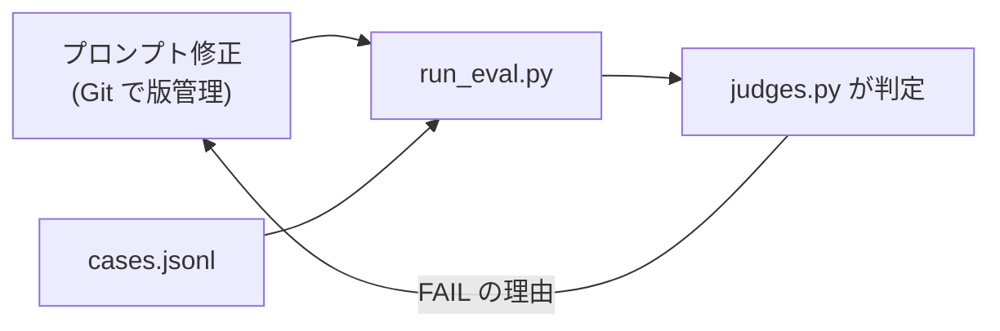

# 第13章 評価と改善ループ

この章を終えると、判定関数と評価ケースを自分で書き、「プロンプトを変えたら
eval を回して退行を確認する」という改善ループを回せるようになります。

第6章のテストが守るのは決定的な部分でした。この章が扱うのは残りの半分、
「モデルが良い報告を書けるか」という確率的な品質です。

## 13.1 概要

### 13.1.1 なぜ evals か

案件で必ず来る要望が「精度を上げてくれ」です。このとき evals が無いと、
プロンプトをいじる → 目視で 2〜3 例を確認 → 良くなった気がする → 別のケースが
壊れていたことに 1 週間後に気づく、という進み方になります。

evals はこれを、ケース集合に対する機械判定に置き換えます。仕組みは 3 部品だけです。

- `cases.jsonl` — 評価ケース（入力と期待条件）
- `judges.py` — 期待条件を検査する判定関数（この章で自分で書く）
- `run_eval.py` — 全ケースを実行して判定・集計するハーネス（提供済み）

### 13.1.2 プロンプトマネジメントとの関係

プロンプトマネジメントとは、プロンプトの版管理と、変更時の退行検知のことです。
本質は「Git で版管理し、evals で退行を検知する」の 2 つで、この章の改善ループが
そのまま実体になります。



マネージドツール（Bedrock Prompt Management）を検討するのは、このループが
回るようになった後の話です。ループ無しでツールだけ入れても、退行は検知できません。

## 13.2 実装のポイント

### 13.2.1 ケース設計

ケースは 3 分類で考えます。既に 3 件のベースケースが `cases.jsonl` にあります。

- **典型** — 主要ユースケース。`pricing-comparison` が該当。
  mock プロバイダの固定データ（49 ドル・99 ドル）が報告に出るはず、という検証
- **境界** — 情報が部分的にしか無い、観点が多い、などエージェントが苦手になりやすい入力
- **悪意 / 想定外** — 存在しない会社を聞かれる、調査と無関係な依頼。
  `unknown-topic-honesty` が該当。「確認できず」と言えるか = でっち上げないか

期待条件を書くコツは、「良い報告」という曖昧な基準を**検証可能な条件に翻訳する**ことです。
「価格が正確」ではなく `contains: ["49", "99"]`。「出典がある」ではなく
`require_source: true`。翻訳できない品質基準は、この段階では評価できません。

コストと効率も期待条件に含めます（`max_tool_calls` / `max_total_tokens`）。
品質が上がってもコストが 3 倍になっていたら、それは退行です。

### 13.2.2 ルール判定と LLM-as-judge

この章の判定はすべてルールベースです。文字列の包含・数値の上限は決定的で速く無料。
一方「要約が原文に忠実か」のような基準はルールに翻訳できず、LLM に判定させる
LLM-as-judge が要ります。使い分けの原則は、**ルールで書けるものはルールで書く**。
judge 用の LLM 呼び出しにもコストと不確実性があるからです。LLM-as-judge は
発展課題とします（`judges.py` に judge 関数を 1 つ足すだけで組み込める設計です）。

## 13.3 【ハンズオン】判定関数を書く

`judges.py` を作成してください。設計方針が 1 つあります。判定は bool ではなく
**失敗メッセージのリスト**を返す（空 = 合格）。FAIL の理由がそのままレポートに
出るようにするためです。

次のコードを自分の手で書いてください。

```python
"""ルールベースの判定関数群。各関数は失敗メッセージのリストを返す（空 = 合格）。"""

from __future__ import annotations


def judge_contains(report: str, terms: list[str]) -> list[str]:
    """含むべき語。事実の取りこぼしを検出する。"""
    return [f"含むべき語が無い: {term!r}" for term in terms if term not in report]


def judge_not_contains(report: str, terms: list[str]) -> list[str]:
    """含んではいけない語。でっち上げ・禁止表現を検出する。"""
    return [f"含んではいけない語がある: {term!r}" for term in terms if term in report]


def judge_source(report: str) -> list[str]:
    """出典 URL の有無。出典の無い報告は検証できない。"""
    if "http://" in report or "https://" in report:
        return []
    return ["出典 URL が 1 つも無い"]
```

残り 2 つの判定（`judge_tool_calls(tool_calls, limit)` と `judge_tokens(usage, limit)`。
usage は `totalTokens` キーを持つ dict）と、expect の内容に応じて各判定を呼び分ける
`judge_case(report, usage, tool_calls, expect) -> list[str]` は自分で設計してください。
expect のキーは 13.2.1 の 5 種類です。書かれていないルールは適用しないこと。

## 13.4 【ハンズオン】ケースを 2 件追加する

`cases.jsonl` に自作ケースを 2 件以上追加してください。1 件は境界、1 件は悪意/想定外の
分類から。mock プロバイダの固定データは `07-full-app/src/tools/providers/mock.py` に
あるので、それを前提に期待条件を書きます。

判定を流します（判定関数とケースの構造だけを検査します）。

```bash
uv run --project 07-full-app pytest 13-evaluation/verify -q
```

`5 passed` で合格です。

## 13.5 【ハンズオン】改善ループを一周する

実際にエージェントを走らせて評価し、プロンプトを直し、退行なしを確認します。

```bash
uv run --project 07-full-app python 13-evaluation/run_eval.py
```

各ケースの PASS/FAIL、失敗理由、トークン数が表で出ます。ここからが本番です。

1. FAIL したケースの失敗理由を読み、原因を分類する
   （プロンプトの問題か / ツールの問題か / 期待条件が厳しすぎるのか）
2. `07-full-app/src/agents/` のシステムプロンプトを 1 箇所直す
3. もう一度 run_eval.py を回し、**直したケースが PASS になり、他が FAIL に
   変わっていない**ことを確認する

この 3 手がプロンプトマネジメントの実体です。プロンプトは Git で版管理し、
変更のたびに eval で退行を検知する。管理ツールはその後の話です。

コスト概算を出す場合は単価を環境変数で渡します（モデルと契約で変わるため
リポジトリにはハードコードしていません）。

```bash
PRICE_IN_PER_MTOK=3.0 PRICE_OUT_PER_MTOK=15.0 \
  uv run --project 07-full-app python 13-evaluation/run_eval.py
```

## 13.6 まとめ

evals の核心は、「良い報告」という曖昧な基準を **検証可能な条件に翻訳する** ことです。
翻訳できた条件は機械判定になり、プロンプト変更のたびに退行の有無を数分で答えて
くれます。次の第14章でもこのハーネスをそのまま使い、検索結果に仕込まれた
インジェクションへの耐性を、耐性ケースとして同じ仕組みで測ります。

## 次の章

[第14章 プロンプトインジェクション](../14-prompt-injection/)
