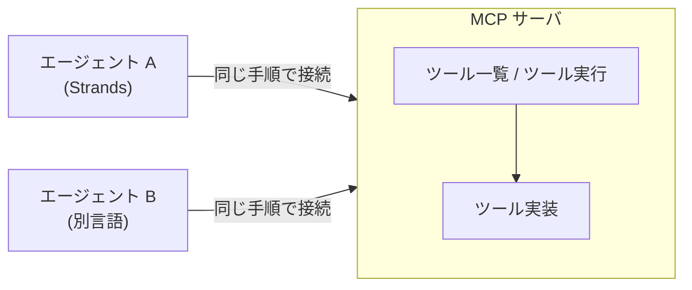

# 第15章 MCP サーバ

この章を終えると、ツールを MCP サーバとして切り出し、エージェントから
プロトコル経由で使えるようになります。

```bash
cd 15-mcp
uv sync
```

## 15.1 概要

### 15.1.1 MCP とは何を解決するものか

第3章のツールは `@tool` を付けた Python 関数で、エージェントと同じプロセスの中で
動きます。この密結合には限界があります。ツールを別チームが管理している、
複数のエージェント（別言語含む）から同じツールを使いたい、社内 API 群を
ツールとして公開したい——そういうとき、ツールを**独立したサーバ**にします。

ただしサーバに切り出しただけでは、エージェントの実装ごとに接続コードが要ります。
エージェントが M 種類、ツール提供元が N か所あれば、接続の書き方は M×N 通りに
膨らむ。この組み合わせ爆発を解消するのが MCP（Model Context Protocol）です。

MCP はそのための標準プロトコルです。サーバが「ツール一覧」「ツール実行」の
共通インタフェースを公開し、クライアント（エージェント側）はどのサーバに対しても
同じ手順で接続します。ツールの実装言語もエージェントのフレームワークも問わなくなる。



### 15.1.2 AgentCore Gateway との位置づけ

AgentCore Gateway（既存 API の MCP 化）も、この規格の上に乗っています。
社内の既存 REST API 群をコードを書かずに MCP ツールとして公開するマネージド機能で、
この章で手書きするサーバの「運用をマネージドに寄せた版」です。使い分けは
「変換ロジックが要るなら自作、素直な API 公開なら Gateway」。入口は
[付録D](../99-appendix/) にあります。

## 15.2 実装のポイント

通信は今回、標準入出力（stdio）を使います。クライアントがサーバをサブプロセスと
して起動し、stdin/stdout で JSON-RPC をやり取りする方式で、ローカル開発の標準です
（リモートには Streamable HTTP がある）。

このリポジトリのツール規約は、プロセスを分離してもそのまま適用できます。
docstring は「LLM がツールを選択するための仕様書」であり、MCP ではそれが
そのままツール定義としてプロトコル越しにクライアントへ渡ります。
1 ツール 1 責務も同じで、サーバに切り出したからといってツールの粒度は変えません。
変わるのはツールが動く場所（同一プロセスか別プロセスか）だけで、書き方の規約は
変わらない、というのがこの章で確かめることです。

## 15.3 【ハンズオン】MCP サーバを書く

`01_mcp_server.py` を作成し、次のコードを自分の手で書いてください。
第3章の docstring 規約は MCP でも同じ意味を持ちます。docstring がそのまま
ツール定義としてクライアントへ渡ります。

```python
"""検索ツールを提供する MCP サーバ。stdio で起動される。"""

from mcp.server.fastmcp import FastMCP

# サーバ名はクライアント側のログに出る識別子
mcp = FastMCP("search-server")

# 固定データ。実運用ならここが社内 API や DB への問い合わせになる
_DATA = {
    "acme": "Acme Analytics: Starter 月額 49 ドル / Business 149 ドル。SSO は Enterprise のみ。",
    "globex": "Globex Insights: Pro 月額 99 ドル。SSO は全プラン対応。異常検知機能あり。",
}


@mcp.tool()
def company_search(name: str) -> str:
    """企業名で社内データベースを検索し、要約を返す。

    受け取るもの:
        name: 企業名。"acme" または "globex"（大文字小文字は無視）。
    返すもの:
        その企業の要約 1 行。見つからなければ「該当なし」。
    含まないもの:
        Web 検索。ここにあるのは社内データだけ。
    """
    return _DATA.get(name.lower(), f"該当なし: {name}")


if __name__ == "__main__":
    mcp.run()  # stdio で待ち受ける
```

## 15.4 【ハンズオン】クライアントから接続する

LLM を使わずに、プロトコルの往復だけを確認します。`02_list_tools.py` を
作成してください。

```python
"""MCP サーバに接続し、ツール一覧の取得と実行だけを行う（LLM なし）。"""

import sys

from mcp import StdioServerParameters
from mcp.client.stdio import stdio_client
from strands.tools.mcp import MCPClient

# サーバをサブプロセスとして起動する接続定義
client = MCPClient(
    lambda: stdio_client(
        StdioServerParameters(command=sys.executable, args=["01_mcp_server.py"])
    )
)

with client:
    tools = client.list_tools_sync()
    print("tools:", [t.tool_name for t in tools])

    result = client.call_tool_sync(
        tool_use_id="check-1", name="company_search", arguments={"name": "acme"}
    )
    print("result:", result["content"][0]["text"])
```

実行します。

```bash
uv run 02_list_tools.py
```

`tools: ['company_search']` と、Acme の要約 1 行が出るはずです。
いま起きたことを整理すると、クライアントがサーバを起動し、初期化ハンドシェイク →
ツール一覧の要求 → ツール実行、をすべて JSON-RPC で行いました。
Python 関数を直接 import した箇所はどこにもありません。

## 15.5 【ハンズオン】エージェントから使う

`03_mcp_agent.py` を作成してください。15.4 のクライアントをエージェントに渡します。

```python
"""MCP サーバのツールを使うエージェント。"""

import os
import sys

from mcp import StdioServerParameters
from mcp.client.stdio import stdio_client
from strands import Agent
from strands.models import BedrockModel
from strands.tools.mcp import MCPClient

client = MCPClient(
    lambda: stdio_client(
        StdioServerParameters(command=sys.executable, args=["01_mcp_server.py"])
    )
)

with client:
    agent = Agent(
        model=BedrockModel(
            region_name=os.environ.get("AWS_REGION", "ap-northeast-1"),
            model_id=os.environ.get("MODEL_ID", "apac.anthropic.claude-haiku-4-5"),
            max_tokens=512,
        ),
        system_prompt="社内データベースを使って質問に答えてください。",
        tools=client.list_tools_sync(),  # MCP のツールがそのまま tools になる
    )
    agent("Acme と Globex の価格を比較して")
```

```bash
uv run 03_mcp_agent.py
```

比較の回答が出るはずです。第3章の `@tool` 関数と第15章の MCP ツールは、
エージェントから見ればどちらも同じ「ツール」です。違いは、同じプロセス内で
動くか別プロセスで動くかだけ。

## 15.6 合格判定

```bash
uv run pytest -q
```

`3 passed` で合格です（サーバ起動〜ツール実行まで検証します）。

## 15.7 発展

07-full-app の `web_search` を MCP サーバに切り出し、`build_search_agent` の
tools を MCP クライアント経由に差し替えてみてください。プロセス分離により、
検索プロバイダの差し替え（第3章）がエージェントの再デプロイなしでできるようになります。

## 15.8 まとめ

MCP は、エージェント×ツールの M×N 通りの接続を **「ツール一覧・ツール実行の
共通インタフェース」1 つに集約する**プロトコルです。ハンズオンで見たとおり、第3章の
docstring 規約と 1 ツール 1 責務はプロセスを分離しても変わらず、変わるのはツールが
動く場所だけです。次は 15.7 の発展で本体の `web_search` を切り出してみるか、
マネージドに寄せたいなら付録D の AgentCore Gateway に進んでください。

## 次の章

[第16章 プロンプトキャッシュ](../16-prompt-caching/)
