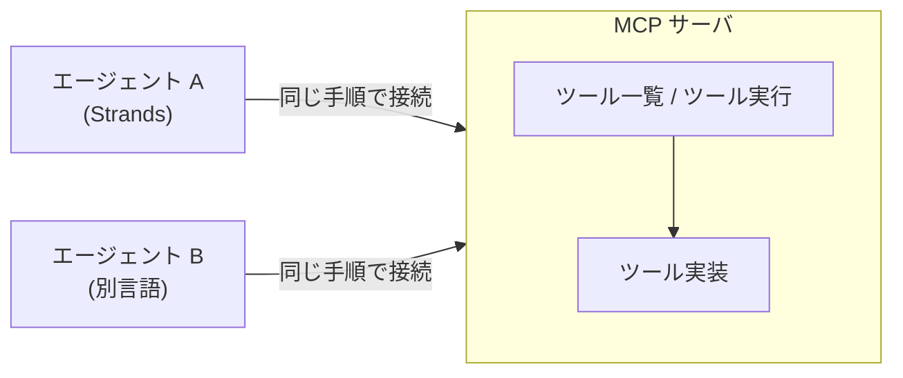

# 第15章 MCP サーバ

この章を終えると、ツールを MCP サーバとして切り出し、エージェントからプロトコル経由で使えるようになります。
ハンズオンで検索ツールを持つ MCP サーバを実装し、LLM なしのクライアントで往復を確かめてから、エージェントに接続します。

この章も独立した uv プロジェクトです。最初に依存を入れてください。

```bash
cd 15-mcp
uv sync
```

## 15.1 概要

### 15.1.1 MCP が解決する問題

第3章のツールは `@tool` を付けた Python 関数で、エージェントと同じプロセスの中で動きます。
この密結合には限界があります。
ツールを別チームが管理している、複数のエージェント（別言語含む）から同じツールを使いたい、社内 API 群をツールとして公開したい。
そういうときはツールを独立したサーバに切り出します。

ただしサーバに切り出しただけでは、エージェントの実装ごとに接続コードが要ります。
エージェントが M 種類、ツール提供元が N か所あれば、接続の書き方は M×N 通りになります。

この組み合わせを減らす標準プロトコルが MCP（Model Context Protocol）です。
サーバが「ツール一覧」「ツール実行」の共通インタフェースを公開し、クライアント（エージェント側）はどのサーバに対しても同じ手順で接続します。
ツールの実装言語もエージェントのフレームワークも問わなくなります。



### 15.1.2 AgentCore Gateway との使い分け

AgentCore Gateway（既存 API の MCP 化）も、この規格の上に乗っています。
社内の既存 REST API 群をコードを書かずに MCP ツールとして公開するマネージド機能で、この章で手書きするサーバの運用を AWS 側に任せた形です。
変換ロジックが要るなら自作し、API をそのまま公開するだけなら Gateway に任せます。
入口は[付録D](../99-appendix/)にあります。

## 15.2 実装のポイント

通信は今回、標準入出力（stdio）を使います。
クライアントがサーバをサブプロセスとして起動し、stdin/stdout で JSON-RPC をやり取りする方式で、ローカル開発の標準です（リモートには Streamable HTTP がある）。

このリポジトリのツール規約は、プロセスを分離してもそのまま適用できます。
docstring は「LLM がツールを選択するための仕様書」であり、MCP ではそれがそのままツール定義としてプロトコル越しにクライアントへ渡ります。
1 ツール 1 責務も同じで、サーバに切り出したからといってツールの粒度は変えません。
変わるのはツールが動く場所（同一プロセスか別プロセスか）だけで、書き方の規約は変わりません。

## 15.3 【ハンズオン】MCP サーバを実装する

架空 2 社の固定データを検索するツールを、MCP サーバとして公開します。
編集するのは `exercises/server.py` の 1 ファイルだけです。

### 15.3.1 TODO を 2 つ埋める

`exercises/server.py` を開いてください。
サーバの枠（`FastMCP("search-server")` と起動処理）と固定データ `_DATA` は書いてあり、TODO が 2 つ残っています。

1. `@mcp.tool()` を付けた `company_search(name: str) -> str` の定義 — docstring は第3章の 3 節構成（受け取るもの / 返すもの / 含まないもの）で書く
2. 関数本体 — `_DATA` を name の小文字化で引き、なければ「該当なし: {name}」を返す

第3章の docstring 規約は MCP でも同じ意味を持ちます。
`@tool` ではフレームワークがモデルに渡していた文章を、今度はプロトコルがクライアントへ運びます。

### 15.3.2 クライアントから接続する

実装できたら TODO コメントを消し、判定の前に動かします。
LLM を使わずにプロトコルの往復だけを行うスクリプトを用意してあります（編集不要）。
サーバをサブプロセスとして起動し、ツール一覧の取得とツール実行を行います。

```bash
uv run 01_list_tools.py
```

`tools: ['company_search']` と、Acme の要約 1 行が出るはずです。
サーバ側のログ（`Processing request of type ...`）と、Python のバージョンによっては mcp 由来の警告が混ざって表示されることがありますが、動作には影響しません。
いま起きたことを整理すると、クライアントがサーバを起動し、初期化ハンドシェイク → ツール一覧の要求 → ツール実行、をすべて JSON-RPC で行いました。
Python 関数を直接 import した箇所はどこにもありません。

### 15.3.3 合格判定

```bash
uv run pytest -q
```

`4 passed` で合格です。
ツールが公開されていること、docstring の 3 節がプロトコル越しに届くこと、大文字の "ACME" でも検索できることを検査します。

<details>
<summary>解答例</summary>

```python
@mcp.tool()
def company_search(name: str) -> str:
    """企業名で社内データベースを検索し、要約を返す。

    受け取るもの:
        name: 企業名。"acme" または "globex"（大文字小文字は無視）。
    返すもの:
        その企業の要約 1 行。見つからなければ「該当なし」。
    含まないもの:
        Web 検索。ここにあるのは社内データだけ。
    """
    return _DATA.get(name.lower(), f"該当なし: {name}")
```

全文は `solutions/server.py` にあります。

</details>

### 15.3.4 エージェントから呼ばせる

ここまでの呼び出し主体は、自分（15.3.2）とテスト（15.3.3）でした。
本来の使われ方は、モデルが docstring を読んで呼ぶ形です。Bedrock を呼びます。

```bash
uv run 02_mcp_agent.py
```

モデルが company_search を Acme と Globex に対して呼び、価格を比較した回答が返るはずです。
第3章の `@tool` 関数とこの章の MCP ツールは、エージェントから見ればどちらも同じツールです。
違いは、同じプロセス内で動くか別プロセスで動くかだけです。

## 15.4 まとめ

MCP は、エージェント×ツールの M×N 通りの接続を**ツール一覧とツール実行の共通インタフェース 1 つに集約する**プロトコルです。
ハンズオンで見たとおり、第3章の docstring 規約と 1 ツール 1 責務はプロセスを分離しても変わらず、変わるのはツールが動く場所だけです。
サーバの運用を AWS 側に任せたくなったら、付録D の AgentCore Gateway に進んでください。

## 次の章

[第16章 プロンプトキャッシュ](../16-prompt-caching/)
