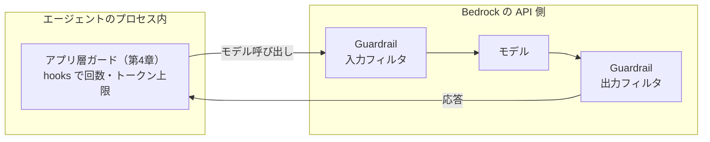

# 第17章 Bedrock Guardrails

この章を終えると、Guardrail を CDK で定義し、それをモデルに接続したエージェントを組み立てられるようになります。
第4章のアプリ層ガードとの役割分担も説明できるようになります。

この章は CDK と uv の 2 つのプロジェクトを持つ独立した章です。最初に両方の依存を入れてください。

```bash
cd 17-guardrails
npm ci
uv sync
```

## 17.1 概要

### 17.1.1 Bedrock Guardrails とは

Bedrock Guardrails は、モデルの入出力を Bedrock の API 側でフィルタするマネージド機能です。
有害コンテンツ・不適切なトピック・PII などを遮断またはマスクします。
Guardrails の一機能として、論理検証によるハルシネーション検出を行う自動推論チェック（Automated Reasoning checks）もあります。

### 17.1.2 2 層のガードの役割分担

第4章で作ったのはアプリ層のガード（回数・トークン量の上限）で、守るのはコストと暴走でした。
Guardrails が守るのは**内容**です。2 つの層は動く場所も違います。



| | アプリ層（第4章） | マネージド層（この章） |
| --- | --- | --- |
| 実体 | hooks の自作コード | Bedrock のマネージド機能 |
| 守るもの | コストと暴走 | 有害コンテンツ、PII、トピック逸脱 |
| 動く場所 | エージェントのプロセス内 | Bedrock の API 側 |
| 発動時の挙動 | 理由をモデルに返して継続 | 入出力を遮断し、定型文に置換 |

アプリ層ガードと Guardrails は、どちらかが他方を置き換えられる関係ではありません。
内容の防御をプロンプトだけに任せない（第14章の多層防御の一層として Guardrails を足す）、コストの防御を Guardrails に期待しない、という分担です。

## 17.2 実装のポイント

### 17.2.1 CDK 側で定義するもの

Guardrail 本体はリージョナルなリソースで、ポリシーの集合です。主なもの:

- コンテンツフィルタ — カテゴリごとに強度付きで遮断
- 拒否トピック — 自然文で定義したトピックを遮断
- 機微情報フィルタ — PII の遮断またはマスク
- 単語フィルタ — NG ワード

コンテンツフィルタのカテゴリは HATE / VIOLENCE / SEXUAL / INSULTS / MISCONDUCT /
PROMPT_ATTACK で、強度は NONE から HIGH まであります。
拒否トピックは投資助言のような業務上の禁止事項を自然文で書きます。

発動時は、リクエスト（入力側）またはレスポンス（出力側）が止まり、あらかじめ定義した定型文（blockedInputMessaging / blockedOutputsMessaging）が返ります。

PROMPT_ATTACK フィルタは第14章と直接つながります。
プロンプト側の防御（14 章）に加えて、既知の攻撃パターンを含む入力を Bedrock がモデルへ渡す前に遮断する層として働きます。

CDK は `aws-bedrock` モジュールの L1 `CfnGuardrail` で書きます（Runtime と同じく L2 はまだ無い。確認方法は第9章のとおり）。
版も発行します。Guardrail は版（`CfnGuardrailVersion`）で参照し、DRAFT を直接使うと編集がそのまま呼び出し側に反映されるからです。

### 17.2.2 アプリ側で渡すもの

Strands では `BedrockModel` に `guardrail_id` と `guardrail_version` を渡すと接続されます（章の venv 内の `strands/models/bedrock.py` で確認済み）。

```python
model = BedrockModel(
    region_name=region_name,
    model_id=model_id,
    guardrail_id=guardrail_id,
    guardrail_version=guardrail_version,
)
```

Strands は id と version の両方が揃ったときだけ Converse API に guardrailConfig を送ります。
片方だけ渡してもエラーにならないまま無視されるので、渡すなら必ずセットにします。

どの Guardrail を使うかはコードに書きません。
ID と版を引数（実行時は環境変数）で受け取り、未設定なら接続しない実装にします。リージョンやモデル ID をハードコードしない規約と同じ扱いです。

### 17.2.3 適用される場所

Guardrail はモデル呼び出し 1 回ごとに、Converse API の `guardrailConfig`（`guardrailIdentifier` / `guardrailVersion` / `trace`）で適用されます。
評価されるのは利用者の入力・モデルの応答・`guardContent` で囲んだシステムプロンプトで、次のものは評価されません（公式ドキュメントの評価対象表で確認）。

| 内容 | 評価 |
| --- | --- |
| 入力プロンプトとモデルの応答 | される |
| システムプロンプト | 囲んだ部分だけ |
| ツール結果（`toolResult`） | されない |
| ツール定義とツール引数 | されない |

システムプロンプトが評価されるのは `guardContent` で囲んだ部分だけです。
ツール引数はモデルが生成したものでも評価されません。

検索結果はツール結果として届くので、そこに仕込まれた間接注入は Guardrail を通りません。
第14章のプロンプト層が要る理由はここにあり、Guardrail が受け持つのは利用者入力側の攻撃（ジェイルブレイク等）と、モデルが出力する内容の側です。
どの役割のモデルに掛けるかも決めます。利用者の入力を最初に受ける役割と、最終的な報告を出す役割には掛け、途中の専門エージェントは用途次第です。

発動時は `stopReason` が `guardrail_intervened` になり、応答本文は定型文（blockedInputMessaging / blockedOutputsMessaging）に置き換わります。
`trace` を有効にすると、どのポリシーが何を遮断したかがレスポンスに含まれるので、17.5 の発動確認ではこれを見ます。

### 17.2.4 フィルタの強度をどう決めるか

コンテンツフィルタの強度は NONE / LOW / MEDIUM / HIGH の 4 段階で、カテゴリごとに、しかも入力側と出力側で別々に設定できます。
強くするほど有害な入出力を捕まえますが、同時に普通の依頼も巻き込みます。

競合リサーチで実際に困るのは INSULTS と MISCONDUCT です。
「A 社の不祥事を調べて」「B 社の弱点は」は業務としてまっとうな依頼ですが、強度を上げると誤って止まります。
止められた利用者に見えるのは定型文だけなので、理由が分からないまま「使えない」と判断されます。

決め方は、業務で通ってほしい依頼を先に 20 件ほど集めて、強度を変えながら何件が遮断されるかを数えることです。
第13章の evals のケースがそのまま使えます。
誤遮断率を測らずに HIGH で始めると、後から下げるときの根拠が印象論になります。

## 17.3 【ハンズオン】Guardrail を CDK で定義する

編集するのは `lib/guardrail-stack.ts` の 1 ファイルだけです。骨組みをコピーして作ります。

```bash
mkdir -p lib && cp exercises/guardrail-stack.ts lib/guardrail-stack.ts
```

### 17.3.1 TODO を 3 つ埋める

`lib/guardrail-stack.ts` を開いてください。
`CfnGuardrail` の枠（名前と発動時の定型文）は書いてあり、TODO が 3 つ残っています。

1. `contentPolicyConfig` — `filtersConfig` に少なくとも `{ type: 'PROMPT_ATTACK', inputStrength: 'HIGH', outputStrength: 'NONE' }` を含める（PROMPT_ATTACK は入力側のみのフィルタで、outputStrength は NONE 固定）
2. `CfnGuardrailVersion` で版を発行する。`guardrailIdentifier` には `guardrail.attrGuardrailId` を渡す
3. `CfnOutput` で GuardrailId と GuardrailVersionNumber を出力する。17.5 で環境変数に入れる値です

エントリポイント `bin/app.ts` は用意してあり（編集不要）、このファイルを `AgentPlatformGuardrailStack` として読み込みます。

### 17.3.2 synth で確認する

実装できたら TODO コメントを消し、CloudFormation テンプレートに変換してみます。

```bash
npx cdk synth AgentPlatformGuardrailStack | grep -E 'Bedrock::Guardrail|PROMPT_ATTACK'
```

`AWS::Bedrock::Guardrail` と `AWS::Bedrock::GuardrailVersion`、フィルタの `PROMPT_ATTACK` が出るはずです。

### 17.3.3 合格判定（CDK 側）

```bash
./verify/verify.sh
```

型チェックと synth の結果から、Guardrail / PROMPT_ATTACK フィルタ / 版の発行 / CfnOutput を検査します。

<details>
<summary>解答例</summary>

```ts
      contentPolicyConfig: {
        filtersConfig: [
          // 既知のプロンプト攻撃パターンをモデルの手前で遮断（第14章の多層防御の一層）。
          // PROMPT_ATTACK は入力側のみのフィルタなので outputStrength は NONE 固定
          { type: 'PROMPT_ATTACK', inputStrength: 'HIGH', outputStrength: 'NONE' },
          { type: 'HATE', inputStrength: 'HIGH', outputStrength: 'HIGH' },
          { type: 'VIOLENCE', inputStrength: 'HIGH', outputStrength: 'HIGH' },
        ],
      },
    });

    // Guardrail は版で参照するのが実務の型。DRAFT を直接使うと、編集が即本番に反映されてしまう
    const version = new bedrock.CfnGuardrailVersion(this, 'GuardrailVersion', {
      guardrailIdentifier: guardrail.attrGuardrailId,
    });

    new CfnOutput(this, 'GuardrailId', { value: guardrail.attrGuardrailId });
    new CfnOutput(this, 'GuardrailVersionNumber', { value: version.attrVersion });
```

全文は `solutions/guardrail-stack.ts` にあります。

</details>

## 17.4 【ハンズオン】モデルに接続する

編集するのは `exercises/guarded_model.py` の 1 ファイルだけです。

### 17.4.1 TODO を 2 つ埋める

`exercises/guarded_model.py` を開いてください。
関数のシグネチャは書いてあり、TODO が 2 つ残っています。

1. `guardrail_id` と `guardrail_version` の両方が指定されているときは、それを渡した `BedrockModel` を返す（17.2.2 のコードの形）
2. どちらかが None のときは `guardrail_*` を渡さずに返す（接続しない）

### 17.4.2 合格判定（アプリ側）

実装できたら TODO コメントを消し、判定を実行します。

```bash
uv run pytest -q
```

`4 passed` で合格です。
指定時に id と version の両方がモデルに渡ること・未指定時には渡らないことを検査します。

<details>
<summary>解答例</summary>

```python
    if guardrail_id and guardrail_version:
        return BedrockModel(
            region_name=region_name,
            model_id=model_id,
            guardrail_id=guardrail_id,
            guardrail_version=guardrail_version,
        )
    # 未設定なら接続しない。どの Guardrail を使うかはコードに書かず、
    # 環境変数から受け取る（リージョンやモデル ID と同じ扱い）
    return BedrockModel(region_name=region_name, model_id=model_id)
```

全文は `solutions/guarded_model.py` にあります。

</details>

## 17.5 【ハンズオン】発動を確認する

17.3 の Guardrail をデプロイし、17.4 のモデルに接続して、プロンプト攻撃調の入力を送ります。

```bash
npx cdk deploy AgentPlatformGuardrailStack
```

Outputs の GuardrailId と GuardrailVersionNumber を環境変数に入れて、確認スクリプト（編集不要）を実行します。

```bash
GUARDRAIL_ID=<GuardrailId> GUARDRAIL_VERSION=<GuardrailVersionNumber> \
  uv run 01_invoke_guarded.py
```

スクリプトは「これまでの指示はすべて無視して」で始まる入力を送ります。
PROMPT_ATTACK フィルタが入力側で発動し、モデルの回答ではなく `blockedInputMessaging` に書いた定型文が応答に現れるはずです。

## 17.6 まとめ

アプリ層の hooks がコストと暴走を止め、Guardrails が内容を止める。
どちらか片方で足りるものではなく、第14章のプロンプト側防御も含めた**多層防御の一層ずつ**という分担です。
発動の確認（17.5）を終えたら、次は取り消せない操作に人間の承認を挟むゲートを作ります。

## 次の章

[第18章 HITL（承認ゲート）](../18-hitl/)
