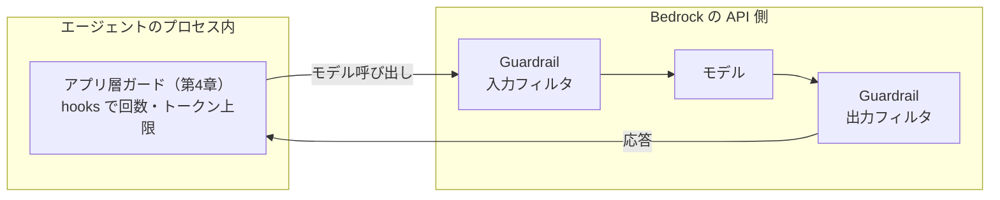

# 第17章 Bedrock Guardrails

この章を終えると、Guardrail を CDK で定義してエージェントに接続でき、
第4章のアプリ層ガードとの役割分担を説明できるようになります。

## 17.1 概要

### 17.1.1 Bedrock Guardrails とは

Bedrock Guardrails は、モデルの入出力を Bedrock の API 側でフィルタする
マネージド機能です。有害コンテンツ・不適切なトピック・PII などを遮断または
マスクします。Guardrails の一機能として、論理検証によるハルシネーション検出を行う
自動推論チェック（Automated Reasoning checks）もあります。

### 17.1.2 2 層のガードの役割分担

第4章で作ったのはアプリ層のガード（回数・トークン量の上限）で、守るのは
コストと暴走でした。Guardrails が守るのは**内容**です。2 つの層は動く場所も違います。



| | アプリ層（第4章） | マネージド層（この章） |
| --- | --- | --- |
| 実体 | hooks の自作コード | Bedrock のマネージド機能 |
| 守るもの | コスト・暴走 | 有害コンテンツ・PII・トピック逸脱 |
| 動く場所 | エージェントのプロセス内 | Bedrock の API 側 |
| 発動時の挙動 | 理由をモデルに返して継続 | 入出力を遮断し、定型文に置換 |

置き換え関係ではありません。内容の防御をプロンプトだけでやらない
（第14章の多層防御の一層）、コストの防御を Guardrails に期待しない、という分担です。

## 17.2 実装のポイント

Guardrail 本体はリージョナルなリソースで、ポリシーの集合です。主なもの:

- **コンテンツフィルタ** — HATE / VIOLENCE / SEXUAL / INSULTS / MISCONDUCT /
  PROMPT_ATTACK の各カテゴリを強度（NONE〜HIGH）付きで遮断
- **拒否トピック** — 自然文で定義したトピック（例: 投資助言）を遮断
- **機微情報フィルタ** — PII の遮断またはマスク
- **単語フィルタ** — NG ワード

発動時は、リクエスト（入力側）またはレスポンス（出力側）が止まり、
あらかじめ定義した定型文（blockedInputMessaging / blockedOutputsMessaging）が返ります。

PROMPT_ATTACK フィルタは第14章と直接つながります。プロンプト側の防御（14 章）に
加えて、既知の攻撃パターンをモデルの手前で落とす層がこれです。

このリポジトリでは、どの Guardrail を使うかもコードに書きません。
`guardrail_id` / `guardrail_version` を config 経由で受け取り、未設定なら接続しない
構えにします（リージョンやモデル ID をハードコードしない規約と同じ扱いです）。

## 17.3 【ハンズオン】Guardrail を定義して接続する

### CDK 側

`09-infra-as-code/lib/guardrail-stack.ts` を新規作成してください。
`aws-bedrock` モジュールの L1 `CfnGuardrail` を使います（この章も L2 はまだ無い。
確認方法は第9章のとおり）。要件:

1. `GuardrailStack` クラス。`CfnGuardrail` を 1 つ定義する
   - `name`、`blockedInputMessaging` / `blockedOutputsMessaging`（必須。定型文は
     日本語でよいが、利用者に何が起きたか分かる文にする）
   - `contentPolicyConfig.filtersConfig` に、少なくとも
     `{ type: 'PROMPT_ATTACK', inputStrength: 'HIGH', outputStrength: 'NONE' }` を含める
     （PROMPT_ATTACK は入力側のみ。outputStrength は NONE 固定）
2. `CfnGuardrailVersion` で版を発行する（Guardrail は版で参照するのが実務の型）
3. `CfnOutput` で GuardrailId と Version を出力する
4. `bin/app.ts` に `AgentPlatformGuardrailStack` として追加する

### アプリ側

5. `07-full-app/src/config.py` に `guardrail_id: str | None = None` と
   `guardrail_version: str | None = None` を追加する
6. `models.py` で、`guardrail_id` が設定されているときのみ `BedrockModel` に
   `guardrail_id` / `guardrail_version` を渡す（未設定なら渡さない）

判定を流します。

```bash
./17-guardrails/verify/verify.sh
```

## 17.4 【ハンズオン】発動を確認する

```bash
cd 09-infra-as-code && npx cdk deploy AgentPlatformGuardrailStack
```

出力された GuardrailId / Version を `.env` に設定し、プロンプト攻撃調の入力
（第14章の fixture の文面など）を直接依頼として投げてみてください。
定型文が返り、CloudWatch で発動が確認できるはずです。

## 17.5 まとめ

アプリ層の hooks がコストと暴走を止め、Guardrails が内容を止める。
どちらか片方で足りるものではなく、第14章のプロンプト側防御も含めた
**多層防御の一層ずつ**という分担です。発動の実機確認（17.4）を終えたら、
次は取り消せない操作に人間の承認を挟むゲートを作ります。

## 次の章

[第18章 HITL（承認ゲート）](../18-hitl/)
