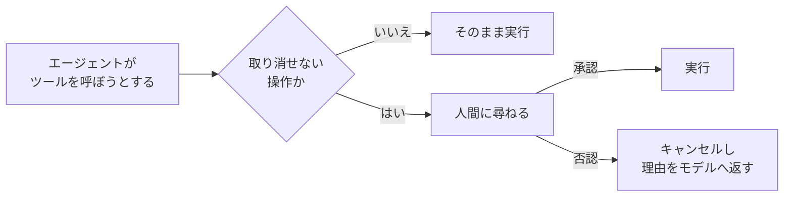

# 第18章 HITL — 人間の承認を挟む

この章を終えると、「危険なツールは人間の承認が下りるまで実行しない」という
承認ゲートを hooks で実装できるようになります。完全オフラインで完結する章です。

## 18.1 概要

### 18.1.1 HITL とは

HITL（Human-in-the-Loop）は、エージェントの判断に人間の承認を挟む設計です。
すべてを人間が確認するのでは自動化の意味がなく、すべてを自動にすると事故が
取り返せない。そこで、承認を挟む箇所を絞り込みます。

### 18.1.2 なぜ承認ゲートか

いまのエージェントのツールは読み取り専用（検索・取得）です。しかし案件では
すぐに「メールを送る」「チケットを起票する」「DB を更新する」ツールが要求されます。
読み取りと書き込みでは失敗の重さが違います。誤検索はやり直せますが、
誤送信は取り消せません。

この非対称に対して、**取り消せない操作だけ**に人間の承認を挟みます。
判断の仕方は第5章の「裁量とコードの境界」と同じで、どのツールに承認が要るかは
モデルの裁量に任せずコードで決めます。基準は「その操作が誤って実行されたとき、
誰かが困るか」。困るなら承認ゲートを挟みます。



## 18.2 実装のポイント

第4章で学んだとおり、`BeforeToolCallEvent` はツール実行の直前に割り込め、
`event.cancel_tool` に文字列を入れると実行をキャンセルして理由をモデルに返せます。
承認ゲートはこの仕組みの応用です。

- 承認が必要なツール名の集合（`requires_approval`）を持つ
- 該当ツールの実行前に、承認関数（`approver`）へツール名と引数を渡して尋ねる
- 承認されたら通し、否認されたら「否認された」という理由付きでキャンセルする

approver は固定の実装にせず、関数として外から注入します。CLI なら `input()` で人間に聞く、
テストなら常に True/False を返す、本番なら Slack 承認フローに置き換える——
ゲートの実装を変えずに承認手段だけ差し替えられます。

## 18.3 【ハンズオン】ApprovalGate を実装する

`07-full-app/src/guards.py` に `ApprovalGate` を追加してください。

要件:

1. `ApprovalGate(requires_approval: set[str], approver: Callable[[str, dict], bool])` —
   dataclass の `HookProvider`
2. `BeforeToolCallEvent` で、ツール名が `requires_approval` に**含まれない**場合は
   何もしない（読み取り系ツールを遅くしない）
3. 含まれる場合は `approver(ツール名, ツール入力)` を呼ぶ。
   ツール入力は `event.tool_use.get("input", {})` から取る
4. 否認されたら `event.cancel_tool` に理由の文字列を入れる。理由には
   ツール名と「人間の承認が得られなかった」ことを含め、モデルが代替行動
   （実行せずに下書きを提示する等）に移れる文にする
5. 承認・否認のどちらでも `log_event` で記録を残す（`message="approval_requested"`、
   `approved=True/False`。どの操作が承認・否認されたかを後から追う監査ログの元データになる）

判定を流します（完全オフライン）。

```bash
uv run --project 07-full-app pytest 18-hitl/verify -q
```

`4 passed` で合格です。

## 18.4 使いどころのイメージ

このゲートを実際に使うときの形も見ておいてください（実装は不要）。

```python
def cli_approver(tool_name: str, tool_input: dict) -> bool:
    print(f"エージェントが {tool_name} を実行しようとしています: {tool_input}")
    return input("承認しますか？ [y/N]: ").strip().lower() == "y"

guards = build_guards(settings, role="orchestrator")
gate = ApprovalGate(requires_approval={"send_email", "create_ticket"}, approver=cli_approver)
agent = Agent(..., hooks=[*guards.hooks, gate])
```

同期の `input()` はローカル専用です。AgentCore Runtime 上では応答を返せないので、
本番では「承認待ちをキューに積んで一時停止し、承認 API で再開する」形になります。
その非同期版は AgentCore の組み込み機能や Step Functions と組み合わせる発展課題です。

## 18.5 まとめ

承認ゲートは新しい仕組みではなく、第4章の hooks 基盤（`BeforeToolCallEvent`）の
応用です。取り消せない操作かどうかで線を引き、**承認手段は関数として注入する**。
この形なら、CLI の `input()` から Slack 承認フローまで、ゲート本体を変えずに
差し替えられます。次は、ReviewAgent のテキストパースを構造化出力に置き換えます。

## 次の章

[第19章 構造化出力](../19-structured-output/)
