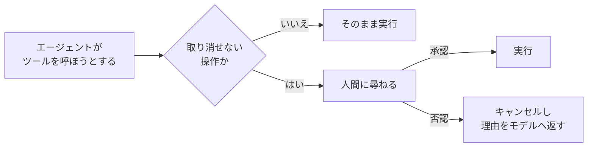

# 第18章 HITL（承認ゲート）

この章を終えると、取り消せない操作を人間の承認が下りるまで実行しない承認ゲートを、hooks で自作できるようになります。
合格判定まではモデルを呼ばず、オフラインで進みます。

この章も独立した uv プロジェクトです。最初に依存を入れてください。

```bash
cd 18-hitl
uv sync
```

## 18.1 概要

### 18.1.1 HITL とは

HITL（Human-in-the-Loop）は、エージェントの判断に人間の承認を挟む設計です。
すべてを人間が確認するなら自動化の意味がなく、すべてを自動にすると事故が取り返せません。
だから、承認を挟む箇所を絞り込みます。

### 18.1.2 取り消せない操作という線引き

ここまでの章で作ったツールは読み取り専用（検索・取得）でした。
しかし案件では、すぐに「メールを送る」「チケットを起票する」「DB を更新する」ツールが要求されます。
読み取りと書き込みでは失敗の重さが違います。誤検索はやり直せますが、誤送信は取り消せません。

この非対称に合わせて、取り消せない操作だけに人間の承認を挟みます。
どのツールに承認が要るかはモデルの裁量に任せず、コードで決めます。第5章の「裁量とコードの境界」と同じ判断です。
基準は、その操作が誤って実行されたとき誰かが困るか。困るなら承認ゲートの対象にします。



## 18.2 実装のポイント

### 18.2.1 BeforeToolCallEvent の再利用

第4章で見たとおり、`BeforeToolCallEvent` はツール実行の直前に割り込め、`event.cancel_tool` に文字列を入れると実行をキャンセルして理由をモデルに返せます。
承認ゲートはこの応用で、新しい API は出てきません。
違いは止める条件だけです。回数の上限ではなく、人間の返事で決めます。

ゲートの動きは 3 つに収まります。

- 承認が必要なツール名の集合（`requires_approval`）を持つ
- 該当ツールの実行前に、承認関数（`approver`）へツール名と引数を渡して尋ねる
- 承認されたら通し、否認されたら理由付きでキャンセルする

対象外のツールでは approver を呼びません。
読み取り系ツールまで人間の応答待ちにすると確認が形骸化し、内容を見ずに y を押す運用になるからです。

### 18.2.2 approver の注入

approver は固定実装にせず、`Callable[[str, dict], bool]` として外から注入します。
CLI なら `input()` で人間に聞き、テストなら固定値を返し、本番なら Slack 承認フローに置き換える。
ゲート本体を変えずに、承認手段だけを差し替えられます。

否認の返し方は第4章の `cancel_tool` と同じで、bool ではなく理由の文字列を渡します。
黙ってキャンセルするとモデルは「ツールが壊れた」と解釈して同じ呼び出しを繰り返します。
承認が得られなかったこと、代わりに下書きを提示すべきことまで書けば、モデルは代替行動に移れます。

## 18.3 【ハンズオン】ApprovalGate を実装する

書き込み系ツールの直前で人間に尋ねるゲートを作ります。
編集するのは `exercises/approval_gate.py` の 1 ファイルだけです。

### 18.3.1 TODO を 3 つ埋める

`exercises/approval_gate.py` を開いてください。
dataclass の枠と approver の型は書いてあり、TODO が 3 つ残っています。

1. `register_hooks` — `BeforeToolCallEvent` に `self._check` を登録する
2. `_check` の前半 — `requires_approval` に含まれないツールを素通りさせる（approver を呼ばない）
3. `_check` の後半 — approver に尋ねて結果をログに残し、否認なら `event.cancel_tool` に理由の文字列を入れる

先に判定テスト `verify/test_approval_gate.py` を読むのも近道です。
イベントを手で作って hook を検証する技法は第4章・第6章と同じです。

### 18.3.2 承認と否認の両パスを流す

実装できたら TODO コメントを消し、判定の前に動かします。
モデルを呼ばずにイベントだけを手で流すスクリプトを用意してあります（編集不要）。

```bash
uv run 01_run_gate.py
```

対象外のツール・承認・否認の 3 ケースを流すので、こう表示されるはずです。

```
web_search : cancel_tool=False  approver への問い合わせ=0 回
send_email : cancel_tool=False  （承認されたので実行される）
send_email : 否認。ツール結果としてモデルに渡る理由 ->
  ツール 'send_email' の実行に人間の承認が得られませんでした。実行せずに、代わりに実行内容の下書きを提示してください。
```

### 18.3.3 合格判定

```bash
uv run pytest -q
```

`5 passed` で合格です。
対象外のツールで approver を呼ばないこと・承認なら通すこと・否認の理由が文字列でツール名を含むこと・approver にツールの入力が渡ることを検査します。

<details>
<summary>解答例</summary>

```python
    def register_hooks(self, registry: HookRegistry, **kwargs: object) -> None:
        registry.add_callback(BeforeToolCallEvent, self._check)

    def _check(self, event: BeforeToolCallEvent) -> None:
        name = event.tool_use.get("name", "<unknown>")
        if name not in self.requires_approval:
            # 読み取り系ツールを遅くしない。承認対象だけ人間に回す
            return

        tool_input = dict(event.tool_use.get("input", {}))
        approved = self.approver(name, tool_input)
        # どの操作が承認・否認されたかを後から追う監査ログの元データになる
        logger.info("approval_requested tool=%s approved=%s", name, approved)
        if not approved:
            event.cancel_tool = (
                f"ツール '{name}' の実行に人間の承認が得られませんでした。"
                "実行せずに、代わりに実行内容の下書きを提示してください。"
            )
```

全文は `solutions/approval_gate.py` にあります。

</details>

### 18.3.4 エージェントで観察する（任意）

自作したゲートを実エージェントに付けて走らせます。Bedrock を呼びます。

```bash
uv run 02_agent_with_gate.py
```

メール送信を頼むと、モデルが `send_email` を呼ぼうとした瞬間に承認を聞かれます。
`y` なら送信結果（演習用の疑似送信）が、`n` なら実行されないまま、モデルが本文の下書きを提示する応答が返るはずです。
スクリプトには第4章型のツール回数上限ガードも付けてあります。承認ゲートは事故を防ぐ側、回数上限は暴走を止める側で、役割が別だからです。

`input()` は同期なのでローカル実行専用です。
AgentCore Runtime 上では実行中のコンテナに人間が応答を返せないため、本番では承認待ちをキューに積んで一時停止し、承認 API で再開する形になります。
その非同期版は Step Functions などと組み合わせる発展課題です。

## 18.4 まとめ

承認ゲートは新しい仕組みではなく、第4章の `BeforeToolCallEvent` の止める条件を人間の返事に変えただけのものです。
取り消せない操作かどうかで対象を線引きし、承認手段は関数として注入する。
この形なら、CLI の `input()` から Slack 承認フローまで、ゲート本体を変えずに差し替えられます。
次の第19章では、テキストのパースという別の故障モードを構造化出力で消します。

## 次の章

[第19章 構造化出力](../19-structured-output/)
