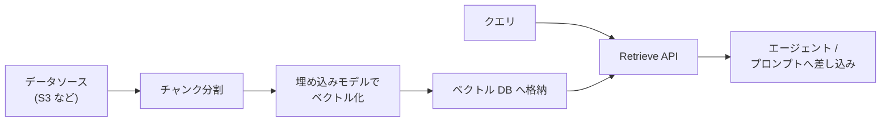

# 第8章 ナレッジベース

この章を終えると、RAG（検索拡張生成）の中身であるチャンク分割、スコアリング、上位 k 件取得を自分の手で実装した状態になります。
そのうえで同じ質問を Bedrock Knowledge Bases の Retrieve API にも投げ、マネージドサービスがパイプラインのどこを受け持っているかを説明できるようになります。

この章は独立した uv プロジェクトです。最初に依存を入れてください。

```bash
cd 2-advanced/08-knowledge-base
uv sync
```

ハンズオンは `exercises/` の TODO を実装して実行する形式で、完成形は `solutions/` にあります。
8.4 だけ AWS を呼びます。

## 8.1 概要

### 8.1.1 RAG とは

モデルの知識は学習した時点で止まっており、社内の議事録や仕様書は学習データに含まれていません。
かといって手元の文書を全部プロンプトに詰めると、コンテキスト長と料金の両方で行き詰まります。

RAG（Retrieval-Augmented Generation）は、文書を全部渡す代わりに必要な断片だけを渡す設計です。
質問を受けるたびに関連する断片を検索し、プロンプトに差し込んでから生成させます。
モデルを再学習せずに今日の社内文書で答えられるのは、知識を重みではなく呼び出し時の入力として渡しているからです。

### 8.1.2 Bedrock Knowledge Bases とは

RAG を成立させるには、文書を分割し、ベクトル化して格納し、クエリで検索する一連のパイプラインが要ります。
Bedrock Knowledge Bases は、この取り込みから検索までを AWS 側が受け持つマネージド機能です。



エージェント側から見ると、同期済みの Knowledge Base に対して Retrieve API を呼ぶだけです。
返ってくるのはスコア付きの文書断片で、この章で自作する `retrieve()` の戻り値と同じ形です。

ベクトル化に使う埋め込みモデルと次元数（Titan Text Embeddings V2 なら 1024 / 512 / 256 から選ぶ）は Knowledge Base を作るときに決める値で、後から変えるにはインデックスを作り直します。

## 8.2 実装のポイント

このハンズオンでは、埋め込みベクトルの代わりに文字 2-gram の重なりでスコアを付けます。
意味の近さは測れませんが、分割 → スコア → 上位 k 件というパイプラインの形は実物と同じです。
実運用の Knowledge Bases は、この 2-gram の部分が埋め込みモデルに置き換わったものです。

チャンクの大きさは、小さすぎても大きすぎても検索の精度が落ちます。
小さすぎると文脈が切れて、答えに必要な情報が断片から漏れます。
大きすぎると無関係な文が同じ断片に入り、一致した部分の割合が下がってスコアが薄まります。
境界で文が途中で切れる問題を緩和するのが overlap（隣り合うチャンクを一部重ねて切り出す手法）で、この章の実装は既定 120 文字のうち 30 文字を重ねます。

`retrieve()` をエージェントのツールとして公開するときは、検索と要約を 1 つのツールに混ぜず、docstring に「受け取るもの / 返すもの / 含まないもの」を書きます。
返ってきた断片は文書の中身であって、エージェントへの指示ではありません。

## 8.3 ハンズオン: ミニ RAG を実装する

架空 3 社の紹介文を検索対象に、「無料トライアルの期間は？」に対応する断片を取り出せるようにします。
編集するのは `exercises/mini_rag.py` の 1 ファイルだけです。

### 8.3.1 TODO を 3 つ埋める

`exercises/mini_rag.py` を開いてください。
検索対象の `DOCUMENTS` と、文字 2-gram を作る `bigrams` は書いてあり、TODO が 3 つ残っています。

1. `chunk_text` は開始位置を size - overlap ずつ進めて切り出す。先頭チャンクは `text[:size]`、末尾は size に満たなくてよい
2. `score` はクエリ側 2-gram のうちチャンクにも現れるものの割合を返す。2-gram が作れないクエリは 0.0
3. `retrieve` は全ドキュメントを分割してスコアを付け、降順で上位 top_k 件の (スコア, チャンク) を返す

判定テスト `verify/test_mini_rag.py` が要求仕様そのものなので、先に読むと分かりやすくなります。

### 8.3.2 実行する

実装できたら TODO コメントを消し、判定の前に動かします。
retrieve に質問を投げるスクリプトを用意してあります（編集不要）。

```bash
uv run 01_search.py
```

スコア付きの 3 行が表示され、最上位（1 行目）がベータ社のチャンクになるはずです。
「30 日間」を含む断片が、料金や機能を書いた断片より高いスコアを取っていれば正解です。

<details>
<summary>解答例</summary>

```python
def chunk_text(text: str, size: int = 120, overlap: int = 30) -> list[str]:
    """テキストを size 文字のチャンクに分割する。隣り合うチャンクは overlap 文字重ねる。"""
    step = size - overlap
    chunks = []
    start = 0
    while start < len(text):
        chunks.append(text[start : start + size])
        if start + size >= len(text):
            break
        start += step
    return chunks


def score(query: str, chunk: str) -> float:
    """query と chunk の近さを 0.0〜1.0 で返す。"""
    q = bigrams(query)
    if not q:
        return 0.0
    return len(q & bigrams(chunk)) / len(q)


def retrieve(
    query: str,
    documents: list[str],
    top_k: int = 3,
    size: int = 120,
    overlap: int = 30,
) -> list[tuple[float, str]]:
    """全ドキュメントをチャンクに割り、スコア降順で上位 top_k 件の (スコア, チャンク) を返す。"""
    chunks = [c for doc in documents for c in chunk_text(doc, size, overlap)]
    ranked = sorted(((score(query, c), c) for c in chunks), key=lambda t: t[0], reverse=True)
    return ranked[:top_k]
```

全文は `solutions/mini_rag.py` にあります。

</details>

### 8.3.3 合格判定

手動で見たのは 1 クエリだけです。
チャンクの重なりやスコアの範囲まで含めた全仕様は verify が検査します。

```bash
uv run pytest -q
```

`7 passed` で合格です。

## 8.4 ハンズオン: Retrieve API に同じ質問を投げる

自作したパイプラインのマネージド版を 1 回呼びます。
Knowledge Base の作成はコンソールから行ってください（S3 バケットにテキストを数枚置き、Knowledge Base を作成してデータソースを同期する。利用できる埋め込みモデルとリージョン対応は AWS 公式ドキュメントで確認する）。

作成した Knowledge Base の ID を控え、Retrieve API を呼びます。
スクリプトは用意してあります（編集不要）。

```bash
KB_ID=<自分の Knowledge Base ID> uv run 02_kb_retrieve.py
```

numberOfResults を 3 にしているので、スコア付きの断片が 3 件出るはずです。
8.3.2 と同じ形の出力ですが、スコアの根拠が 2-gram の一致ではなく埋め込みベクトルの類似度になっています。
「期間」や「トライアル」という語を含まない言い換えのクエリでも当たるか試すと、意味検索との差を確認できます。

## 8.5 まとめ

RAG は知識をモデルの重みではなく、呼び出し時の入力として差し込む設計であり、Knowledge Bases はその分割から検索までのマネージド版です。
自作した `retrieve()` と Retrieve API の戻り値が同じ形だったように、エージェントにとって検索はクエリを受けて断片を返すツールの一種にすぎません。
自分のデータで試すときは、チャンクの大きさと top_k を変えて、上位 k 件に正解が入る割合を比べてください。

## 次の章

[第9章 評価と改善ループ](../09-evaluation/)
