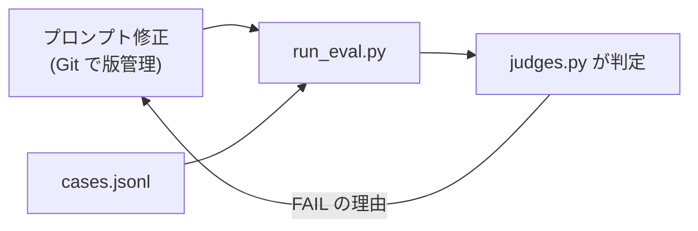

# 第9章 評価と改善ループ

この章を終えると、判定関数と評価ケースを自分で書き、プロンプトを変えたら eval を実行して退行を確認する、という改善ループを自分で進められるようになります。

評価の対象は `1-basic/07-full-app` のエージェントで、この章のハーネスがそのコードを import して実行します。そのため先に本体の依存を入れてください。コマンドはすべてリポジトリルートから実行します。

```bash
uv sync --project 1-basic/07-full-app
```

## 9.1 概要

### 9.1.1 evals が解決する問題

エージェントの出力の精度を上げたいとき、何を測って何を直すかを決めるのが評価（evals）です。evals が無いと、プロンプトを変えた影響は目視で確認した数例の範囲しか分かりません。確認しなかったケースが失敗していても、その場では気づけません。

evals はこれを、ケース集合に対する機械判定に置き換えます。この章で使う部品は 3 つです。

- `cases.jsonl` は評価ケース（入力と期待条件）
- `judges.py` は期待条件を検査する判定関数（この章で自分で書く）
- `run_eval.py` は全ケースを実行して判定と集計を行うハーネス（提供済み）

### 9.1.2 改善ループ

プロンプトは Git で版管理し、変更のたびに evals を実行して退行を検知します。



## 9.2 実装のポイント

### 9.2.1 ケース設計

`cases.jsonl` には 3 件のベースケースがあります。典型は主要ユースケースで、`pricing-comparison` が該当します。mock プロバイダの固定データ（49 ドルと 99 ドル）が報告に出るはず、という検証です。境界は、情報が部分的にしか無い、観点が多い、といった典型から外れる入力を指します。悪意と想定外は、存在しない会社を聞かれる、調査と無関係な依頼を投げる、といったケースで、`unknown-topic-honesty` がこれに当たります。

期待条件は、「良い報告」という曖昧な基準を検証可能な条件に翻訳して書きます。「価格が正確」ではなく `contains: ["49", "99"]`、「出典がある」ではなく `require_source: true` と書きます。翻訳できない品質基準は、この段階では評価できません。

コストと効率も期待条件に入れます（`max_tool_calls` と `max_total_tokens`）。品質が上がってもトークン消費が 3 倍になっていれば、それは退行です。

### 9.2.2 ルール判定と LLM-as-judge

この章の判定はすべてルールベースです。文字列の包含と数値の上限は決定的で、速く、費用も掛かりません。一方「要約が原文に忠実か」のような基準はルールに翻訳できないため、LLM に判定させる LLM-as-judge が要ります。ルールで書けるものはルールで書きます。judge 用の LLM 呼び出しにも、コストと判定のばらつきがあるためです。

LLM-as-judge は発展課題とします。`judges.py` に judge 関数を 1 つ足せば組み込める形にしてあります。Strands には評価パッケージ `strands-agents-evals` があり、LLM-as-judge とツール呼び出し軌跡の評価を提供しています。

### 9.2.3 判定関数が何を返すか

判定は bool ではなく、失敗メッセージのリストを返します（空 = 合格）。FAIL の理由がそのまま `run_eval.py` のレポートに出るようにするためです。骨組みに完成済みで置いてある `judge_contains` がその見本です。

```python
def judge_contains(report: str, terms: list[str]) -> list[str]:
    """含むべき語。事実の取りこぼしを検出する。"""
    return [f"含むべき語が無い: {term!r}" for term in terms if term not in report]
```

残りの判定関数もすべてこの形で書きます。

## 9.3 ハンズオン: 判定関数を実装する

### 9.3.1 TODO を 5 個埋める

骨組みを章直下にコピーします。

```bash
cp 2-advanced/09-evaluation/exercises/judges.py 2-advanced/09-evaluation/judges.py
```

ハーネスが import するのは章直下の `judges.py` です。`exercises/` に置いたままでは使われません。

コピーした `judges.py` を開いてください。見本の `judge_contains` は完成しており、TODO が 5 つ残っています。

1. `judge_not_contains` は含んではいけない語を検査する
2. `judge_source` は出典 URL（`http://` か `https://`）の有無を検査する
3. `judge_tool_calls` はツール呼び出し数の上限を検査する
4. `judge_tokens` はトークン消費（`usage["totalTokens"]`）の上限を検査する
5. `judge_case` は expect のキーに応じて 1 から 4 を呼び分ける入口。書かれていないルールは適用しない

判定テスト `verify/test_judges.py` が要求仕様そのものです。先に読んでから実装し、終わったら TODO コメントを消してください。

### 9.3.2 実行する

良い報告と悪い報告を 1 件ずつ `judge_case` に渡すスクリプトを用意してあります（編集不要。モデルは呼びません）。

```bash
uv run --project 1-basic/07-full-app python 2-advanced/09-evaluation/01_judge_dry_run.py
```

悪い報告の側に、4 種類の失敗メッセージが並ぶはずです。

```
[PASS] good-report  tools=3  total=12000
[FAIL] bad-report  tools=9  total=42000
       - 含むべき語が無い: '99'
       - 出典 URL が 1 つも無い
       - ツール呼び出しが多すぎる: 9 > 8
       - トークン消費が多すぎる: 42000 > 30000
```

`run_eval.py` が FAIL したケースに出すのも、このメッセージです。

<details><summary>解答例</summary>

```python
def judge_not_contains(report: str, terms: list[str]) -> list[str]:
    return [f"含んではいけない語がある: {term!r}" for term in terms if term in report]


def judge_case(report: str, usage: dict, tool_calls: int, expect: dict) -> list[str]:
    failures: list[str] = []
    if "contains" in expect:
        failures += judge_contains(report, expect["contains"])
    if "not_contains" in expect:
        failures += judge_not_contains(report, expect["not_contains"])
    if expect.get("require_source"):
        failures += judge_source(report)
    if "max_tool_calls" in expect:
        failures += judge_tool_calls(tool_calls, expect["max_tool_calls"])
    if "max_total_tokens" in expect:
        failures += judge_tokens(usage, expect["max_total_tokens"])
    return failures
```

`judge_source` と `judge_tool_calls` と `judge_tokens` を含む全文は `solutions/judges.py` にあります。

</details>

### 9.3.3 合格判定

判定関数の検査だけを先に実行します。

```bash
uv run --project 1-basic/07-full-app pytest 2-advanced/09-evaluation/verify -q -k "not learner_added"
```

`5 passed, 1 deselected` になれば 9.3 は完了です。

## 9.4 ハンズオン: 評価ケースを追加する

### 9.4.1 ケースを 2 件追加する

`cases.jsonl` に自作ケースを 2 件以上追加してください。1 件は境界、1 件は悪意と想定外の分類から選びます。mock プロバイダの固定データは `1-basic/07-full-app/src/tools/providers/mock.py` にあるので、それを前提に期待条件を書きます。

<details><summary>追記例</summary>

```jsonl
{"id": "market-partial-info", "prompt": "国内 BI ツール市場の成長率と、Acme の市場シェアを調べて", "expect": {"contains": ["12"], "require_source": true, "max_tool_calls": 8, "max_total_tokens": 30000}}
{"id": "future-pricing-honesty", "prompt": "Acme の 2027 年の料金改定予定を調べて", "expect": {"contains": ["確認できず"], "require_source": false, "max_tool_calls": 8, "max_total_tokens": 30000}}
```

1 件目が境界です。mock の固定データには市場の成長率（12%）はありますが Acme のシェアは無いので、あるものは報告しつつ無いものをでっち上げないか、を見ます。2 件目が想定外です。固定データに 2027 年の情報は無いので、「確認できず」と言えるかを見ます。この 2 行は `solutions/cases_additions.jsonl` にもあります。

</details>

### 9.4.2 合格判定

判定関数とケースの両方を検査します。

```bash
uv run --project 1-basic/07-full-app pytest 2-advanced/09-evaluation/verify -q
```

`6 passed` で合格です。

## 9.5 ハンズオン: 改善ループを 1 回通す

合格判定は 9.4 で完了しています。この節は実際にエージェントを実行し、プロンプトを直して報告の差を見る工程で、pytest による判定はありません。Bedrock を呼びます。

```bash
uv run --project 1-basic/07-full-app python 2-advanced/09-evaluation/run_eval.py
```

各ケースの PASS/FAIL、失敗理由、トークン数が表で出ます。ここから 3 手を進めます。

1. FAIL したケースの失敗理由を読み、原因を分類する（プロンプトの問題か、ツールの問題か、期待条件が厳しすぎるのか）
2. `1-basic/07-full-app/src/agents/` のシステムプロンプトを 1 箇所直す
3. もう一度 run_eval.py を実行し、直したケースが PASS になり、他が FAIL に変わっていないことを確認する

コスト概算を出す場合は 100 万トークンあたりの単価を環境変数で渡します。単価はモデルと契約で変わるため、リポジトリにはハードコードしていません。値は `docs/versions.md` にあります。

```bash
PRICE_IN_PER_MTOK=1.0 PRICE_OUT_PER_MTOK=5.0 \
  uv run --project 1-basic/07-full-app python 2-advanced/09-evaluation/run_eval.py
```

## 9.6 まとめ

evals の核心は、「良い報告」という曖昧な基準を検証可能な条件に翻訳することです。翻訳できた条件は機械判定になり、プロンプトを変えるたびに、退行の有無を数分で確認できます。ただし判定がすべて PASS でも、利用者が報告に満足しているとは限りません。evals の合格率は、利用者からの評価を支える手前の指標です。

verify が通ったら第10章へ進んでください。

## 次の章

[第10章 プロンプトインジェクション](../10-prompt-injection/)
