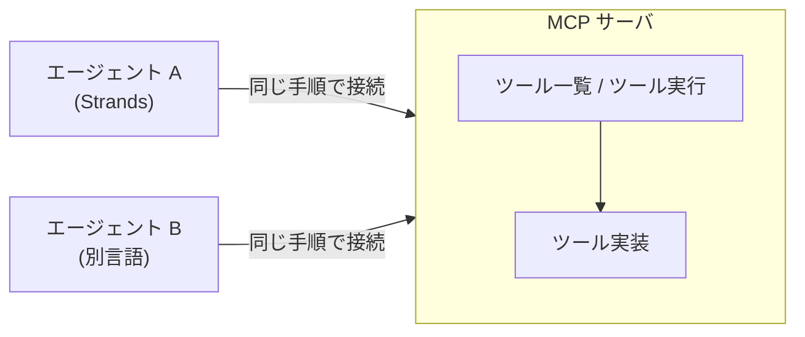

# 第11章 MCP サーバ

この章を終えると、ツールを MCP サーバとして切り出し、エージェントからプロトコル経由で呼べるようになります。
ハンズオンでは検索ツールを持つサーバを実装し、LLM を使わないクライアントで往復を確かめてから、エージェントに接続します。

この章は独立した uv プロジェクトです。最初に依存を入れてください。

```bash
cd 2-advanced/11-mcp
uv sync
```

## 11.1 概要

### 11.1.1 MCP が解決する問題

エージェントのツールは、多くの場合エージェントと同じプロセスで動く関数です。
ツールを別チームが管理している、複数のエージェントから同じツールを使いたい、といった事情が出ると、ツールを独立したサーバへ切り出すことになります。

切り出しただけでは、エージェントの実装ごとに接続コードが要ります。
エージェントが M 種類、ツール提供元が N か所あれば、接続の書き方は M×N 通りになります。

この組み合わせを減らす標準プロトコルが MCP（Model Context Protocol）です。
サーバが「ツール一覧」と「ツール実行」の共通インタフェースを公開し、クライアント（エージェント側）はどのサーバにも同じ手順で接続します。
ツールの実装言語もエージェントのフレームワークも問いません。



### 11.1.2 AgentCore Gateway

AgentCore Gateway は、OpenAPI や Smithy で定義された REST API、Lambda 関数、既存の MCP サーバをターゲットとして登録し、ひとつの MCP サーバにまとめるマネージド機能です。
呼び出しの前後で自前の変換処理が必要ならこの章のようにサーバを実装し、すでにある API や Lambda をそのまま公開するだけなら Gateway に登録します。

## 11.2 実装のポイント

この章の通信には標準入出力（stdio）を使います。
クライアントがサーバをサブプロセスとして起動し、stdin と stdout で JSON-RPC をやり取りする方式で、サーバをローカルで動かすうちはこれで足ります。

ツールの docstring は、MCP ではそのままツール定義としてプロトコル越しにクライアントへ渡り、モデルがツールを選ぶときの判断材料になります。
このリポジトリでは docstring を「受け取るもの / 返すもの / 含まないもの」の 3 節で書きます。
含まないものを書くのは、このツールでは扱えない要求に対してモデルが誤って呼び出すのを防ぐためです。
ツールを別プロセスへ移しても、この書き方と 1 ツール 1 責務の粒度は変えません。

同じサーバを AgentCore Runtime に載せるときは、stdio ではなく Streamable HTTP で待ち受けます。
`FastMCP(host="0.0.0.0", stateless_http=True)` で組み立て、`mcp.run(transport="streamable-http")` で起動します。
Runtime の `protocolConfiguration` を MCP にすると、Runtime はコンテナの 8000 番ポートとパス `/mcp` に接続します。
`stateless_http=True` にするのは、Runtime が `Mcp-Session-Id` ヘッダを自動で付けて送るため、サーバ側がそれを拒否しない構成にしておく必要があるからです。
`uv.lock` をコミットして `uv sync --locked` で依存を復元すると、`mcp` パッケージのバージョンが変わって import が解決できなくなる事態を避けられます。

## 11.3 ハンズオン: MCP サーバを実装する

架空 2 社の固定データを検索するツールを、MCP サーバとして公開します。
編集するのは `exercises/server.py` の 1 ファイルだけです。

### 11.3.1 TODO を 2 つ埋める

`exercises/server.py` を開いてください。
サーバの枠（`FastMCP("search-server")` と起動処理）と固定データ `_DATA` は書いてあり、TODO が 2 つ残っています。

1. `@mcp.tool()` を付けた `company_search(name: str) -> str` を定義する。docstring は「受け取るもの / 返すもの / 含まないもの」の 3 節で書く
2. 関数本体で `_DATA` を name の小文字化で引き、なければ「該当なし: {name}」を返す

実装できたら TODO コメントを消してください。

### 11.3.2 実行する

LLM を使わずにプロトコルの往復だけを行うスクリプトを用意してあります（編集不要）。
サーバをサブプロセスとして起動し、ツール一覧の取得とツール実行を行います。

```bash
uv run 01_list_tools.py
```

`tools: ['company_search']` と、Acme の要約 1 行が出るはずです。
サーバ側のログ（`Processing request of type ...`）や依存ライブラリの警告が混ざって表示されることがありますが、動作には影響しません。

クライアントはサーバを起動し、初期化のやり取り、ツール一覧の要求、ツール実行を、すべて JSON-RPC で行いました。
サーバの Python 関数を直接 import した箇所はどこにもありません。

<details>
<summary>解答例</summary>

```python
@mcp.tool()
def company_search(name: str) -> str:
    """企業名で社内データベースを検索し、要約を返す。

    受け取るもの:
        name: 企業名。"acme" または "globex"（大文字小文字は無視）。
    返すもの:
        その企業の要約 1 行。見つからなければ「該当なし」。
    含まないもの:
        Web 検索。ここにあるのは社内データだけ。
    """
    return _DATA.get(name.lower(), f"該当なし: {name}")
```

全文は `solutions/server.py` にあります。

</details>

### 11.3.3 合格判定

```bash
uv run pytest -q
```

`4 passed` で合格です。
ツールが公開されていること、docstring の 3 節がプロトコル越しに届くこと、大文字の "ACME" でも検索できることを検査します。

### 11.3.4 エージェントから呼ばせる

ここまでの呼び出し主体は、自分（11.3.2）とテスト（11.3.3）でした。
本来の使われ方は、モデルが docstring を読んで呼ぶ形です。次のスクリプトは Bedrock を呼びます。

```bash
uv run 02_mcp_agent.py
```

モデルが company_search を Acme と Globex に対して呼び、価格を比較した回答が返るはずです。
エージェントから見ると、同じプロセスで動く関数ツールと MCP ツールに違いはありません。
違うのはツールが動く場所だけです。

## 11.4 まとめ

MCP は、エージェントとツールの M×N 通りの接続を、ツール一覧とツール実行の共通インタフェース 1 つに集約するプロトコルです。
docstring の 3 節と 1 ツール 1 責務はプロセスを分離しても変わらず、変わるのはツールが動く場所と、それに合わせた起動方法だけです。

## 次の章

[第12章 プロンプトキャッシュ](../12-prompt-caching/)
