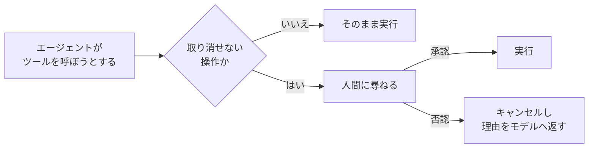

# 第14章 HITL（承認ゲート）

この章を終えると、取り消せない操作を人間の承認が下りるまで実行しない承認ゲートを、Strands の hooks で自作できるようになります。
合格判定まではモデルを呼ばず、オフラインで進みます。

この章は独立した uv プロジェクトです。最初に依存を入れてください。

```bash
cd 2-advanced/14-hitl
uv sync
```

## 14.1 概要

### 14.1.1 HITL とは

HITL（Human-in-the-Loop）は、エージェントの判断に人間の承認を挟む設計です。
すべてを人間が確認するなら自動化の意味がなく、すべてを自動にすると誤った操作を取り消せません。
そのため、承認を挟む箇所を絞ります。

### 14.1.2 承認が要る操作の判断基準

検索や取得のような読み取り専用のツールと、メール送信や DB 更新のような書き込み系のツールでは、失敗の重さが違います。
誤検索はやり直せますが、誤送信は取り消せません。

この違いに合わせて、取り消せない操作だけに人間の承認を挟みます。
どのツールに承認が要るかはモデルの裁量に任せず、コードで決めます。
判断の基準は、その操作が誤って実行されたとき誰かが困るかどうかです。

承認を挟んでも、取り消せない操作には冪等キー（同じ操作を一意に識別する ID）が要ります。
通信の切断でクライアントが同じリクエストを再送すると、人間が承認したのは 1 回でも送信処理は 2 回実行され得るからです。



## 14.2 実装のポイント

### 14.2.1 BeforeToolCallEvent での割り込み

`BeforeToolCallEvent` は、Strands がツールを実行する直前に発火する hook イベントです。
`event.cancel_tool` に文字列を入れると、そのツールは実行されず、その文字列がツール結果としてモデルに返ります。

同じイベントには `event.interrupt(name, reason)` もあり、`cancel_tool` とは止め方が違います。
`cancel_tool` はその場で否認を決めてエージェントのループを続けるのに対し、`interrupt` はエージェントを停止して人間の返事を待ち、返事を受け取ってから同じ地点を再実行します。
承認者が端末の前にいる同期実行なら `cancel_tool` で足り、承認が別のプロセスや後日になるなら `interrupt` を使います。

ゲートは、承認が必要なツール名の集合（`requires_approval`）を持ち、該当ツールの実行前に承認関数（`approver`）へツール名と引数を渡して尋ね、承認されたら通し、否認されたら理由付きでキャンセルします。

対象外のツールでは approver を呼びません。
読み取り系ツールまで人間の応答待ちにすると承認の回数が増え、1 件ずつ内容を確かめるのが難しくなるからです。

### 14.2.2 approver の注入

approver は固定実装にせず、`Callable[[str, dict], bool]` として外から注入します。
CLI なら `input()` で人間に尋ね、テストなら固定値を返し、Slack 承認フローにも差し替えられます。

否認は bool ではなく理由の文字列で返します。
`True` を渡すと、モデルに届くのは Strands の定型文 `tool cancelled by user` だけで、実行できない理由も次にすべきことも伝わりません。
承認が得られなかったこと、代わりに下書きを提示すべきことまで書けば、モデルは代替行動に移れます。

## 14.3 ハンズオン: 承認ゲートを実装する

書き込み系ツールの直前で人間に尋ねるゲート `ApprovalGate` を作ります。
編集するのは `exercises/approval_gate.py` の 1 ファイルだけです。

### 14.3.1 TODO を 3 つ埋める

`exercises/approval_gate.py` を開いてください。
dataclass の枠と approver の型注釈は書いてあり、TODO が 3 つ残っています。

1. `register_hooks` で `BeforeToolCallEvent` に `self._check` を登録する
2. `_check` の前半で、`requires_approval` に含まれないツールはそのまま通す（approver を呼ばない）
3. `_check` の後半で approver に尋ねて結果をログに残し、否認なら `event.cancel_tool` に理由の文字列を入れる

先に判定テスト `verify/test_approval_gate.py` を読み、ゲートに渡る入力と期待される結果を確認してください。

### 14.3.2 実行する

実装できたら TODO コメントを消し、判定の前に動かします。
モデルを呼ばずにイベントだけを手で渡すスクリプトを用意してあります（編集不要）。

```bash
uv run 01_run_gate.py
```

対象外のツール、承認、否認の 3 ケースを渡すので、こう表示されるはずです。

```
web_search : cancel_tool=False  approver への問い合わせ=0 回
send_email : cancel_tool=False  （承認されたので実行される）
send_email : 否認。ツール結果としてモデルに渡る理由 ->
  ツール 'send_email' の実行に人間の承認が得られませんでした。実行せずに、代わりに実行内容の下書きを提示してください。
```

<details>
<summary>解答例</summary>

```python
    def register_hooks(self, registry: HookRegistry, **kwargs: object) -> None:
        registry.add_callback(BeforeToolCallEvent, self._check)

    def _check(self, event: BeforeToolCallEvent) -> None:
        name = event.tool_use.get("name", "<unknown>")
        if name not in self.requires_approval:
            # 読み取り系ツールを遅くしない。承認対象だけ人間に尋ねる
            return

        tool_input = dict(event.tool_use.get("input", {}))
        approved = self.approver(name, tool_input)
        # どの操作が承認・否認されたかを後から追う監査ログの元データになる
        logger.info("approval_requested tool=%s approved=%s", name, approved)
        if not approved:
            event.cancel_tool = (
                f"ツール '{name}' の実行に人間の承認が得られませんでした。"
                "実行せずに、代わりに実行内容の下書きを提示してください。"
            )
```

全文は `solutions/approval_gate.py` にあります。

</details>

### 14.3.3 合格判定

```bash
uv run pytest -q
```

`5 passed` で合格です。
対象外のツールで approver を呼ばないこと、承認なら通すこと、否認の理由が文字列でツール名を含むこと、approver にツールの入力が渡ることを検査します。

### 14.3.4 エージェントで観察する（任意）

自作したゲートを、Bedrock を呼ぶ実際のエージェントに付けて動かします。

```bash
uv run 02_agent_with_gate.py
```

メール送信を頼むと、モデルが `send_email` を呼ぼうとした瞬間に承認を聞かれます。
`y` なら送信結果（疑似送信で、実際にメールは飛びません）が、`n` なら実行されないまま、モデルが本文の下書きを提示する応答が返るはずです。
スクリプトにはツール呼び出し回数の上限ガードも付けてあります。
承認ゲートは取り消せない操作を止め、回数上限は呼び出し回数を抑えるもので、役割が違います。

### 14.3.5 承認者がその場にいないとき

`input()` は同期呼び出しなので、承認者が端末の前にいるローカル実行でしか使えません。
承認が Slack への通知や翌営業日の確認になる場合は、同じ hook で `event.interrupt()` を呼び、エージェントごと停止します。

```python
def _check(self, event: BeforeToolCallEvent) -> None:
    if event.tool_use["name"] not in self.requires_approval:
        return
    answer = event.interrupt("send_email_approval", reason="メール送信の承認")
    if answer != "approve":
        event.cancel_tool = "人間の承認が得られませんでした。実行内容の下書きを提示してください。"
```

`interrupt()` を呼ぶとイベントループが止まり、`agent(...)` は `stop_reason` が `"interrupt"` の `AgentResult` を返します。
停止の内容は `result.interrupts` に `Interrupt`（`id` / `name` / `reason` / `response`）として入っています。
人間の返事は、その `id` を添えたレスポンスをエージェントに渡して再開します。

```python
if result.stop_reason == "interrupt":
    responses = [
        {"interruptResponse": {"interruptId": i.id, "response": "approve"}}
        for i in result.interrupts
    ]
    result = agent(responses)
```

再開すると 2 回目の `event.interrupt()` は停止せず、渡した返事をそのまま返します。
`_check` は返事を受け取った状態で最初から実行され、承認なら送信、否認なら `cancel_tool` に進みます。

## 14.4 まとめ

承認ゲートは、`BeforeToolCallEvent` の止める条件を人間の返事に変えたものです。
取り消せない操作かどうかで対象を決め、承認手段は関数として注入します。
この形なら、CLI の `input()` から Slack 承認フローまで、ゲート本体を変えずに差し替えられます。
承認者が応答するまでプロセスを保てない場合は、`cancel_tool` を `event.interrupt()` に置き換えて停止と再開の形にします。

## 次の章

[第15章 構造化出力](../15-structured-output/)
