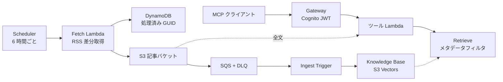

# 第16章 更新情報ナレッジベースと MCP 読み取り経路

この章を終えると、AWS の更新情報（RSS）を Knowledge Base へ定期的に取り込むパイプラインと、それを Claude Code などの MCP クライアントから検索する読み取り経路を、CDK とコードで組み上げられるようになります。

この章は CDK と uv の 2 つのプロジェクトを持ちます。最初に両方の依存を入れてください。

```bash
cd 2-advanced/16-news-kb-mcp
npm ci
uv sync
```

## 16.1 概要

### 16.1.1 何を作るか

AWS What's New と AWS ブログの RSS を 6 時間ごとに取得し、新着だけを Markdown にして S3 へ置き、Knowledge Base に同期します。検索する側は Gateway の 2 ツール（検索と全文取得）だけで、回答の生成は MCP クライアント側の LLM が行います。



書き込み側と読み取り側は S3 と Knowledge Base だけを接点にしています。片側を作り直しても、もう片側に影響しません。

### 16.1.2 S3 Vectors を選ぶ理由

ベクトルストアには OpenSearch Serverless や Aurora も選べますが、どちらも起動している間ずっと課金されます。S3 Vectors はストレージとクエリの従量課金だけなので、検索の機能とレイテンシーが限られる代わりに、置いたままでも費用がほとんど増えません。

### 16.1.3 Gateway の Lambda ターゲットと JWT 認可

Gateway はツールの一覧と実行を MCP で公開し、実行を Lambda に転送します。Lambda の event はツールの引数そのもので、ツール名は `context.client_context.custom["bedrockAgentCoreToolName"]` に「ターゲット名___ツール名」の形で入ります（AgentCore 開発者ガイドの Lambda input format）。
ツールの説明と引数スキーマは Gateway 側の ToolDefinition なので、モデルが読む仕様書は docstring ではなく CDK の `toolSchema` に書きます。
認証は Cognito です。ユーザープールとアプリクライアントが JWT を発行し、`customJwtAuthorizer` が `discoveryUrl` から取得した鍵で署名を検証し、`allowedClients` で宛先を照合します。
Gateway を選ぶのは、ツールを MCP クライアントへ直接公開したいときです。WAF や自社 API を挟むなら、API Gateway と Lambda で AgentCore Runtime を包みます。

## 16.2 実装のポイント

### 16.2.1 検索フィルタの条件はどこから来るか

Fetch Lambda は記事本文（.md）と並べて `<キー>.metadata.json` を置き、Knowledge Base はその `metadataAttributes` を各チャンクの metadata として保存します。読み取り側が絞り込めるのは、書き込み側がこの形で置いているからです。
日付には制約があります。`greaterThanOrEquals` が受け付ける値は number だけで、ISO 8601 の文字列には使えません（Knowledge Bases のフィルタ演算子の表、S3 Vectors の `$gte` の入力型）。そこで表示用の `published_at`（文字列）と絞り込み用の `published_epoch`（UNIX 秒）を両方置きます。

### 16.2.2 差分取得と再キュー

RSS は毎回全件を返すので、処理済み GUID を DynamoDB に記録して新着だけを処理します。同じ記事を 2 回置くと Knowledge Base に重複したチャンクが入ります。
取り込みジョブは 1 データソースにつき同時 1 つなので、Ingest Trigger Lambda は実行中なら開始せず、SQS のバッチ全件を失敗として返して再配信に任せます。可視性タイムアウト 5 分に `maxReceiveCount` 12 を掛けた約 60 分がジョブ 1 回を待てる長さで、4 のままだと 20 分で DLQ に落ちてアラームが鳴ります。

### 16.2.3 get_article が URL でなくキーを受け取る理由

`get_article` の引数は記事の URL ではなく、`search_aws_updates` が返す `s3_key` です。URL から S3 キーを引くには対応表がもう 1 つ要りますが、検索結果に S3 キーを含めれば要りません。ツールをまたぐ受け渡しは、前のツールの返り値に次のツールの引数を含める形で設計します。

## 16.3 ハンズオン: RSS の差分取得を実装する

### 16.3.1 TODO を 4 つ埋める

`exercises/fetch_articles.py` を開いてください。RSS の解析と slug 化（タイトルをファイル名に使える文字列へ変換する処理）は書いてあり、S3 キーの組み立て、Markdown、metadata の 6 キー、処理済み GUID のスキップが TODO として残っています。
埋め終わったら TODO コメントを消してください。

### 16.3.2 実行する

fixture の RSS（3 記事）を通すスクリプトを用意してあります（編集不要）。

```bash
uv run 01_fetch_dry_run.py
```

GUID 1 件を処理済み扱いにしているので、新着 2 件が出ます。1 件目は次のように表示され、続けて 2 件目（AWS Lambda の記事）が並びます。

```
フィード内の記事: 3 件
GUID 1 件を処理済みとした場合の新着: 2 件

S3 キー   : news/2026/09/amazon-s3-vectors-is-now-available-in-additional-regions.md
metadata  : {"published_at": "2026-09-02T09:30:00+00:00", "published_epoch": 1788341400, "category": "Amazon S3", "source": "whats-new", "url": "https://aws.amazon.com/about-aws/whats-new/2026/09/s3-vectors-regions/", "title": "Amazon S3 Vectors is now available in additional regions"}
markdown  : # Amazon S3 Vectors is now available in additional regions ...
```

### 16.3.3 合格判定

```bash
uv run pytest -q verify/test_fetch_articles.py
```

`6 passed` で合格です。キーの形式、metadata の 6 キー、`published_epoch` が数値であること、GUID のスキップを検査します。

<details><summary>解答例</summary>

```python
    key = f"news/{item['published_at'][0:4]}/{item['published_at'][5:7]}/{slugify(item['title'])}.md"
    markdown = f"# {item['title']}\n\n出典: {item['url']}\n\n{item['description']}\n"
    metadata = {"published_at": item["published_at"],
                "published_epoch": int(datetime.fromisoformat(item["published_at"]).timestamp()),
                "category": item["category"], "source": item["source"],
                "url": item["url"], "title": item["title"]}
```

`select_new_articles` は `done = set(seen_guids)` を作り、`item["guid"] in done` の item を飛ばし、残りを `done` に足しながら `build_article` に渡します。全体は `solutions/fetch_articles.py` にあります。

</details>

## 16.4 ハンズオン: Gateway のツール Lambda を実装する

### 16.4.1 TODO を 3 つ埋める

`exercises/tools_handler.py` を開いてください。フィルタの組み立て（`build_retrieval_filter`）、Retrieve の呼び出しと整形（`search_aws_updates`）、ツール名での振り分け（`dispatch`）が TODO です。boto3 クライアントは引数で受け取る形なので、`verify/test_tools_handler.py` は偽のクライアントを渡して検査します。
埋め終わったら TODO コメントを消してください。

### 16.4.2 実行する

Gateway が渡してくる event と context を手で作るスクリプトを用意してあります（編集不要）。

```bash
uv run 02_tools_dry_run.py
```

retrieve に渡ったフィルタが最初に出て、続けて 2 ツールの返り値が並びます。`published_epoch` の値は実行日から 7 日前の UNIX 秒なので、実行するたびに変わります。

```
=== search_aws_updates（source=whats-new, since_days=7）===
retrieve に渡った vectorSearchConfiguration:
  {"numberOfResults": 5, "filter": {"andAll": [{"equals": {"key": "source", "value": "whats-new"}}, {"greaterThanOrEquals": {"key": "published_epoch", "value": 1788389176}}]}}
```

### 16.4.3 合格判定

```bash
uv run pytest -q
```

`14 passed` で合格です。16.3 の差分取得に加えて、フィルタの組み立て、Retrieve の呼び方、ツールの振り分けを検査します。

<details><summary>解答例</summary>

```python
    if source:
        conditions.append({"equals": {"key": "source", "value": source}})
    if since_days:
        since = int((now - timedelta(days=since_days)).timestamp())
        conditions.append({"greaterThanOrEquals": {"key": "published_epoch", "value": since}})

    tool_name = context.client_context.custom["bedrockAgentCoreToolName"].split(DELIMITER, 1)[-1]
    if tool_name == "search_aws_updates":
        return {"results": search_aws_updates(retrieve_client, knowledge_base_id, query=event["query"],
                                              since_days=event.get("since_days"))}
```

`category` の条件、`search_aws_updates` の整形、`get_article` への振り分けは `solutions/tools_handler.py` にあります。

</details>

## 16.5 ハンズオン: 取り込みと読み取りを CDK で定義する

### 16.5.1 TODO を 6 つ埋める

2 つの骨組みを `lib/` に置き、16.4 で実装したロジックをツール Lambda にも配置します。

```bash
mkdir -p lib && cp exercises/knowledge-base-stack.ts exercises/gateway-stack.ts lib/
cp exercises/tools_handler.py lambda_src/tools/tools_handler.py
```

S3 Vectors と Knowledge Base と AgentCore Gateway は、aws-cdk-lib 本体には L1（`Cfn*`）だけがあります。L1 のプロパティ名は CloudFormation リファレンスの記載と 1 対 1 で対応するので、リファレンスを見ながら埋められます。
`lib/knowledge-base-stack.ts` の TODO は、ベクトルストア（`CfnVectorBucket` と `CfnIndex`）、`CfnKnowledgeBase`、`CfnDataSource` と CfnOutput の 3 つです。埋め込みの次元数は `CfnIndex` の `dimension` と KB の `embeddingModelConfiguration` の両方に同じ値を渡します。食い違うと取り込みが失敗します。
`lib/gateway-stack.ts` の TODO は、`CfnGateway`、2 ツールを公開する `CfnGatewayTarget`、CfnOutput の 3 つです。

### 16.5.2 実行する

3 スタックを synth し、この章で足したリソースの型だけを取り出します。

```bash
npx cdk synth > /dev/null && grep -ho 'AWS::[A-Za-z0-9]*::[A-Za-z0-9]*' cdk.out/*.template.json | grep -E 'S3Vectors|Bedrock' | sort -u
```

cdk の警告に続いて、6 行が出るはずです。

```
AWS::Bedrock::DataSource
AWS::Bedrock::KnowledgeBase
AWS::BedrockAgentCore::Gateway
AWS::BedrockAgentCore::GatewayTarget
AWS::S3Vectors::Index
AWS::S3Vectors::VectorBucket
```

### 16.5.3 合格判定

```bash
./verify/verify.sh
```

型チェックと synth の結果から、S3 Vectors のインデックス、S3_VECTORS の KB、次元数の明示、データソース、CUSTOM_JWT の Gateway、2 ツールの公開、取り込みスケジュールを検査します。

<details><summary>解答例（knowledge-base-stack.ts）</summary>

```typescript
    const index = new s3vectors.CfnIndex(this, 'VectorIndex', {
      vectorBucketArn: vectorBucket.attrVectorBucketArn,
      dimension, dataType: 'float32', distanceMetric: 'cosine',
      metadataConfiguration: { nonFilterableMetadataKeys: ['AMAZON_BEDROCK_TEXT'] },
    });
    const kb = new bedrock.CfnKnowledgeBase(this, 'NewsKnowledgeBase', {
      name: 'aws-news-handson', roleArn: kbRole.roleArn,
      knowledgeBaseConfiguration: { type: 'VECTOR', vectorKnowledgeBaseConfiguration: {
        embeddingModelArn, embeddingModelConfiguration: { bedrockEmbeddingModelConfiguration: {
          dimensions: dimension, embeddingDataType: 'FLOAT32' } } } },
      storageConfiguration: { type: 'S3_VECTORS',
        s3VectorsConfiguration: { indexArn: index.attrIndexArn } },
    });
```

`CfnVectorBucket` と `CfnDataSource` は `solutions/knowledge-base-stack.ts` にあります。

</details>

<details><summary>解答例（gateway-stack.ts）</summary>

```typescript
    const gateway = new agentcore.CfnGateway(this, 'NewsGateway', {
      name: 'aws-news-handson', roleArn: gatewayRole.roleArn,
      protocolType: 'MCP', authorizerType: 'CUSTOM_JWT',
      authorizerConfiguration: { customJwtAuthorizer: {
        discoveryUrl, allowedClients: [client.userPoolClientId] } },
    });
    new agentcore.CfnGatewayTarget(this, 'NewsToolsTarget', {
      gatewayIdentifier: gateway.attrGatewayIdentifier, name: 'news-tools',
      credentialProviderConfigurations: [{ credentialProviderType: 'GATEWAY_IAM_ROLE' }],
      targetConfiguration: { mcp: { lambda: { lambdaArn: toolsFn.functionArn,
        toolSchema: { inlinePayload: [/* 2 ツールの ToolDefinition */] } } } },
    });
```

ToolDefinition の description と inputSchema は `solutions/gateway-stack.ts` にあります。

</details>

## 16.6 ハンズオン: デプロイして MCP クライアントから検索する

ここから AWS を使います。3 スタックの依存順は CDK が解決するので `--all` でデプロイできます。リージョンは `cdk.json` の context（既定 us-west-2）なので、S3 Vectors と AgentCore Gateway が使えるリージョンかを先に確認してください。

```bash
npx cdk deploy --all
```

Outputs の値を使って初回同期を実行します（編集不要。60 秒ごとに状態を表示します）。`status=COMPLETE` と取り込み件数が出るはずです。

```bash
AWS_REGION=<リージョン> FETCH_FN=<FetchFn の関数名> KB_ID=<KnowledgeBaseId> DS_ID=<DataSourceId> \
  uv run scripts/03_initial_sync.py
```

Cognito にテストユーザを作ります。`<UserPoolId>` と `<ClientId>` は Outputs の値です。

```bash
aws cognito-idp admin-create-user --user-pool-id <UserPoolId> \
  --username test@example.com --temporary-password 'TempPass123!' --message-action SUPPRESS
```

仮パスワードのままではトークンを取得できないので、確定パスワードに変えます。

```bash
aws cognito-idp admin-set-user-password --user-pool-id <UserPoolId> \
  --username test@example.com --password 'TestPass123!' --permanent
```

アクセストークンを取得します。`eyJ` で始まる長い文字列（JWT）が出るはずです。有効期限は既定 1 時間なので、切れたらこのコマンドを実行し直します。

```bash
aws cognito-idp initiate-auth --auth-flow USER_PASSWORD_AUTH --client-id <ClientId> \
  --auth-parameters USERNAME=test@example.com,PASSWORD='TestPass123!' \
  --query 'AuthenticationResult.AccessToken' --output text
```

トークンと GatewayUrl を `client/mcp.json.sample` の形で MCP クライアントに設定します。Claude Code は `.mcp.json` に `"type": "http"` と `"headers"` を直接書けるので、mcp-remote を挟まずに接続できます。
接続できたら「直近 1 週間の S3 関連のアップデートを調べて、一番影響が大きそうなものを深掘りして」と聞いてください。クライアントの LLM が `search_aws_updates` を `since_days` 付きで呼び、返ってきた `s3_key` を `get_article` に渡す流れが、MCP のログで確認できるはずです。

確認が終わったら削除します。常時課金のリソースはありませんが、置いたままにしない運用に慣れておきます。

```bash
npx cdk destroy --all
```

## 16.7 まとめ

書き込み側と読み取り側を S3 と Knowledge Base だけでつなぐと、取り込みの失敗が検索を止めず、検索の負荷が取り込みに影響しません。
検索条件を成立させているのは metadata.json に何を書くかの取り決めで、日付で絞れるかどうかは `published_epoch` を数値で置いたかどうかで決まります。
回答の生成をクライアント側の LLM に任せたので、サーバ側は Lambda 2 つ分の従量課金だけでこの検索基盤が動き続けます。

## 次の章

[第17章 AgentCore Runtime にデプロイする](../../3-production/17-agentcore-deploy/)（第3部 本番運用基盤）
