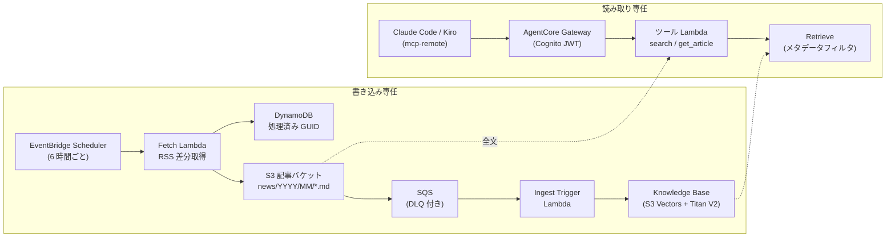

# 第16章 更新情報ナレッジベースと MCP 読み取り経路

この章を終えると、AWS の更新情報（RSS）を定期的に Knowledge Base へ取り込むパイプラインと、それを Claude Code などの MCP クライアントから検索する読み取り経路を、CDK とコードで自分の手で組み上げられるようになります。
前提は第8章（KB）、第11章（MCP）、第18章（CDK）、第19章（Cognito と JWT）です。

この章は CDK と uv の 2 つのプロジェクトを持つ独立した章です。最初に両方の依存を入れてください。

```bash
cd 2-advanced/16-news-kb-mcp
npm ci
uv sync
```

## 16.1 概要

### 16.1.1 何を作るか

AWS What's New と AWS ブログの RSS を 6 時間ごとに取得し、新着だけを Markdown にして S3 へ置き、Knowledge Base に同期します。
検索する側は AgentCore Gateway に載せた 2 つのツール（検索と全文取得）だけで、回答の生成は MCP クライアント側の LLM が行います。サーバ側に回答生成の LLM や AgentCore Runtime は置きません。



書き込み側と読み取り側は直接つながらず、S3 と KB だけを接点にしています。
片側を作り直しても、もう片側に影響しない構成です。

### 16.1.2 これまでの章との対応

第8章で自作した「分割 → スコア → 上位 k 件」の実物が Knowledge Base、第11章で自作した MCP サーバの運用を AWS に任せた形が Gateway です。
JWT インバウンド認可は第19章の `customJwtAuthorizer` と同じ構造を Gateway に設定し、実行ロールの confused deputy 対策は第18章の信頼ポリシーと同じ書き方をします。
新しく登場するのは、ベクトルストアとしての S3 Vectors と、Gateway の Lambda ターゲットの 2 つだけです。

### 16.1.3 S3 Vectors を選ぶ理由

Knowledge Base のベクトルストアには OpenSearch Serverless や Aurora（pgvector）も選べますが、どちらも常時課金のリソースです。
S3 Vectors はストレージとクエリの従量課金だけなので、放置しても費用がほぼ掛からず、この章のような常設ハンズオンに向きます。
引き換えに検索のレイテンシーと機能は専用ベクトル DB より限定的で、大量トラフィックの本番にそのまま使う選択ではありません。

### 16.1.4 Gateway の Lambda ターゲット

Gateway はツールの一覧と実行を MCP でクライアントに公開し、実行を Lambda に転送します。
Lambda が受け取る event はツールの引数そのもので、どのツールが呼ばれたかは `context.client_context.custom["bedrockAgentCoreToolName"]` に「ターゲット名___ツール名」の形で入ります（公式ドキュメントの Lambda input format）。
ツールの名前・説明・引数スキーマは Gateway 側の ToolDefinition として登録するので、第3章で docstring に書いていた仕様書を、今度は CDK の `toolSchema` に書くことになります。

## 16.2 実装のポイント

### 16.2.1 metadata.json がフィルタの供給源

Fetch Lambda は記事本文（.md）と並べて `<キー>.metadata.json` を置きます。
Knowledge Base は取り込み時にこのファイルを読み、中の `metadataAttributes` を各チャンクの metadata として保存します。
読み取り側の `search_aws_updates` が `published_at` や `source` で絞り込めるのは、書き込み側がこの形で置いているからです。
書き込みと読み取りは直接つながっていないのに検索条件が成立するのは、この metadata の契約があるためです。

### 16.2.2 差分取得と再キュー

RSS は毎回全件を返すので、処理済み GUID を DynamoDB に記録して新着だけを処理します（冪等性。重複して置くと KB に重複チャンクが入ります）。
Knowledge Base の取り込みジョブは 1 データソースにつき同時 1 つなので、Ingest Trigger Lambda は実行中のジョブがあれば新たに開始せず、SQS のバッチ全件を失敗として返して再配信に任せます。
「失敗にして再配信させる」は SQS の標準的な再試行手段で、4 回で DLQ に落ち、DLQ の滞留はアラームで通知されます。

### 16.2.3 get_article が URL でなくキーを受け取る理由

検索結果の深掘りは `get_article` が S3 から全文を返します。
引数は記事の URL ではなく、`search_aws_updates` が返す `s3_key` です。
URL から S3 キーを引くには対応表がもう 1 つ要りますが、検索結果に S3 キーを含めれば対応表なしで済みます。
ツールをまたぐ受け渡しは、ツールの返り値に次のツールの引数を含める形で設計します。

## 16.3 ハンズオン: RSS の差分取得を実装する

RSS を S3 に置く形へ整形するロジックを作ります。ネットワークも AWS も呼びません。
編集するのは `exercises/fetch_articles.py` の 1 ファイルだけです。

### 16.3.1 TODO を 4 つ埋める

`exercises/fetch_articles.py` を開いてください。
RSS の解析（`parse_feed`）と slug 化（`slugify`）は書いてあり、TODO が 4 つ残っています。

1. `build_article` の key。published_at から `news/YYYY/MM/<slug>.md` を組み立てる
2. `build_article` の markdown。1 行目 `# <title>`、出典 URL の行、description
3. `build_article` の metadata。published_at / category / source / url / title の 5 キー
4. `select_new_articles`。処理済み GUID と同一実行内の重複をスキップする

### 16.3.2 fixture で動かす

実装できたら TODO コメントを消し、判定の前に動かします。
fixture の RSS（3 記事）を通すスクリプトを用意してあります（編集不要）。

```bash
uv run 01_fetch_dry_run.py
```

GUID 1 件を処理済み扱いにしているので、新着 2 件の S3 キーと metadata が表示されるはずです。

## 16.4 ハンズオン: Gateway のツール Lambda を実装する

検索（`search_aws_updates`）と全文取得（`get_article`）のロジックを作ります。
boto3 クライアントは引数で受け取る形なので、テストは偽クライアントで AWS を呼ばずに動きます（第6章の技法）。
編集するのは `exercises/tools_handler.py` の 1 ファイルだけです。

### 16.4.1 TODO を 3 つ埋める

`exercises/tools_handler.py` を開いてください。TODO が 3 つ残っています。

1. `build_retrieval_filter`。equals と greaterThanOrEquals の条件を組み立て、2 件以上なら andAll で束ねる
2. `search_aws_updates`。Retrieve をフィルタ付きで呼び、スコア・タイトル・URL・抜粋・s3_key に整形する
3. `dispatch`。`bedrockAgentCoreToolName` から接頭辞を取り除き、ツールへ振り分ける

先に判定テスト `verify/test_tools_handler.py` を読むと分かりやすくなります。

### 16.4.2 Gateway から届く形で動かす

実装できたら TODO コメントを消し、判定の前に動かします。
Gateway が渡してくる event / context を手で作るスクリプトを用意してあります（編集不要）。

```bash
uv run 02_tools_dry_run.py
```

retrieve に渡ったフィルタと、2 ツールの返り値が表示されるはずです。

### 16.4.3 合格判定（アプリ側）

```bash
uv run pytest -q
```

`14 passed` で合格です。
16.3 の差分取得（キーの形式、metadata の 5 キー、GUID のスキップ）と、16.4 のフィルタ組み立て・Retrieve の呼び方・振り分けを検査します。

## 16.5 ハンズオン: S3 Vectors の Knowledge Base を定義する

ここから CDK です。骨組みをコピーして作ります。

```bash
mkdir -p lib && cp exercises/knowledge-base-stack.ts lib/knowledge-base-stack.ts
```

### 16.5.1 TODO を 3 つ埋める

`lib/knowledge-base-stack.ts` を開いてください。
記事バケット、S3 → SQS の追加キュー（DLQ 付き）、KB の実行ロールは書いてあり、TODO が 3 つ残っています。

1. `CfnVectorBucket` と `CfnIndex`（dimension は context から。dataType 'float32'、distanceMetric 'cosine'）
2. `CfnKnowledgeBase`（storageConfiguration の type を 'S3_VECTORS' に）
3. `CfnDataSource`（S3 の `news/` プレフィックス、FIXED_SIZE チャンク）と CfnOutput

S3 Vectors / KB / Gateway はどれも L2 がまだ無く、L1 で書きます。
プロパティ名は CloudFormation リファレンスそのままなので、第18章 18.1.1 の読み方で埋められます。

## 16.6 ハンズオン: Gateway の読み取り経路を定義する

```bash
cp exercises/gateway-stack.ts lib/gateway-stack.ts
```

### 16.6.1 TODO を 3 つ埋める

`lib/gateway-stack.ts` を開いてください。
Cognito（第19章と同じ形）、ツール Lambda、Gateway の実行ロールは書いてあり、TODO が 3 つ残っています。

1. `CfnGateway`。protocolType 'MCP'、authorizerType 'CUSTOM_JWT'、customJwtAuthorizer（第19章 19.2.1 と同じ構造）
2. `CfnGatewayTarget`。toolSchema の inlinePayload に 2 ツールの定義。description は第3章の 3 節構成で書く
3. `CfnOutput`。GatewayUrl / UserPoolId / ClientId

### 16.6.2 ツール Lambda にロジックを配置する

16.4 で作ったロジックを、デプロイされる Lambda のディレクトリへコピーします。

```bash
cp exercises/tools_handler.py lambda_src/tools/tools_handler.py
```

### 16.6.3 合格判定（CDK 側）

```bash
./verify/verify.sh
```

型チェックと synth の結果から、S3 Vectors のインデックス、S3_VECTORS の KB、データソース、CUSTOM_JWT の Gateway、2 ツールの公開、取り込みスケジュールを検査します。

## 16.7 ハンズオン: デプロイして初回同期する

ここから AWS を使います。3 スタックの依存順は CDK が解決するので、この章は `--all` でデプロイできます（ECR と Runtime の順序問題（第18章）はこの構成にはありません）。
リージョンは `cdk.json` の context（既定 us-west-2）です。S3 Vectors と AgentCore Gateway が使えるリージョンかを先に確認してください。

```bash
npx cdk deploy --all
```

Outputs の値を使って、初回同期を実行します（編集不要。60 秒ごとに状態を表示します）。

```bash
AWS_REGION=<リージョン> FETCH_FN=<FetchFn の関数名> KB_ID=<KnowledgeBaseId> DS_ID=<DataSourceId> \
  uv run scripts/03_initial_sync.py
```

`status=COMPLETE` と取り込み件数が出るはずです。
S3 記事バケットに `news/YYYY/MM/` のオブジェクトが並んでいることも確認してください。

## 16.8 ハンズオン: MCP クライアントから検索する

第19章 19.4 と同じ手順で Cognito にテストユーザを作り、アクセストークンを取得します（UserPoolId / ClientId は 16.6 の Outputs）。
取得したトークンと GatewayUrl を `client/mcp.json.sample` の形で MCP クライアントに設定します。Claude Code なら `.mcp.json` に貼り付けて再起動します。

接続できたら、こう聞いてみてください。

> 直近 1 週間の S3 関連のアップデートを調べて、一番影響が大きそうなものを深掘りして

クライアントの LLM が `search_aws_updates` を `since_days` 付きで呼び、結果の `s3_key` を `get_article` に渡して全文を読む流れが、MCP のログで確認できるはずです。
Cognito のアクセストークンには有効期限（既定 1 時間）があるので、切れたら 19.4 のコマンドで取り直します。

確認が終わったら削除します。常時課金のリソースはありませんが、置いたままにしない運用に慣れておきます。

```bash
npx cdk destroy --all
```

## 16.9 まとめ

書き込み側と読み取り側を S3 と KB だけでつなぐと、取り込みの失敗が検索を止めず、検索の負荷が取り込みに影響しません。
検索条件を成立させているのは metadata.json の契約（16.2.1）で、ツールの仕様書は docstring から Gateway の toolSchema に場所を変えただけです（16.1.4）。
回答の生成をクライアント側 LLM に任せたので、サーバ側は Lambda 2 つ分の従量課金だけで、この検索基盤は動き続けます。

## 次の章

[第17章 AgentCore Runtime にデプロイする](../../3-production/17-agentcore-deploy/)（第3部 本番運用基盤）
