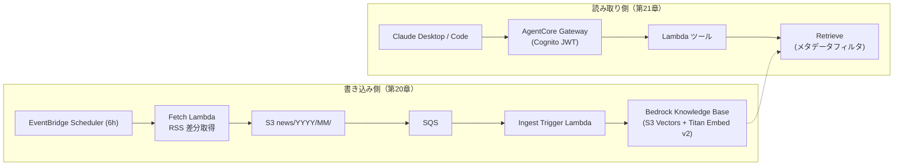

# 第2部 応用編

基礎編（`1-basic/`）で作ったエージェントを、実務の品質へ仕上げる部です。
RAG、評価、インジェクション耐性、MCP、キャッシュ、内容フィルタ、承認ゲート、構造化出力の 8 章で、どの順で進めてもかまいません（root README の「順序と前提」参照）。
デプロイ、IaC、認証、フロントエンドは第3部 本番運用基盤（`3-production/`）にあります。

## 章の一覧

| 章 | 学べること |
| --- | --- |
| [08-knowledge-base](08-knowledge-base/) | RAG を手で作る |
| [09-evaluation](09-evaluation/) | 判定関数と改善ループ |
| [10-prompt-injection](10-prompt-injection/) | インジェクション耐性と多層防御 |
| [11-mcp](11-mcp/) | MCP サーバによる分離 |
| [12-prompt-caching](12-prompt-caching/) | プロンプトキャッシュとコスト実測 |
| [13-guardrails](13-guardrails/) | マネージド層の内容フィルタ |
| [14-hitl](14-hitl/) | 取り消せない操作の承認ゲート |
| [15-structured-output](15-structured-output/) | 構造化出力とパースの撤去 |

## 準備中: ニュース検索基盤（第20〜21章）

複数の AWS サービスを組み合わせ、AWS アップデート情報の収集と検索を行う基盤を作る章を準備しています。
取り込み（書き込み専任）と読み取り（読み取り専任）を分離した構成です。

第20章（20-ingest-pipeline）は GUID による冪等な差分取得、S3 イベント → SQS → StartIngestionJob の同期トリガ、DLQ とアラームによる失敗の通知を扱います。
第21章（21-gateway-tools）は Cognito JWT で認可された AgentCore Gateway に検索ツールを載せ、Retrieve のメタデータフィルタで結果を絞ります。
前提は第17章（CDK。第3部）と第8章（ナレッジベース）で、第21章はさらに第3章、第18章（第3部）、第11章を使います。
章の実体は設計が確定した Phase で追加します。設計の経緯と未確認事項は docs/plan.md を参照してください。
