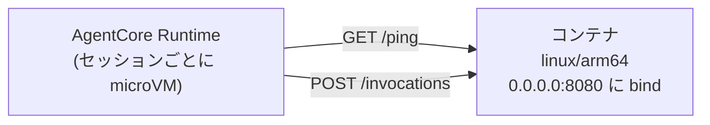

# 第17章 AgentCore Runtime にデプロイする

この章を終えると、AgentCore Runtime が受け付けるコンテナの条件を説明でき、その条件を満たす Dockerfile を自分で書いて、デプロイ前にローカルで契約検証できるようになります。

この章で入れる依存はありません。Docker Desktop が起動していることだけ確認してください。

```bash
docker buildx version
```

バージョンが表示されるはずです。

## 17.1 概要

### 17.1.1 AgentCore Runtime とは

第7章までのエージェントはローカルの Python プロセスでした。
AgentCore Runtime はそれをコンテナとしてホストする、エージェント専用のサーバレス実行基盤です。
実行特性は次のとおりです。

- セッションごとに専用の microVM を起動。CPU、メモリ、ファイルシステムがセッション間で分離され、終了時に microVM ごと破棄されてメモリはサニタイズされる
- 課金は消費した CPU とメモリに基づく。事前のキャパシティ確保は不要

Lambda の実行時間を超える処理、セッション状態の分離、ストリーミング応答という、エージェントが必要とする条件に合わせた実行特性です。
VPC を用意する必要もないため、このリポジトリではネットワークをマネージドに任せています。

ここで選んでいるのはエージェントのコードを実行する場所であって、モデル推論のキャパシティをどう買うか（第4章 4.1.5）とは別の軸です。
Runtime に載せてもモデル呼び出しは Bedrock のオンデマンドのままで、課金も Runtime の CPU・メモリと Bedrock のトークンに分かれて出ます。

### 17.1.2 コンテナ契約

Runtime がコンテナに要求するのは 3 点です。

- アーキテクチャ: linux/arm64 のみ
- エンドポイント: `POST /invocations`（本体）と `GET /ping`（ヘルスチェック）
- バインド: `0.0.0.0:8080`



契約は HTTP の 3 点だけで、フレームワークは指定されていません。中身は Strands でも LangGraph でも自作でもよく、乗り換えるとき書き換えるのは `src/main.py` 1 ファイルで済みます。

`BedrockAgentCoreApp` がこの契約を実装しています。
`@app.entrypoint` を付けた関数を書くだけで /invocations と /ping のエンドポイントが用意されます。

`app.run()` は host 省略時に 127.0.0.1 へ bind します。
この場合ローカルでは動きますが、コンテナに入れると外から到達できません。
そのため main.py で `host="0.0.0.0"` を明示しています（troubleshooting.md 参照）。

### 17.1.3 デプロイ方法の選択

Runtime へ載せる方法は 3 つあります。
AgentCore CLI は `agentcore create` → `dev` → `deploy` の流れで、コードを zip（既定）かコンテナにまとめ、内部で CDK を使って Runtime と IAM ロールを作ります（ARM64 対応も CLI が処理します）。
直接コードデプロイは zip だけを渡し、言語ランタイムへのパッチ適用を AgentCore 側に任せる方式です。
コンテナはベースイメージの更新を自分で行う代わりに、システム依存やベースイメージを自由に選べます。
3 つ目が、自分で ARM64 イメージを作って ECR に push し、Runtime を IaC で定義する方法で、この教材はこれです。

実務では CLI で試作を素早く検証し、本番へ移す段階でコンテナと IaC に切り替える順序が典型です。
どの方法でも `BedrockAgentCoreApp` と `@app.entrypoint` を使うエントリポイントのコードは同じで、変わるのはパッケージの形式と作成手順だけです。
この教材が CDK を選ぶのは、実行ロールの信頼ポリシーと権限、スタック分割と順序を自分の手で書き、第18章で読める形にするためです。

### 17.1.4 クォータ

デプロイできた次に確かめるのがクォータです。
データプレーン API（InvokeAgentRuntime など）のリクエストレートと、新規セッションの作成レートには、アカウント単位で全エンドポイントが共有する上限があります（値は versions.md）。
エンドポイントごとの上限ではないので、同じアカウントに複数のエージェントを置くと合算で数えられます。セッション作成レートはコンテナと直接コードデプロイの両方に同じ値が適用されます。
実行時間の上限（同期 / ストリーミング / 非同期）とペイロード上限も versions.md にあります。レート系の上限は Service Quotas から引き上げを申請できます。
本番運用の前に、想定トラフィック（秒間の呼び出し数と新規セッション数）を見積もり、上限との差を確認してください。

## 17.2 実装のポイント

この契約をイメージの側で満たすのが `07-full-app/Dockerfile` です。
30 行ですが、各行に理由があります。

`FROM --platform=linux/arm64` でプラットフォームを固定します。
x86 マシンで誤って amd64 を作ると、デプロイ後の起動時まで気づけないからです。

依存レイヤと src レイヤは分けます。pyproject.toml と uv.lock だけを先に COPY して
`uv sync --frozen --no-dev` を実行し、ソースは後から別レイヤで COPY します。
コード 1 行の修正で依存の再解決を実行しないためです。

`CMD` の `--no-sync` を付けないと、uv が起動のたびにプロジェクトを再ビルドし、コールドスタートが長くなります。
このリポジトリで付けない場合と付けた場合を実測した値は versions.md にあり、環境によって変わります。
コールドスタートは新しいセッションの初回応答にそのまま乗るため、この差は利用者の待ち時間の差です。

## 17.3 ハンズオン: 本体イメージをビルドして契約を検証する

第7章の本体をイメージにして、契約の 3 点をローカルで検査します。

### 17.3.1 ARM64 イメージをビルドする

```bash
docker buildx build --platform linux/arm64 -t agent-platform/agent:local --load 1-basic/07-full-app
```

### 17.3.2 アーキテクチャを確認する

```bash
docker image inspect agent-platform/agent:local --format '{{.Os}}/{{.Architecture}}'
```

`linux/arm64` と出るはずです。

### 17.3.3 契約の 2 エンドポイントを呼ぶ

```bash
docker run -d --name agent-local -p 8181:8080 \
  -e AWS_ACCESS_KEY_ID=dummy -e AWS_SECRET_ACCESS_KEY=dummy \
  -e AWS_DEFAULT_REGION=ap-northeast-1 \
  agent-platform/agent:local
```

```bash
curl http://127.0.0.1:8181/ping
```

`{"status":"Healthy",...}` が返るはずです。

```bash
curl -XPOST http://127.0.0.1:8181/invocations \
  -H 'Content-Type: application/json' -d '{"prompt":""}'
```

`{"error": "payload に 'prompt' が必要です。", ...}` が返るはずです。
空プロンプトはモデルを呼ばずにエラー応答を返す設計なので、ローカルのコンテナだけで契約検証ができます。
終わったら片付けます。

```bash
docker rm -f agent-local
```

## 17.4 ハンズオン: Dockerfile を自分で書く

17.3 は完成品のビルドでした。今度は契約を自分の手で満たします。
`hello-agent/` に LLM を呼ばないミニエージェント（app.py と pyproject.toml）を用意してあり、無いのは Dockerfile だけです。

### 17.4.1 骨組みをコピーして TODO を埋める

```bash
cp 3-production/17-agentcore-deploy/exercises/Dockerfile 3-production/17-agentcore-deploy/hello-agent/Dockerfile
```

`hello-agent/Dockerfile` を開いてください。
WORKDIR と ENV は書いてあり、TODO が 4 つ残っています。

1. FROM で uv の Python ベースイメージ（バージョンは versions.md）を linux/arm64 に固定する
2. 依存レイヤを分離する。pyproject.toml と uv.lock を先に入れ、app.py は後から別レイヤで COPY する
3. EXPOSE で契約のポート 8080 を宣言する
4. CMD で uv run から app.py を起動する。コールドスタート対策も入れる

埋める材料はすべて 17.2 にあります。
埋めたら TODO コメントは消してください。

### 17.4.2 ビルドして契約を検証する

```bash
docker buildx build --platform linux/arm64 -t hello-agent:local --load 3-production/17-agentcore-deploy/hello-agent
```

```bash
docker run -d --name hello-local -p 18081:8080 hello-agent:local
```

```bash
curl http://127.0.0.1:18081/ping
```

`{"status":"Healthy",...}` が返るはずです。

```bash
curl -XPOST http://127.0.0.1:18081/invocations -H 'Content-Type: application/json' -d '{"prompt":"test"}'
```

`{"echo": "test", "chapter": 17}` が返るはずです。
片付けます。

```bash
docker rm -f hello-local
```

### 17.4.3 合格判定

verify.sh が本体（17.3）と自作 Dockerfile（17.4）の両方を自動判定します。

```bash
./3-production/17-agentcore-deploy/verify/verify.sh
```

<details>
<summary>解答例</summary>

```dockerfile
FROM --platform=linux/arm64 ghcr.io/astral-sh/uv:python3.12-bookworm-slim

WORKDIR /app

ENV PYTHONUNBUFFERED=1 UV_COMPILE_BYTECODE=1

COPY pyproject.toml uv.lock ./
RUN uv sync --frozen --no-dev

COPY app.py ./

EXPOSE 8080

CMD ["uv", "run", "--no-sync", "python", "app.py"]
```

コメント付きの全文は `solutions/hello-agent.Dockerfile` にあります。

</details>

## 17.5 ハンズオン: デプロイして 1 回呼び出す

```bash
./scripts/deploy.sh
```

ECR 作成 → ARM64 イメージ push → Runtime 作成の順で進みます（順序の理由は第18章）。
完了メッセージに `InvokeAgentRuntime` の呼び出し例が出力されます。
セッション ID には最小長の制約があり（versions.md）、例はそれを満たす形になっています。
呼び出し後、CloudWatch Logs で `token_usage` ログを確認してください。

## 17.6 まとめ

AgentCore Runtime が決めているのは arm64 / 2 エンドポイント / 0.0.0.0:8080 の 3 点だけで、中身のフレームワークには関与しません。
契約が短いからこそデプロイ前にローカルで契約検証を済ませることができ、契約を満たさないイメージを push してから気づく状況を避けられます。
verify.sh を通したら第18章へ進んでください。

## 次の章

[第18章 基盤をコードで定義する](../18-infra-as-code/)
