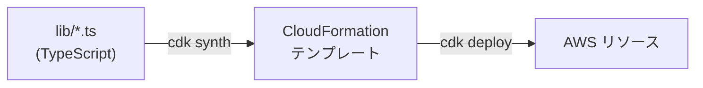

# 第17章 基盤をコードで定義する

CDK (TypeScript) の本体であり、IaC を学ぶ章です。
終えると、IAM 実行ロールの信頼ポリシーに何を書くべきか、なぜスタックを分けデプロイ順序を外部化するのかを説明できるようになります。

依存を先に入れてください。

```bash
cd 3-production/17-infra-as-code
npm ci
```

## 17.1 概要

### 17.1.1 CDK とは

インフラを TypeScript のコードとして定義し、CloudFormation テンプレートに変換してデプロイする IaC ツールです。
コンソールの手作業と違い、何を作るかがコードレビューと差分確認（`npx cdk diff`）の対象になり、同じ構成を何度でも再現できます。



コンストラクタには、既定値とヘルパー付きの L2（`ecr.Repository` など）と、CloudFormation リソースと 1 対 1 の L1（`Cfn` 始まり）の 2 階層があります。
`lib/agent-runtime-stack.ts` は Runtime を L1 の `CfnRuntime` で書いています。
プロパティ名が CloudFormation リファレンスと同じなので、authorizerConfiguration などの設定項目をリファレンスを見ながらそのまま書けます。

## 17.2 実装のポイント

### 17.2.1 スタックを 2 つに分けた理由

AgentCore Runtime は、作成時点で ECR にイメージが存在することを要求します。
ECR と Runtime を同じスタックに入れると、CloudFormation は「空のリポジトリを参照する Runtime」を作ろうとして失敗します。

CloudFormation が管理するのはリソースの存在であって、「イメージが push 済みか」という状態ではありません。
リソースが IaC の管理外の状態に依存するとき、IaC 単体では順序を保証できません。

このリポジトリでは次の 3 つで順序を保証しています。

1. スタックを EcrStack と AgentRuntimeStack に分割する
2. `scripts/deploy.sh` が「ECR デプロイ → イメージ push → Runtime デプロイ」を強制する
3. `cdk deploy --all` の直接実行は禁止（CLAUDE.md の禁止事項）

### 17.2.2 IAM 実行ロールの信頼ポリシー

`resolveExecutionRole()` が Runtime の実行ロールを定義しています。
信頼ポリシーが要点です。

`bedrock-agentcore.amazonaws.com` からの AssumeRole を、`aws:SourceAccount` と `aws:SourceArn` の条件で自アカウント起源に限定しています。
条件が無いと、他人の AWS アカウントの AgentCore があなたのロールを引き受けられる余地が生まれます（confused deputy 問題）。

権限は 3 つに絞ってあります。

- ECR からのイメージ pull
- Bedrock の InvokeModel / InvokeModelWithResponseStream
- CloudWatch Logs への書き込み

ロールを自分で作れない組織向けに、context で既存ロール ARN を渡すと新規作成をスキップする分岐も入れてあります。

Bedrock の許可では、アクションよりリソース ARN の指定でエラーになります。
クロスリージョン推論（第1章 1.1.7）では、リクエストは推論プロファイルに向かい、実際の推論はルーティング先リージョンの基盤モデルで走ります。
IAM はその両方を評価するので、プロファイルの ARN だけ許可すると拒否されます。

```typescript
resources: [
  `arn:aws:bedrock:${this.region}::foundation-model/*`,                 // 呼び出し元リージョンのモデル
  `arn:aws:bedrock:${this.region}:${this.account}:inference-profile/*`, // プロファイル本体
  `arn:aws:bedrock:*::foundation-model/*`,                              // ルーティング先リージョンのモデル
],
```

3 行目を落とすと、ローカルでは通るのにデプロイ後だけ `AccessDeniedException` になります。
リクエストが別リージョンへ転送された時点で拒否されるからです。
foundation-model の ARN にアカウント ID が入らないのは、モデルが AWS 所有のリソースだからです。

### 17.2.3 CDK に入れておく統制

ロールのほかに、案件のレビューで聞かれる統制がいくつかあります。
どれも CDK 側の話です。

- Guardrail のバージョン固定
- 呼び出しの記録
- VPC エンドポイント

Guardrail は識別子だけ渡すと `DRAFT` が使われ、コンソールで誰かが設定を触った瞬間に
本番の挙動が変わります。`guardrailVersion` に数字のバージョンを指定して、
変更をデプロイ経由に限定します（第13章）。

CloudTrail には Bedrock の API 呼び出しが残りますが、プロンプト本文までは入りません。
入出力そのものを残すなら、Bedrock のモデル呼び出しログを S3 か CloudWatch Logs に出すか、
アプリ側のログに書きます（本体は `src/observability.py`）。

VPC エンドポイントは通信を AWS 内に閉じる要件が出たときに使います。
この教材は VPC を作らない構成なので入っていません。

### 17.2.4 context で渡す環境差分

リージョン、モデル ID、ロール ARN はコードに書かず、`cdk.json` の context に既定値を置いて `-c` で上書きします。
context を読むのは `lib/config.ts` の `loadConfig()` だけです。
Python 側の「config.py だけが環境変数を読む」と同じ規約です。

```bash
npx cdk deploy -c region=us-east-1 -c imageTag=v1.2.0
```

`cdk synth` はテンプレート生成だけでデプロイはしないので、デプロイ前に「この変更で何が作られるか」を確認できます。

## 17.3 ハンズオン: context から環境変数を渡す

エージェントの `LOG_LEVEL` を CDK context から Runtime に注入できるようにします。
この章のディレクトリは動く CDK コードの本体でもあるため、骨組みのコピーではなく `lib/config.ts` と `cdk.json` を直接編集します。

### 17.3.1 config.ts に logLevel の読み取りを追加する

`lib/config.ts` の `loadConfig()` を開いてください。
`agentEnvironment` の組み立てに、context `logLevel` を読んで `LOG_LEVEL` に入れる処理を追加します。
`searchProvider` と同じ三項スプレッドのパターンで、未指定なら入れません。

### 17.3.2 cdk.json に既定値を置く

`cdk.json` の context に `"logLevel": "INFO"` を追加します。

### 17.3.3 型チェックと synth で確認する

```bash
cd 3-production/17-infra-as-code && npx tsc --noEmit
```

何も出力されなければ型は通っています。
synth への反映を確認します。

```bash
CDK_DEFAULT_ACCOUNT=111111111111 npx cdk synth AgentPlatformRuntimeStack \
  -c logLevel=DEBUG | grep LOG_LEVEL
```

`LOG_LEVEL: DEBUG` が出るはずです。

### 17.3.4 合格判定

```bash
cd ../.. && ./3-production/17-infra-as-code/verify/verify.sh
```

考えてみてください（記述・任意）。
`-c logLevel=DEBUG` と `07-full-app/.env` の `LOG_LEVEL=DEBUG` は、それぞれどの環境（ローカル実行とデプロイ済み Runtime）のログ設定に反映されるでしょうか。

<details>
<summary>解答例</summary>

`lib/config.ts` は `searchProvider` の処理の直後に追加します。

```typescript
    ...(app.node.tryGetContext('logLevel')
      ? { LOG_LEVEL: String(app.node.tryGetContext('logLevel')) }
      : {}),
```

`cdk.json` は context に 1 行追加します。

```json
    "logLevel": "INFO",
```

`loadConfig()` 以外の場所で `tryGetContext` を呼ばないでください。
設定の読み取り口を 1 箇所に保つのは Python 側（config.py）と同じ規約です。
「未指定なら入れない」三項スプレッドにより、context を消せば Runtime の環境変数からも消え、`.env` 側の既定値が使われます。
解説付きの全文は `solutions/README.md` にあります。

</details>

## 17.4 まとめ

実行ロールの信頼ポリシーには、AssumeRole を許す相手と、`aws:SourceAccount` / `aws:SourceArn` による自アカウント起源への限定を書きます（17.2.2）。
Bedrock の許可は、呼び出し元リージョンの foundation-model、inference-profile、ルーティング先リージョンの foundation-model の 3 種の ARN を揃えます。
クロスリージョン推論では IAM がプロファイルとルーティング先モデルの両方を評価するためです。

スタックを分けるのは、CloudFormation が保証するのはリソースの存在までで、「イメージが push 済みか」のような管理外の状態は保証しないからです。
順序は `scripts/deploy.sh` に持たせ、IaC が保証しない部分を手順で補います（17.2.1）。

## 次の章

[第18章 認証と認可](../18-auth/)
