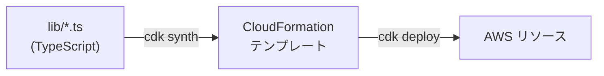

# 第18章 基盤をコードで定義する

この章は CDK (TypeScript) の本体です。
終えると、AgentCore Runtime の実行ロールに何を書くべきかを説明でき、スタックを分けてデプロイ順序を外部化する理由を自分の言葉で言えるようになります。

章のディレクトリへ移動して依存を入れてください。以降のコマンドはすべてこの場所で実行します。

```bash
cd 3-production/18-infra-as-code
```

```bash
npm ci
```

## 18.1 概要

### 18.1.1 CDK とコンストラクトの階層

インフラを TypeScript のコードとして定義し、CloudFormation テンプレートに変換してデプロイする IaC ツールです。
コンソールでの手作業と違い、何を作るかがコードレビューと `npx cdk diff` の対象になります。



コンストラクトには、既定値とヘルパー付きの L2（`ecr.Repository` など）と、CloudFormation リソースと 1 対 1 の L1（`Cfn` 始まり）の 2 階層があります。
AgentCore Runtime には両方あり、L2 の `Runtime` は `AgentRuntimeArtifact.fromAsset()` でイメージのビルドと ECR への push を deploy 時に肩代わりします。
この経路なら ECR を先に作る順序制約は起きませんが、`fromAsset` はプラットフォームを強制しないので、`platform: Platform.LINUX_ARM64` を渡すか Dockerfile 側で固定する必要があります（aws-cdk-lib 2.264.0 の型定義と実装で確認）。
この章が L1 の `CfnRuntime` を使うのは、プロパティが CloudFormation リファレンスと 1 対 1 で読めるからです。

## 18.2 実装のポイント

### 18.2.1 スタックを 2 つに分けた理由

AgentCore Runtime は、作成時点で ECR にイメージが存在することを要求します。
自分で ECR を作り `CfnRuntime` の `containerUri` で指すこの構成では、両方を同じスタックに入れると、CloudFormation が空のリポジトリを参照する Runtime を作ろうとして失敗します。

CloudFormation が管理するのはリソースの存在で、「イメージが push 済みか」という状態ではありません。
この構成では順序を次の 3 つで保証しています。

1. スタックを EcrStack と AgentRuntimeStack に分割する
2. `scripts/deploy.sh` が「ECR デプロイ、イメージ push、Runtime デプロイ」を強制する
3. `cdk deploy --all` の直接実行は禁止（CLAUDE.md の禁止事項）

### 18.2.2 IAM 実行ロール

`resolveExecutionRole()` が Runtime の実行ロールを定義しています。
`bedrock-agentcore.amazonaws.com` からの AssumeRole を、`aws:SourceAccount` と `aws:SourceArn` の条件で自アカウント起源に限定しています。
条件が無いと、他人の AWS アカウントの AgentCore があなたのロールを引き受けられる余地が生まれます（confused deputy 問題）。

権限は AWS が公開している実行ロールの例に合わせてあります。
ECR からの pull、Runtime のロググループへの書き込み、X-Ray へのトレース送信、`bedrock-agentcore` 名前空間へのメトリクス送信、ワークロードアクセストークンの取得、Bedrock のモデル呼び出しです。
context で既存ロール ARN を渡せば、新規作成をスキップして既存ロールを使う分岐も入れてあります。

つまずくのはリソース ARN の指定です。
推論プロファイルを指定すると、リクエストはプロファイルに向かい、推論はルーティング先リージョンの基盤モデルで実行されます。
IAM は両方を評価するので、必要な ARN は 2 種類です。

```typescript
resources: [
  `arn:aws:bedrock:${this.region}:${this.account}:inference-profile/*`, // プロファイル本体
  `arn:aws:bedrock:*::foundation-model/*`,                              // ルーティング先のモデル
],
```

2 行目を落とすと、ローカルでは通るのにデプロイ後だけ `AccessDeniedException` になります。
アカウント ID が入らないのは、モデルが AWS 所有のリソースだからです。
本番では `aws bedrock get-inference-profile` の `models[].modelArn` に出る ARN までワイルドカードを絞ります。

### 18.2.3 ネットワークモードと VPC

`networkConfiguration` は `PUBLIC` で、コンテナは AgentCore のマネージドネットワークから外へ出ます。
VPC モードに変えると、AWS があなたの VPC にネットワークインタフェースを作り、ECR からのイメージ取得も CloudWatch Logs も Bedrock 呼び出しも、指定したサブネットとセキュリティグループを通ります。
VPC 接続したコンテナは既定でインターネットに出られないため、NAT ゲートウェイ付きのプライベートサブネットか、ECR（`ecr.dkr` と `ecr.api`）と S3 ゲートウェイと CloudWatch Logs の VPC エンドポイントが要ります。
どちらも無いとコンテナが起動できず、ログも出ないので原因が見えません。
この教材は `PUBLIC` なので、この設定は入っていません。

### 18.2.4 context で渡す環境差分

リージョン、モデル ID、ロール ARN はコードに書かず、`cdk.json` の context に既定値を置いて `-c` で上書きします。context を読むのは `lib/config.ts` の `loadConfig()` だけです。

```bash
npx cdk deploy -c region=us-east-1 -c imageTag=v1.2.0
```

`cdk synth` はテンプレート生成だけでデプロイはしないので、「この変更で何が作られるか」を先に確認できます。

## 18.3 ハンズオン: context と実行ロールを自分で書く

この章のディレクトリは動く CDK コードの本体でもあるため、骨組みのコピーではなく `lib/` と `cdk.json` を直接編集します。

### 18.3.1 config.ts に logLevel の読み取りを追加する

`lib/config.ts` の `loadConfig()` を開いてください。
`agentEnvironment` の組み立てに、context `logLevel` を読んで `LOG_LEVEL` に入れる処理を追加します。
`searchProvider` と同じ三項スプレッドのパターンで、未指定なら入れません。

続けて `cdk.json` の context に `"logLevel": "INFO"` を追加します。

### 18.3.2 実行ロールに X-Ray の権限を追加する

`lib/agent-runtime-stack.ts` の `resolveExecutionRole()` に、X-Ray へのトレース送信を許可するステートメントが抜けています。
CloudWatch メトリクスのステートメントの手前にコメントで場所を示してあるので、そこへ `iam.PolicyStatement` を 1 つ足してください。
必要なアクションは `xray:PutTraceSegments`、`xray:PutTelemetryRecords`、`xray:GetSamplingRules`、`xray:GetSamplingTargets` の 4 つで、リソースは `*` です。
X-Ray のセグメント送信先はトレース単位に決まるため、リソース ARN で絞れません。

### 18.3.3 型チェックと synth で確認する

```bash
npx tsc --noEmit
```

何も出力されなければ型は通っています。次に synth への反映を確認します。

```bash
CDK_DEFAULT_ACCOUNT=111111111111 npx cdk synth AgentPlatformRuntimeStack -c logLevel=DEBUG | grep LOG_LEVEL
```

`LOG_LEVEL: DEBUG` が出るはずです。

```bash
CDK_DEFAULT_ACCOUNT=111111111111 npx cdk synth AgentPlatformRuntimeStack | grep xray
```

`xray:PutTraceSegments` を含む 4 つのアクションが出るはずです。

### 18.3.4 合格判定

```bash
./verify/verify.sh
```

考えてみてください（記述・任意）。
`-c logLevel=DEBUG` と、エージェント本体の `.env` の `LOG_LEVEL=DEBUG` は、それぞれどちらのログ設定に反映されるでしょうか。

<details>
<summary>解答例</summary>

`lib/config.ts` は `searchProvider` の処理の直後に追加します。

```typescript
    ...(app.node.tryGetContext('logLevel')
      ? { LOG_LEVEL: String(app.node.tryGetContext('logLevel')) }
      : {}),
```

`cdk.json` は context に 1 行追加します。

```json
    "logLevel": "INFO",
```

`lib/agent-runtime-stack.ts` に足すステートメントはこうなります。

```typescript
    role.addToPolicy(
      new iam.PolicyStatement({
        actions: [
          'xray:PutTraceSegments',
          'xray:PutTelemetryRecords',
          'xray:GetSamplingRules',
          'xray:GetSamplingTargets',
        ],
        resources: ['*'],
      }),
    );
```

`loadConfig()` 以外の場所で `tryGetContext` を呼ばないでください。
設定の読み取り口を 1 箇所に保つのは Python 側（config.py）と同じ規約です。
「未指定なら入れない」三項スプレッドにより、context を消せば Runtime の環境変数からも消え、`.env` 側の既定値が使われます。
解説付きの全文は `solutions/README.md` にあります。

</details>

## 18.4 まとめ

実行ロールには、AssumeRole を許す相手と、`aws:SourceAccount` と `aws:SourceArn` による自アカウント起源への限定を書きます。
Bedrock の許可は、推論プロファイルとルーティング先リージョンの基盤モデルの 2 種類の ARN を揃えます。IAM が両方を評価するためです。

スタックを分けるのは、CloudFormation が保証するのはリソースの存在までで、「イメージが push 済みか」のような管理外の状態は保証しないからです。
順序は `scripts/deploy.sh` に持たせ、IaC が保証しない部分を手順で補います。

## 次の章

[第19章 認証と認可](../19-auth/)
