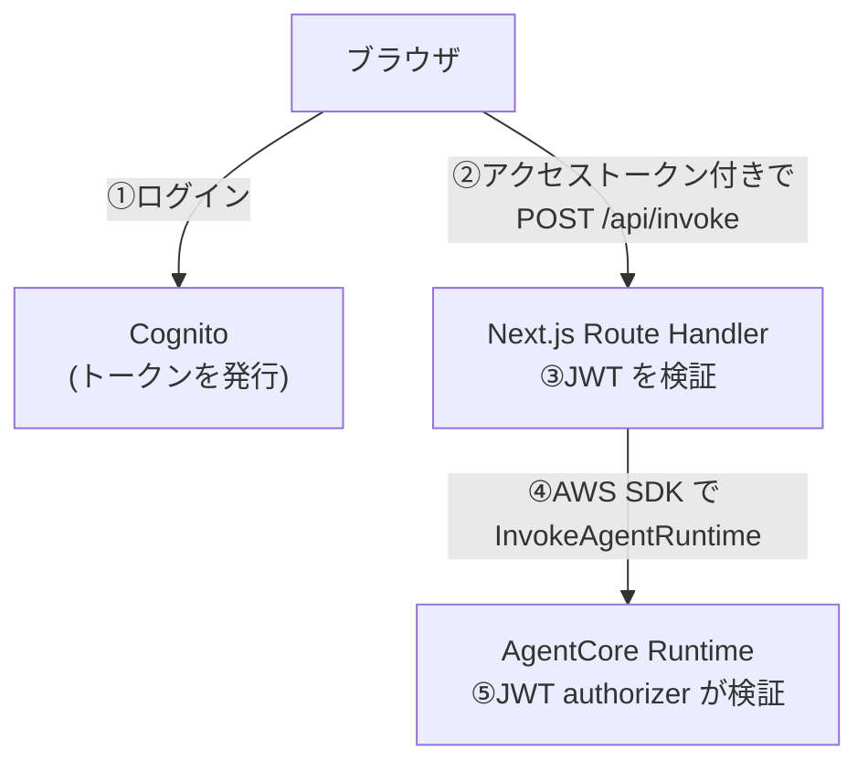

# 第19章 認証と認可

この章を終えると、Cognito User Pool を CDK で自分で書き、AgentCore Runtime の inbound JWT authorizer に何を渡すかを説明できるようになります。
「誰がエージェントを呼べるか」をコードで定義する章です。

この章は独立した CDK プロジェクトです。章のディレクトリへ移動して依存を入れてください。以降のコマンドはすべてこの場所で実行します。

```bash
cd 3-production/19-auth
```

```bash
npm ci
```

## 19.1 概要

### 19.1.1 認証と認可

認証は相手が誰かを確かめること、認可はその相手に何を許すかを決めることです。エージェントは呼び出されるたびに Bedrock のトークン費用が発生するので、認可の無い API として公開すると、誰でもそのコストを積み上げられます。

### 19.1.2 認証経路の全体像

このリポジトリの完成形の経路です。設計の原則は、AWS の認証情報をブラウザに置かないことです。



③と⑤で二重に検証しているのは役割が違うからです。③はアプリの入口での検証、⑤は Route Handler を経由せずに Runtime を直接呼び出す経路を塞ぐ、基盤側の検証です。
この章が扱うのは①の Cognito と⑤の JWT authorizer です。

### 19.1.3 Cognito のトークンと discovery URL

Cognito User Pool はユーザディレクトリとトークン発行者を兼ねます。ログインに成功すると 3 種のトークンが返ります。

- ID トークンはユーザ属性（メール等）を含む。画面表示用
- アクセストークンは API 呼び出しの認可に使う。この章で使うのはこれ
- リフレッシュトークンは上の 2 つを再発行するための長寿命トークン

検証側は署名を確かめる必要があります。User Pool は公開鍵一覧（JWKS）を既知の URL で公開しており、その場所を検証側に知らせる URL が discovery URL です。

```
https://cognito-idp.{region}.amazonaws.com/{userPoolId}/.well-known/openid-configuration
```

検証側はこの URL から JWKS の場所を知り、公開鍵で署名を検証し、`iss`（発行者）と宛先のクレームが想定どおりかを確かめます。OpenID Connect の標準的な仕組みで、Cognito 固有ではありません。

## 19.2 実装のポイント

### 19.2.1 Runtime 側の JWT authorizer

AgentCore Runtime には JWT authorizer を設定できます。Runtime を定義する CDK 側で、`CfnRuntime` の `authorizerConfiguration.customJwtAuthorizer` に discovery URL と許可する Client ID を渡します。

```ts
new agentcore.CfnRuntime(this, 'AgentRuntime', {
  // ...（agentRuntimeName や roleArn などの定義）
  authorizerConfiguration: {
    customJwtAuthorizer: {
      discoveryUrl: authStack.discoveryUrl, // 19.1.3 の URL。ここから鍵を取る
      allowedClients: [authStack.clientId], // 他の Client のトークンは弾く
    },
  },
});
```

`discoveryUrl` は `/.well-known/openid-configuration` で終わる必要があります。この章の AuthStack はその形の文字列を公開するので、Runtime を定義するスタックへ props で渡せば接続できます。

`allowedClients` を使うのは Cognito だからです。authorizer は `allowedClients` を JWT の `client_id` クレームと、`allowedAudience` を `aud` クレームと照合します。
Cognito のアクセストークンは `client_id` を必ず持ちますが、`aud` はリソースサーバのバインドを要求したときにしか入りません。`allowedAudience` を書くと `aud` の無いトークンが全部拒否されます。
両方を指定すると両方が検証されます。`aud` を持つ IdP（Entra ID など）に差し替えるときは `allowedAudience` へ切り替えます。

検証できるのは JWT だけです。discovery URL から取った公開鍵で署名を検証する仕組みなので、中身を持たない不透明トークン（opaque token）を返す IdP はこの authorizer では使えません。

### 19.2.2 この章で書く AuthStack

Cognito 側は L2 が揃っているので、`cognito.UserPool` と `pool.addClient()` で書けます。判断が要るのは設定値のほうです。

`selfSignUpEnabled: false` にして、ユーザは管理者が作る形にします。true にすると誰でもアカウントを作れてしまい、認可を付けた意味が消えます。

`authFlows: { userPassword: true }` は 19.4 で CLI からログインするためのもので、本番の Web アプリでは SRP や Hosted UI を検討します。`removalPolicy: DESTROY` はひな形なので消しやすさ優先で、本番では RETAIN にします。

### 19.2.3 エージェントの権限と、呼び出したユーザの権限

JWT を検証すれば誰が呼んだかは分かります。一方でエージェント自身は実行ロール 1 つで動くので、一般社員が呼んでも部長が呼んでも、ツールが使う権限は同じです。
ここを決めないと、権限の弱いユーザがエージェント経由で、自分では閲覧できないデータを取得できます。

対処は 2 段構えになります。まず実行ロールの権限を、一番弱いユーザに許してよい範囲まで落とします。ロールが持っていない権限は、誰がどう頼んでも引き出せません。
それで足りないなら、呼び出したユーザの識別子をツールまで渡して、ツールの中で絞ります。

## 19.3 ハンズオン: Cognito のスタックを実装する

編集するのは `lib/auth-stack.ts` の 1 ファイルだけです。

### 19.3.1 TODO を 4 個埋める

```bash
mkdir -p lib && cp exercises/auth-stack.ts lib/auth-stack.ts
```

`lib/auth-stack.ts` を開いてください。クラスの枠と公開プロパティは書いてあり、TODO が 4 つ残っています。

1. `cognito.UserPool` を作る（設定値は 19.2.2 のとおり）
2. `pool.addClient()` で App Client を作る
3. `discoveryUrl` と `clientId` を組み立てる。discoveryUrl は `pool.userPoolProviderUrl` に `/.well-known/openid-configuration` を連結する
4. `CfnOutput` で UserPoolId / ClientId / DiscoveryUrl を出力する。19.4 のコマンドで使う値です

エントリポイント `bin/app.ts` は用意してあり（編集不要）、このファイルを `AgentPlatformAuthStack` として読み込みます。

### 19.3.2 実行する

実装できたら TODO コメントを消し、CloudFormation テンプレートに変換します。

```bash
npx cdk synth AgentPlatformAuthStack | grep -E 'Cognito::UserPool|USER_PASSWORD'
```

`AWS::Cognito::UserPool` と `AWS::Cognito::UserPoolClient`、認証フローの `USER_PASSWORD_AUTH` が出るはずです。

<details>
<summary>解答例</summary>

```ts
    const pool = new cognito.UserPool(this, 'UserPool', {
      // 社内利用の想定。ユーザは管理者が作る
      selfSignUpEnabled: false,
      signInAliases: { email: true },
      // ひな形なので消しやすさ優先。本番では RETAIN に変えること
      removalPolicy: RemovalPolicy.DESTROY,
    });

    const client = pool.addClient('AppClient', {
      // USER_PASSWORD_AUTH: ハンズオンで CLI からログインするため。
      // 本番の Web アプリでは SRP / Hosted UI を検討する
      authFlows: { userPassword: true },
      generateSecret: false,
    });

    // OIDC の discovery URL。JWT 検証側はここから JWKS の場所を知る
    this.discoveryUrl = `${pool.userPoolProviderUrl}/.well-known/openid-configuration`;
    this.clientId = client.userPoolClientId;

    new CfnOutput(this, 'UserPoolId', { value: pool.userPoolId });
    new CfnOutput(this, 'ClientId', { value: this.clientId });
    new CfnOutput(this, 'DiscoveryUrl', { value: this.discoveryUrl });
```

全文は `solutions/auth-stack.ts` にあります。

</details>

### 19.3.3 合格判定

型チェックと synth の結果から、UserPool、App Client、discovery URL の形、CfnOutput を検査します。

```bash
./verify/verify.sh
```

## 19.4 ハンズオン: デプロイしてトークンを取得する

作った AuthStack をデプロイし、テストユーザのトークンを取ります。

```bash
npx cdk deploy AgentPlatformAuthStack
```

Outputs に UserPoolId / ClientId / DiscoveryUrl が表示されるはずです。以降のコマンドの `<UserPoolId>` と `<ClientId>` をこの値で置き換えてください。

```bash
aws cognito-idp admin-create-user --user-pool-id <UserPoolId> \
  --username test@example.com --temporary-password 'TempPass123!' \
  --message-action SUPPRESS
```

```bash
aws cognito-idp admin-set-user-password --user-pool-id <UserPoolId> \
  --username test@example.com --password 'TestPass123!' --permanent
```

```bash
aws cognito-idp initiate-auth --auth-flow USER_PASSWORD_AUTH \
  --client-id <ClientId> \
  --auth-parameters USERNAME=test@example.com,PASSWORD='TestPass123!' \
  --query 'AuthenticationResult.AccessToken' --output text
```

`eyJ` で始まる長い文字列（JWT）が出るはずです。Runtime 側に 19.2.1 の authorizer を設定してデプロイしてあれば、このトークンを Bearer として `InvokeAgentRuntime` を呼べること、トークン無しだと拒否されることまで確認できます。

## 19.5 まとめ

User Pool と App Client は `cognito.UserPool` と `pool.addClient()` で書け、判断が要るのはセルフサインアップと認証フローの設定値です。
Runtime 側の authorizer には discovery URL と `allowedClients` を渡します。Cognito のアクセストークンが持つのは `aud` ではなく `client_id` だからです。

トークンの発行は Cognito が担い、検証は discovery URL から公開鍵を取れる側なら誰でも行えます。この分離があるから、アプリの入口と基盤の二重の検証を同じ User Pool で行えます。

## 次の章

[第20章 フロントエンドとストリーミング](../20-streaming/)
