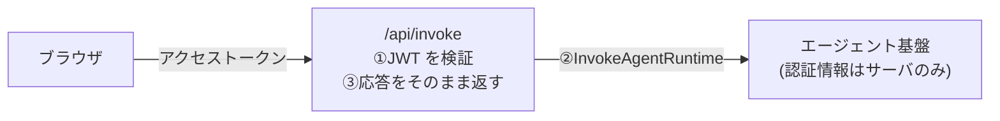

# 第20章 フロントエンドとストリーミング

この章を終えると、JWT 検証つきの Route Handler を自分で書き、エージェントの進捗をストリーミングで表示する画面が手元で動くようになります。
Next.js（App Router）の骨組みは用意してあり、書くのはサーバ側の 1 ファイルだけです。

章のディレクトリへ移動し、依存と開発用の設定ファイルを用意してください。以降のコマンドはすべてこの場所で実行します。

```bash
cd 3-production/20-streaming
```

```bash
npm ci && cp .env.local.example .env.local
```

## 20.1 概要

### 20.1.1 ストリーミング

応答の完成を待たずに、できた部分から順に送り続ける方式です。
エージェントの調査は数十秒かかります。無反応の画面が数十秒続くと、利用者は処理が止まったと判断するので、進捗を順に表示します。
待ち時間の見せ方だけの話ではありません。AgentCore Runtime が許す実行時間は同期よりストリーミングのほうが長いので、長い調査を最後まで実行しきる手段でもあります（20.4）。

### 20.1.2 リクエストが通る経路

ブラウザから AgentCore Runtime を直接呼ぶ構成にすると、AWS の認証情報か署名の仕組みをブラウザに置くことになります。
そこで間にサーバ側の Route Handler を挟みます。



②は提供コードの `lib/backend.ts` が担当します。
`LOCAL_AGENT_URL` があればローカルで起動したエージェントへ、無ければ AgentCore Runtime へ転送するので、デプロイなしで動かせます。
この章で書くのは①と③、JWT の検証とストリームの受け渡しです。

## 20.2 実装のポイント

### 20.2.1 JWT 検証

検証は `aws-jwt-verify` に任せます。自前で JWKS を取りに行く必要はありません。

`CognitoJwtVerifier.create({userPoolId, clientId, tokenUse: "access"})` はモジュールスコープで 1 度だけ作ります。
JWKS がプロセス内にキャッシュされ、リクエストごとの鍵取得を避けられるからです。
あとは `verify(token)` が署名、発行者、client_id、有効期限をまとめて検証します。
API の認可に使うのはアクセストークンで、ID トークンではありません。

`AUTH_BYPASS` は、開発時に限って JWT 検証を省略するための設定です。
判定は文字列 `"true"` との厳密比較にします。truthy な値をすべて通す判定だと、`1` や `yes` のような意図しない値でも検証が消えるためです。
バイパスするのは認可だけで、prompt の必須チェックなど他の検証は省きません。

### 20.2.2 ストリームの受け渡し

エージェント本体は payload に `"stream": true` を付けると SSE（text/event-stream）で応答します。届くイベントは 3 種類です。

- 進捗は `{"event": "stage", "stage": "research" | "review" | "revise"}`
- 最終レポートは `{"event": "result", ...}`
- 失敗は `{"event": "error", "detail": ...}`

Route Handler の仕事は、このストリームを変換せずそのままブラウザへ返すことです。
`await upstream.text()` のように全部読み切ってから返すと、完了までブラウザに何も届かず、ストリーミングになりません。
`new Response(upstream.body, ...)` のように body を渡すだけにします。

### 20.2.3 バックエンド呼び出しの上限

`lib/backend.ts` は `BedrockAgentCoreClient` に `maxAttempts: 1` と `requestHandler` を明示しています。
JS SDK の既定は maxAttempts 3 なので、5xx や 409 が返ると SDK が同じ `runtimeSessionId` で投げ直し、エージェントが二重に実行されてトークン費用も二重に出ます。
`requestTimeout` の既定は 0（無制限）で、応答が返らないまま Route Handler が待ち続けるので、こちらも値を入れます。

## 20.3 ハンズオン: Route Handler を書いて通しで動かす

JWT を検証してバックエンドへ転送する Route Handler を作り、ブラウザから 1 往復させます。
編集するのは `app/api/invoke/route.ts` の 1 ファイルだけです。

### 20.3.1 TODO を 3 個埋める

```bash
mkdir -p app/api/invoke && cp exercises/route.ts app/api/invoke/route.ts
```

App Router はファイルの場所が URL になるため、この配置だけで `POST /api/invoke` が有効になります。
`app/api/invoke/route.ts` を開いてください。Verifier の生成と prompt の必須チェックは書いてあり、TODO が 3 つ残っています。

1. `AUTH_BYPASS` の分岐。文字列 `'true'` のときだけ認可をスキップする（20.2.1 の厳密比較）
2. JWT 検証。`Authorization: Bearer <token>` を取り出して `verifier.verify()` にかけ、無いか無効なら 401 を返す
3. 転送。`invokeBackend()` の応答をストリームのまま返す。status と Content-Type も引き継ぐ（20.2.2）

埋めたら TODO コメントは消してください。

### 20.3.2 実行する

デプロイ不要で、ブラウザから Route Handler、ローカルのエージェント、Bedrock までの全経路を動かします。
ターミナル 1 でエージェントを起動します。

```bash
cd ../../1-basic/07-full-app && uv run python -m src.main
```

ターミナル 2 でフロントエンドを起動します。
`.env.local` は `AUTH_BYPASS=true` と `LOCAL_AGENT_URL=http://127.0.0.1:8080` のままにしてください。

```bash
npm run dev
```

http://localhost:3000 を開いて「調査する」を押すと、「調査中…」と「検証中…」の進捗が順に現れ、最後にレポートが表示されるはずです。
mock プロバイダのままなので検索結果は固定データです。

<details>
<summary>解答例</summary>

```typescript
async function authorize(request: NextRequest): Promise<Response | null> {
  // 開発時のバイパス。文字列 "true" のときだけ有効にする
  if (process.env.AUTH_BYPASS === 'true') {
    return null;
  }
  if (!verifier) {
    return Response.json(
      { error: 'COGNITO_USER_POOL_ID / COGNITO_CLIENT_ID が未設定です。' },
      { status: 500 },
    );
  }

  const header = request.headers.get('authorization') ?? '';
  const token = header.startsWith('Bearer ') ? header.slice(7) : '';
  if (!token) {
    return Response.json({ error: 'Authorization: Bearer <token> が必要です。' }, { status: 401 });
  }

  try {
    await verifier.verify(token); // 署名と iss と client_id と有効期限を検証
    return null;
  } catch {
    return Response.json({ error: 'トークンが無効です。' }, { status: 401 });
  }
}

export async function POST(request: NextRequest): Promise<Response> {
  const denied = await authorize(request);
  if (denied) {
    return denied;
  }

  const body = (await request.json()) as InvokePayload;
  if (!body.prompt?.trim()) {
    return Response.json({ error: 'prompt が必要です。' }, { status: 400 });
  }

  // バックエンドの応答（SSE または JSON）をそのままブラウザへ返す
  const upstream = await invokeBackend(body);
  return new Response(upstream.body, {
    status: upstream.status,
    headers: {
      'Content-Type': upstream.headers.get('Content-Type') ?? 'application/json',
    },
  });
}
```

全文は `solutions/route.ts` にあります。

</details>

### 20.3.3 合格判定

実装の構造検査と `tsc --noEmit` の型チェックを行います。

```bash
./verify/verify.sh
```

「第20章 合格。」が出るはずです。

## 20.4 本番経路とタイムアウト

デプロイ済みの環境に向けるときは、`.env.local` の `AUTH_BYPASS` を false にし、`LOCAL_AGENT_URL` を消し、`AGENT_RUNTIME_ARN` と `COGNITO_*` を CloudFormation の出力値で埋めます。
Cognito から取得したアクセストークンを `Authorization` ヘッダに付けて呼び出し、トークン無しが 401 になることも確認してください。
Amplify Hosting などへのデプロイは、この教材では扱いません。

タイムアウトは層ごとにあり、最も短いものが先に切れます。
AgentCore Runtime の上限（同期とストリーミング）は versions.md にありますが、手前のホストのほうが先に切れることがあります。
Route Handler を動かす実行環境の上限、API Gateway を挟むなら統合タイムアウト（既定 29 秒）が代表です。
SSE ではチャンク間の無通信時間に idle タイムアウトが適用されるので、進捗イベントを送る間隔も設計対象になります。

## 20.5 まとめ

Route Handler がするのは JWT の検証と応答の転送だけです。
AWS の認証情報はサーバ側にだけ置き、入口で JWT を検証し、通ったリクエストの応答ストリームは変換せずそのまま返します。
読み切ってから返すと進捗がブラウザに届かなくなるので、間に処理を挟まないことがストリーミングの条件です。

## 次の章

[付録 発展領域の入口](../99-appendix/)
