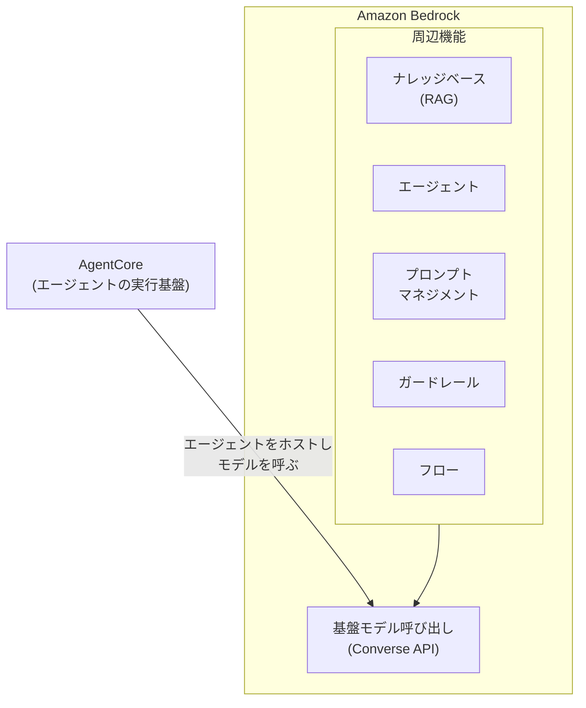
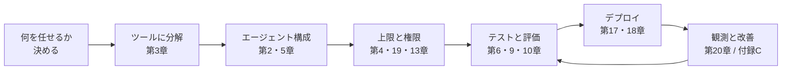

# agent-platform

AI エージェント開発を、動くコードを自分で書きながら習得するリポジトリです。3 部制です。

第1部 基礎編（`1-basic/`）は第0〜7章です。競合リサーチエージェントを題材に、環境構築 → モデル呼び出し → エージェントループ → ツール設計 → コスト制御 → マルチエージェント → テストと進み、完成形を通読します（[1-basic/README.md](1-basic/README.md)）。
第2部 応用編（`2-advanced/`）は第8〜16章で、RAG、評価、インジェクション耐性、MCP などエージェントの中身を仕上げるテーマ別の章です（[2-advanced/README.md](2-advanced/README.md)）。
第3部 本番運用基盤（`3-production/`）はエージェントを外へ届ける側で、デプロイ、IaC、認証、フロントエンドを扱います（[3-production/README.md](3-production/README.md)）。

第7章（完成形の通読）を除き、すべての章が同じ流れで進みます。

1. 読む。README の解説節で仕組みと理由を理解する
2. 書く。ハンズオンの節で、その技術を自分の手でコードとして実装する
3. 動かす。実行して「〜が出るはずです」と照合する
4. 判定。verify が機械的に確認する。何を検査するかは章ごとに違い、実行結果まで見る章と、実装の形だけを見る章がある

「書く」は穴埋め方式です。各章の `exercises/` にある TODO 付きの骨組みを実装し、章直下のスクリプトや verify で動かして確かめます。
完成形は `solutions/` にあります。
ハンズオンは章のディレクトリ内で完結し、本体 `07-full-app/` は完成形として読む・動かす対象です（第7章は通読、第18章は CDK コードを直接編集する形です）。

## 始め方

1. fork するか個人ブランチを切る。ハンズオンではリポジトリ内のファイルを直接編集するので、共有の main を変更しない作業場所を先に作る
2. `1-basic/00-dev-environment/README.md` を開き、指示どおりに環境を作る
3. 以降は番号順。詰まったら各章の `solutions/` を見てよい

```bash
# 合格判定の例（章によっては verify.sh）
uv run --project 1-basic/07-full-app pytest 1-basic/03-tool-design/verify -q
```

## Bedrock の機能の位置づけ

Bedrock はモデル呼び出しの上に周辺機能が載る構造です。
この教材が主に使うのはモデル呼び出しと AgentCore です。エージェント自体は、マネージドの Bedrock Agents ではなく Strands Agents で自前実装します。



| 機能 | 何をするものか | 扱う章 |
| --- | --- | --- |
| AgentCore | エージェントの実行基盤 | 第17章 |
| エージェント | ツールを呼んで進む仕組み | 第2〜7章 |
| ナレッジベース | 検索拡張生成（RAG） | 第8章 |
| プロンプトマネジメント | 版管理と退行検知 | 第9章 |
| ガードレール | 入出力の内容フィルタ | 第13章 |
| フロー | 処理をノードで繋ぐ | 対象外 |
| データオートメーション | 非構造化文書の情報抽出 | 対象外 |

フローとデータオートメーションを対象外にしたのは、この教材が処理の流れをコードで制御するからです。

## 章の一覧

第1部 基礎編（エージェントのコア。詳細は [1-basic/README.md](1-basic/README.md)）。

| 章 | 学べること |
| --- | --- |
| [00-dev-environment](1-basic/00-dev-environment/) | uv / Docker / AWS CLI の環境構築 |
| [01-invoke-bedrock](1-basic/01-invoke-bedrock/) | Bedrock でモデルを呼ぶ |
| [02-agent-loop](1-basic/02-agent-loop/) | エージェントループと ReAct |
| [03-tool-design](1-basic/03-tool-design/) | ツール設計とエラー設計 |
| [04-cost-control](1-basic/04-cost-control/) | hooks による上限とトークン計測 |
| [05-multi-agent](1-basic/05-multi-agent/) | 役割分割とモデルの使い分け |
| [06-agent-testing](1-basic/06-agent-testing/) | LLM を呼ばないテスト |
| [07-full-app](1-basic/07-full-app/) | 完成形の通読 |

第2部 応用編（エージェントの中身を仕上げるテーマ別の章。詳細は [2-advanced/README.md](2-advanced/README.md)）。

| 章 | 学べること |
| --- | --- |
| [08-knowledge-base](2-advanced/08-knowledge-base/) | RAG を手で作る |
| [09-evaluation](2-advanced/09-evaluation/) | 判定関数と改善ループ |
| [10-prompt-injection](2-advanced/10-prompt-injection/) | インジェクション耐性と多層防御 |
| [11-mcp](2-advanced/11-mcp/) | MCP サーバによる分離 |
| [12-prompt-caching](2-advanced/12-prompt-caching/) | プロンプトキャッシュとコスト実測 |
| [13-guardrails](2-advanced/13-guardrails/) | マネージド層の内容フィルタ |
| [14-hitl](2-advanced/14-hitl/) | 取り消せない操作の承認ゲート |
| [15-structured-output](2-advanced/15-structured-output/) | 構造化出力とパースの撤去 |
| [16-news-kb-mcp](2-advanced/16-news-kb-mcp/) | KB 取り込みと Gateway 検索基盤 |

第3部 本番運用基盤（エージェントを外へ届ける側。詳細は [3-production/README.md](3-production/README.md)）。

| 章 | 学べること |
| --- | --- |
| [17-agentcore-deploy](3-production/17-agentcore-deploy/) | コンテナの要求条件とデプロイ |
| [18-infra-as-code](3-production/18-infra-as-code/) | CDK と IAM ロール設計 |
| [19-auth](3-production/19-auth/) | Cognito と JWT による認可 |
| [20-streaming](3-production/20-streaming/) | Next.js とストリーミング表示 |
| [99-appendix](3-production/99-appendix/) | 発展領域の入口と用語集 |

Tier 分けと習得判定は [docs/learning-roadmap.md](docs/learning-roadmap.md) に、モデル ID や単価などバージョンで変わる値は [docs/versions.md](docs/versions.md) にあります。

## 開発の工程と章の対応

実案件でエージェントを組むときの工程と、章の対応です。
番号順に進めると、この流れを最初から最後までたどったことになります。



工程のうち作業量が多いのはツール設計（第3章）と評価（第9章）です。

## 順序

どの章も、その章のディレクトリで `uv sync` か `npm ci` を実行すれば単独で始められます。
他の章を先に終えている必要はありません。番号順は、概念が積み上がる順に並べた推奨の順序です。
第0章は AWS CLI と Docker の確認だけなので、環境が整っている人は飛ばしてかまいません。

## 困ったら

`./scripts/check_env.sh` を実行して、環境の問題かコードの問題かを切り分けてください。
[docs/troubleshooting.md](docs/troubleshooting.md) に、症状、原因、対処の順で載っています。
