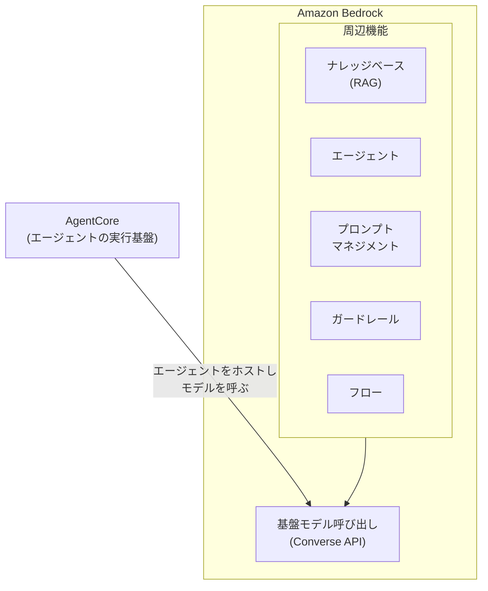
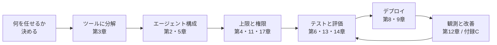

# agent-platform

AI エージェント開発を、動くコードを改造しながら習得するリポジトリです。
番号付きディレクトリが章で、00 から順にこなすと競合リサーチエージェントを題材に
モデル呼び出し → エージェント → ツール → コスト制御 → マルチエージェント → テスト →
コンテナデプロイ → IaC を一周できます。分量は 2〜3 日。

読むだけの章はありません。すべての章が同じ流れで進みます。

1. **読む** — README の解説節で仕組みと理由を理解する
2. **書く** — 【ハンズオン】で、その技術を自分の手でコードとして実装する
3. **動かす** — 実行して「〜が出るはずです」と照合する
4. **判定** — verify が機械的に確認する。verify が通れば、その章を「説明できて、書けて、動かせた」とみなす

「書く」は穴埋め方式です。各章の `exercises/` にある TODO 付きの骨組みを実装し、
章直下のスクリプトや verify で動かして確かめます。完成形は `solutions/` にあります。
ハンズオンは章のディレクトリ内で完結し、本体 `07-full-app/` は完成形として
読む・動かす対象です（第7章は通読、第9章は CDK コードを直接編集する形です）。

## 始め方

1. fork するか個人ブランチを切る。ハンズオンでは各章の `exercises/` など
   リポジトリ内のファイルを直接編集するので、共有の main を汚さない自分専用の作業場所を先に作る
2. `00-dev-environment/README.md` を開き、指示どおりに環境を作る
3. 以降は番号順。詰まったら各章の `solutions/` を見てよい

```bash
# 合格判定の例（章によっては verify.sh）
uv run --project 07-full-app pytest 03-tool-design/verify -q
```

## Bedrock の機能の位置づけ

Bedrock はモデル呼び出しの上に周辺機能が載る構造です。
この教材が主に使うのはモデル呼び出しと AgentCore で、エージェント自体は
マネージドの Bedrock Agents ではなく Strands Agents で自前実装します。



| 機能 | 何をするものか | 扱う章 |
| --- | --- | --- |
| AgentCore | エージェントの実行基盤 | 第8章 |
| エージェント | ツールを呼んで進む仕組み | 第2〜7章 |
| ナレッジベース | 検索拡張生成(RAG) | 第10章 |
| プロンプトマネジメント | 版管理と退行検知 | 第13章 |
| ガードレール | 入出力の内容フィルタ | 第17章 |
| 自動推論チェック | ハルシネーション検出 | 第17章 |
| フロー | 処理をノードで繋ぐ | 対象外 |
| データオートメーション | 非構造化文書の情報抽出 | 対象外 |

フローとデータオートメーションを対象外にしたのは、この教材が処理の流れを
コードで制御するからです。

## 章の一覧

| 章 | 学べること |
| --- | --- |
| [00-dev-environment](00-dev-environment/) | uv / Docker / AWS CLI の環境構築 |
| [01-invoke-bedrock](01-invoke-bedrock/) | Bedrock でモデルを呼ぶ |
| [02-agent-loop](02-agent-loop/) | エージェントループと ReAct |
| [03-tool-design](03-tool-design/) | ツール設計とエラー設計 |
| [04-cost-control](04-cost-control/) | hooks による上限とトークン計測 |
| [05-multi-agent](05-multi-agent/) | 役割分割とモデルの使い分け |
| [06-agent-testing](06-agent-testing/) | LLM を呼ばないテスト |
| [07-full-app](07-full-app/) | 完成形の通読 |
| [08-agentcore-deploy](08-agentcore-deploy/) | コンテナ契約とデプロイ |
| [09-infra-as-code](09-infra-as-code/) | CDK と IAM ロール設計 |
| [10-knowledge-base](10-knowledge-base/) | RAG を手で作る |
| [11-auth](11-auth/) | Cognito と JWT による認可 |
| [12-streaming](12-streaming/) | Next.js とストリーミング表示 |
| [13-evaluation](13-evaluation/) | 判定関数と改善ループ |
| [14-prompt-injection](14-prompt-injection/) | インジェクション耐性と多層防御 |
| [15-mcp](15-mcp/) | MCP サーバによる分離 |
| [16-prompt-caching](16-prompt-caching/) | プロンプトキャッシュとコスト実測 |
| [17-guardrails](17-guardrails/) | マネージド層の内容フィルタ |
| [18-hitl](18-hitl/) | 取り消せない操作の承認ゲート |
| [19-structured-output](19-structured-output/) | 構造化出力とパースの撤去 |
| [99-appendix](99-appendix/) | 発展領域の入口と用語集 |

Tier 分けと習得判定は [docs/learning-roadmap.md](docs/learning-roadmap.md) にあります。

## 開発の工程と章の対応

実案件でエージェントを組むときの工程と、章の対応です。
番号順に進めると、この流れを一周したことになります。



工程のうち手数が要るのはツール設計（第3章）と評価（第13章）です。
エージェントの品質は、モデルを上位に差し替えるより、ツールの粒度と docstring、
それに評価ケースの精度で決まります。

## 順序と前提

- 00 → 06 は番号順に進める（06 は第3章で作ったものと同じツールにテストを書くため、
  第3章を先に終えると学びが繋がる）
- 08・09 は 03 まで終えていれば、04〜06 と並行して進められる。
  10 は 01 まで終えていれば他の章と独立に進められる
- 11 は独立に進められる（デプロイして試す工程だけ 09 が前提）。12 は 11 の後に進める
- 13〜19 はどの順で進めてもよい

## 困ったら

`./scripts/check_env.sh` を実行して、環境の問題かコードの問題かを切り分けてください。
[docs/troubleshooting.md](docs/troubleshooting.md) には、このリポジトリの開発中に
実際に遭遇した問題だけが症状・原因・対処の順で載っています。
